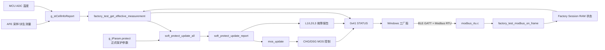
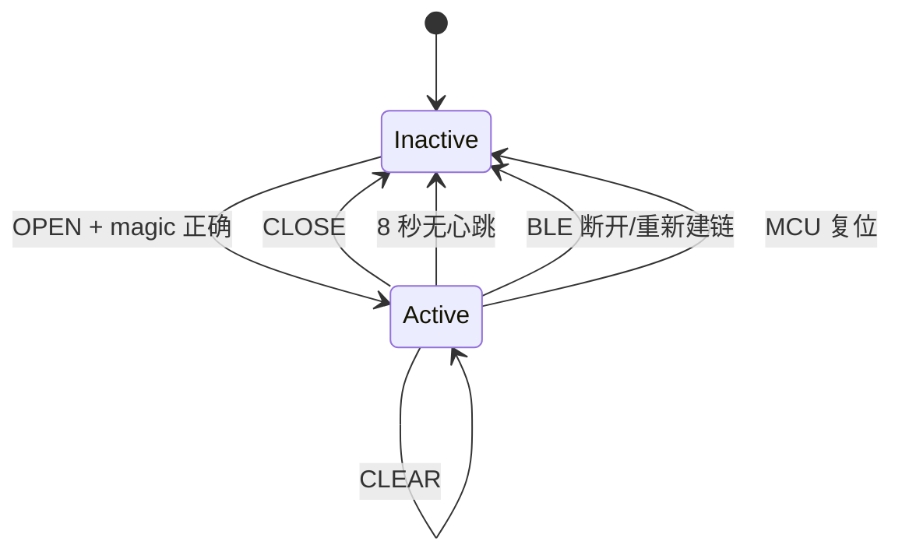
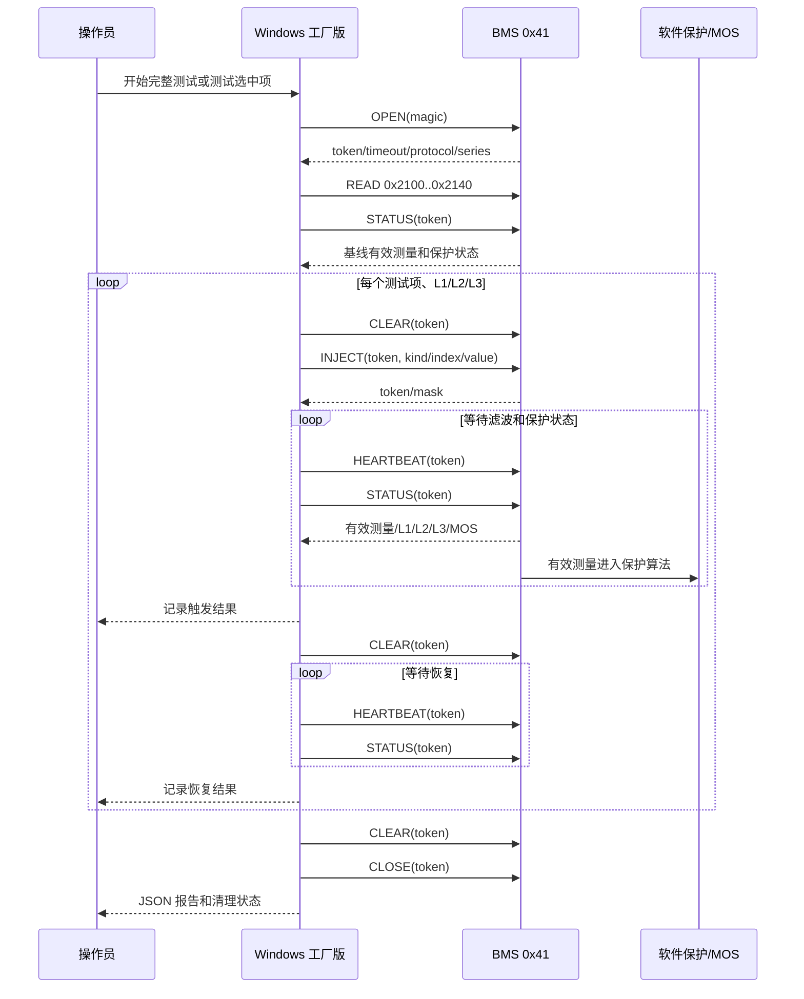

# BMS Factory Test 设计与原理说明

## 1. 文档信息

| 项目 | 内容 |
| --- | --- |
| 文档用途 | BMS 固件、Windows 工厂上位机的研发交接、代码评审、产线使用和问题定位 |
| 当前基线 | `codex-mos-protection-coordination` |
| 本文对应提交 | `6e1193c7d695d4d059789bc5607d3a0b9ba6252f` |
| MCU/芯片 | Telink TLSR8251 / B85，TC32 工具链 |
| 固件入口 | `tc_ble_single_sdk-V3.4.2.8_Patch_0001/tc_ble_single_sdk/vendor/ble_sample/` |
| Windows 客户版 | `bms-tool-windows/BmsTool.Windows/` |
| Windows 工厂版 | `bms-tool-windows/BmsFactoryTest.Windows/` |
| 工厂功能码 | 独立 Modbus RTU 功能码 `0x41` |

本文以仓库当前源码为准。协议、字段和保护逻辑发生变化时，必须同步更新本文、`docs/factory_test_protocol.md`、BMS 实现和 Windows 客户端解析代码。

## 2. 设计目标与非目标

### 2.1 设计目标

Factory Test 用于在不修改正式保护参数、不修改 AFE/ADC 原始数据、不写 Flash 的前提下，验证 MCU 软件保护链路：

1. 真实建立受保护的 Factory Session；
2. 只在 RAM 中保存临时测量注入值；
3. 让软件保护算法读取“有效测量值”，而不是把原始采样值改掉；
4. 验证单体、总压、电流、温度、MOS 温度和 SOC 相关保护的 L1/L2/L3 触发与恢复；
5. 让三级软件保护继续参与 MOS 允许/关断判断；
6. 断开 BLE、心跳超时、复位或显式清理后，临时注入自动消失；
7. Windows 工厂版提供完整测试、单项测试、实时数据面板、步骤结果和 JSON 报告。

### 2.2 非目标

Factory Test 不用于：

- 修改或校准 AFE 芯片硬件保护参数；
- 修改 MCU 软件保护参数；
- 伪造 AFE 原始寄存器、MCU ADC 原始采样或客户页面显示的原始数据；
- 代替真实充放电负载、温箱、MOS 驱动反馈和 AFE 硬件保护验证；
- 作为客户版的普通功能入口；
- 通过清除软件测试状态来掩盖测试前已经存在的真实故障。

## 3. 仓库和项目边界

```text
仓库根目录
├─ tc_ble_single_sdk-V3.4.2.8_Patch_0001/
│  └─ tc_ble_single_sdk/vendor/ble_sample/
│     ├─ app.c              软件保护、MOS 控制、主循环
│     ├─ factory_test.c     Factory Session 和 RAM 注入
│     ├─ factory_test.h     工厂协议常量、类型和接口
│     ├─ modbus_rtu.c       Modbus RTU 收包、CRC 和 0x41 分派
│     └─ param.h/param.c    正式软件保护参数
├─ bms-tool-windows/
│  ├─ BmsTool.Windows/      客户版，不能出现工厂测试入口
│  └─ BmsFactoryTest.Windows/
│     ├─ MainWindow.xaml    工厂版 UI
│     ├─ MainWindow.xaml.cs BLE 连接、轮询、工厂页交互
│     └─ FactoryTestEngine.cs 自动/单项测试编排
└─ docs/
   ├─ factory_test_protocol.md
   ├─ bms_windows_joint_maintenance.md
   └─ bms_factory_test_design_and_principle.md
```

两个 Windows 项目是独立 `.csproj` 和独立 EXE。工厂版通过项目链接复用 BLE、Modbus、BmsClient 等基础代码，但客户版不引用 `BmsFactoryTest.Windows` 的测试编排和 UI。

## 4. 总体架构



核心原则是“替换保护算法的输入接口”，而不是“修改采样源”：

```text
原始采样 -> g_stCellInfoReport -> 有效测量选择 -> 软件保护状态 -> 故障报告/MOS
                                  ↑
                         Factory RAM 注入（会话有效时）
```

`factory_test_get_effective_measurement()` 是唯一的有效测量汇合点。`soft_protect_update_all()` 通过它读取输入；其它客户数据、AFE 原始采样和正式参数仍走原来的路径。

## 5. BMS 固件实现原理

### 5.1 RAM 状态

`factory_test.c` 使用以下静态 RAM 状态：

| 状态 | 作用 | 清理时机 |
| --- | --- | --- |
| `s_factory_token` | 当前会话令牌 | `factory_test_clear_session()` |
| `s_factory_last_heartbeat_tick` | 心跳计时起点 | 会话清除/重新 OPEN |
| `s_factory_active` | 会话是否有效 | 会话清除/重新 OPEN |
| `s_factory_injection_mask` | 哪类输入已注入 | CLEAR、CLOSE、断链、超时 |
| `s_factory_cell_mv[32]` | 每个单体的临时 mV 值 | CLEAR、CLOSE、断链、超时 |
| `s_factory_pack_cv` | 临时总压字段 | CLEAR、CLOSE、断链、超时 |
| `s_factory_current_tenth_a` | 带符号的 0.1 A 电流 | CLEAR、CLOSE、断链、超时 |
| `s_factory_temp_deci_raw` | 电池温度原始值 | CLEAR、CLOSE、断链、超时 |
| `s_factory_mos_temp_deci_raw` | MOS 温度原始值 | CLEAR、CLOSE、断链、超时 |
| `s_factory_soc_percent` | 临时 SOC 百分比 | CLEAR、CLOSE、断链、超时 |

复位后这些静态变量由启动初始化为 0，因此不会跨复位保留。显式清理函数会先清零注入数组和掩码，再清 token、计时和 active 标志。

### 5.2 有效测量计算

`factory_test_get_effective_measurement()` 的实际行为如下：

| 输入类型 | kind | 值含义 | 有效测量行为 |
| --- | ---: | --- | --- |
| 单体 | `1` | 单体 mV | 仅当对应数组元素非 0 时替换该串；随后重新计算最大值、最小值、压差和派生总压 |
| 总压 | `2` | 源码字段 `pack_cv` | 有 PACK 注入掩码时直接使用；否则由单体总和按固件当前 `/10` 规则派生 |
| 电流 | `3` | 有符号 0.1 A | 正数进入充电电流，负数的绝对值进入放电电流 |
| 电池温度 | `4` | 温度原始值 | 同时作为有效最高温和最低温，便于单点触发充/放电温度保护 |
| MOS 温度 | `5` | MOS 温度原始值 | 替换 MOS 温度输入，不改 MCU ADC 原始值 |
| SOC | `6` | 0~100 % | 替换软件保护读取的 SOC |

约束由 `factory_set_injection()` 执行：

- 单体索引必须小于固件 `SeriesNum`；
- SOC 必须不大于 100；
- 电池温度和 MOS 温度原始值必须不大于 3000；
- 未知 kind 返回 `FACTORY_STATUS_UNSUPPORTED`；
- 越界返回 `FACTORY_STATUS_OUT_OF_RANGE`；
- 单体值为 0 时，当前代码会保留该串真实值，但输入类别掩码仍可能保持有效；
- CLEAR 清除所有类别，不支持只清一类注入。

### 5.3 软件保护真实数据流

`app.c` 中 `soft_protect_update_all()` 的每次更新过程：

1. 取得 `g_tParam.protect`，这是正式软件保护参数；
2. 调用 `factory_test_get_effective_measurement()`；
3. 检查 AFE 通信状态及电压/温度测量有效性；
4. 将有效测量分别送入单体、总压、压差、电流、温度、MOS 温度、SOC 保护项；
5. 每个保护项都调用 `soft_protect_update_item()`，再按 L1/L2/L3 分别调用 `soft_protect_update_level()`；
6. 由 `soft_protect_update_report()` 把各级软件状态写回 `g_stCellInfoReport.unMdlFault_First/Second/Third`；
7. `mos_update()` 根据三级软件保护决定 CHG/DSG MOS 是否允许。

软件三级保护与 AFE 硬件保护保持独立。三级对外故障报告会把 AFE 硬件状态并入对应硬件故障位；一、二级只由软件报警状态生成。AFE 通信错误时，软件不会用无效的清零数据错误恢复保护状态。

### 5.4 L1/L2/L3 保护算法

`soft_protect_update_level()` 的统一逻辑：

```text
threshold == 0
    -> 本级保护关闭，并清除本级 active/pending

未触发条件
    -> 清 pending，不产生保护

首次满足触发条件
    -> filter_ms == 0 时立即 active
    -> filter_ms > 0 时进入 pending，持续超过 filter_ms 后 active

L1/L2 已 active
    -> 离开触发条件立即解除，不使用三级恢复值

L3 已 active 且不是过流
    -> 满足 recover 条件后解除

L3 已 active 且是充/放电过流
    -> 使用固件固定约 30 秒自动重试/恢复策略，不使用 OCP_Rcv
```

高阈值保护使用 `value >= threshold` 触发、`value <= recover` 恢复；低阈值保护使用 `value <= threshold` 触发、`value >= recover` 恢复。

## 6. Factory Session 状态机



状态规则：

- `OPEN` 需要 magic `0x46414354`，大端编码；成功后清空旧 RAM 注入并生成非 0 token；
- 除 OPEN 外所有命令都需要 token；token 不匹配或会话失效返回 `AUTH_REQUIRED`；
- 合法命令会刷新心跳计时；`factory_test_poll()` 在主循环中检查超时；
- BLE 连接事件和断开事件均调用 `factory_test_clear_session()`；
- `CLOSE` 无论请求长度是否正确，经过会话鉴权后都会调用清会话；
- 上位机的 `finally` 始终尝试 CLEAR，再尝试 CLOSE；
- 不允许把 Factory Session 当作持久化 factory mode；它不调用会写 Flash 的参数或运行模式接口。

## 7. Modbus RTU 协议

### 7.1 通用帧

地址沿用 `modbus_rtu.c` 的 `MB_ADDR=0x01`。CRC 是 Modbus RTU CRC16：初值 `0xFFFF`、多项式 `0xA001`、低字节在前。

```text
请求：地址(1) | 功能码(0x41) | 命令(1) | 参数(N) | CRC Lo | CRC Hi
应答：地址(1) | 功能码(0x41) | 命令(1) | 状态(1) | 负载(N) | CRC Lo | CRC Hi
```

### 7.2 命令和成功响应

| 命令 | 请求参数 | 成功负载 | 成功响应总长度 |
| --- | --- | --- | ---: |
| `0x01 OPEN` | magic `u32` BE | token `u16`、超时秒 `u16`、协议版本 `u8`、串数 `u8` | 12 |
| `0x02 HEARTBEAT` | token `u16` | token `u16`、剩余秒 `u16` | 10 |
| `0x03 INJECT` | token、kind、index、value `u16` | token `u16`、注入 mask `u16` | 10 |
| `0x04 CLEAR` | token `u16` | token `u16` | 8 |
| `0x05 CLOSE` | token `u16` | 无 | 6 |
| `0x06 STATUS` | token `u16` | 见下表 | 38 |

INJECT 请求固定为 11 字节：地址 1 + 功能码 1 + 命令 1 + token 2 + kind 1 + index 1 + value 2 + CRC 2。

### 7.3 STATUS 负载

STATUS 负载从响应偏移 4 开始，每个字段都是大端 `u16`：

| 顺序 | 字段 | 含义 |
| ---: | --- | --- |
| 0 | token | 当前会话令牌 |
| 1 | injection_mask | CELL/PACK/CURRENT/TEMP/MOS_TEMP/SOC 掩码 |
| 2 | cell_max_mv | 有效单体最大值 |
| 3 | cell_min_mv | 有效单体最小值 |
| 4 | cell_delta_mv | 有效压差 |
| 5 | pack_cv | 有效总压字段，按固件当前内部规则使用 |
| 6 | charge_current_tenth_a | 有效充电电流，0.1 A |
| 7 | discharge_current_tenth_a | 有效放电电流，0.1 A |
| 8 | temperature_max_raw | 有效最高温原始值 |
| 9 | temperature_min_raw | 有效最低温原始值 |
| 10 | mos_temperature_raw | 有效 MOS 温度原始值 |
| 11 | soc_percent | 有效 SOC |
| 12 | protection_level1 | L1 软件保护故障字 |
| 13 | protection_level2 | L2 软件保护故障字 |
| 14 | protection_level3 | L3 软件保护故障字 |
| 15 | mos_state | bit0 充电 MOS、bit1 放电 MOS |

### 7.4 状态码和异常响应长度

| 状态 | 值 | 含义 |
| --- | ---: | --- |
| OK | `0` | 执行成功 |
| BAD_REQUEST | `1` | 请求长度或格式错误 |
| AUTH_REQUIRED | `2` | 会话不存在、超时或 token 错误 |
| UNSUPPORTED | `3` | 不支持的注入类型或命令 |
| OUT_OF_RANGE | `4` | 索引或值超出范围 |

鉴权失败会返回短错误帧；已经通过 token 鉴权但命令本身格式/值错误时，HEARTBEAT、INJECT、CLEAR 会保留各自的 token 负载。Windows `ModbusRtu.InferExpectedLength()` 必须按命令和状态推断长度，不能一律按 6 字节截取。

## 8. Windows 工厂上位机原理

### 8.1 连接链路

```text
BLE 广播扫描 BT_* 设备
    -> GATT 服务/特征发现
    -> 开启通知
    -> BmsClient.ProbeAsync() 读取实时寄存器确认 Modbus 链路
    -> ReadIdentityAsync() 读取身份
    -> ReadBatteryAsync() 周期读取电池数据
```

BLE 层只负责 GATT 连接、写入和通知重组；Modbus 层负责帧构造、CRC、响应长度和字段解析；`BmsClient` 负责设备操作；`FactoryTestEngine` 只负责工厂测试编排。

### 8.2 可视化数据来源

工厂页将两类数据同时显示，避免把临时注入误认为真实采样：

| 区域 | 数据来源 | 语义 |
| --- | --- | --- |
| 身份 | `ReadIdentityAsync()` | 蓝牙名、MAC、序列号、硬件/软件版本 |
| 电池实时数据 | `ReadBatteryAsync()` | 正式实时/Legacy 窗口中的总压、电流、SOC、容量、温度、每串电压、系统状态 |
| 软件保护 | `ReadBatteryAsync()` 的 L1/L2/L3 | 客户可见的保护报告 |
| Factory 有效测量 | `STATUS` | 保护算法实际应看到的有效测量值 |
| 注入掩码 | `STATUS.injection_mask` | 当前哪类临时输入已覆盖 |
| 测试步骤 | `FactoryTestStepResult` | 每个测试项、级别、触发/恢复、PASS/FAIL、细节 |

实时电池轮询在工厂测试期间继续运行；Factory STATUS 只作为额外的保护输入观测窗口，不覆盖客户实时原始数据显示。

### 8.3 自动和单项测试流程



单项测试只把测试项集合缩小为选中项，仍然执行 OPEN、读取正式参数、基线检查、该项 L1/L2/L3、恢复、finally CLEAR/CLOSE。它不是直接写保护参数，也不是绕过会话的裸注入。

### 8.4 测试值生成

`FactoryTestEngine` 从正式参数读取值，不写回设备：

- 高阈值项使用 `threshold + 1`；
- 低阈值项使用 `threshold - 1`；
- 放电过流将值编码为负的有符号 16 位数；
- 压差测试以基线最小单体为低值，再把第二串设置为 `low + threshold + 1`；
- 正式参数为 0 的级别按固件语义跳过；
- 触发和恢复均通过 STATUS 的目标故障位判断；
- MOS 高温的三级结果额外检查 `mos_state` 的充/放电 MOS 位是否已关闭；
- 普通保护等待时间基于正式滤波值加上上位机观察余量；过流恢复等待上限为约 32 秒，以覆盖固件固定约 30 秒策略；
- 每次等待间隔约 250 ms，并发送心跳避免 8 秒会话超时。

### 8.5 finally 清理

Windows 测试引擎对成功、失败、取消都执行：

```text
if session exists:
    try CLEAR(token)  -> 清除全部 RAM 注入
    try CLOSE(token)  -> 关闭会话
    close success     -> CleanupCompleted = true
```

如果 CLEAR 或 CLOSE 失败，日志会保留原始异常，报告的 `CleanupCompleted` 不会伪造为 true。BMS 自身还具备断链和超时清理作为第二道保护。

## 9. 测试覆盖矩阵

| 测试项 | 参数组 | 输入 | 触发方向 | 软件保护位 | 三级 MOS 影响 |
| --- | --- | --- | --- | --- | --- |
| 单体过压 | 0 | CELL | 高 | `b1CellOvp` bit0 | 充电路径关断 |
| 单体欠压 | 1 | CELL | 低 | `b1CellUvp` bit1 | 放电路径关断 |
| 总压过压 | 2 | PACK | 高 | `b1BatOvp` bit2 | 充电路径关断 |
| 总压欠压 | 3 | PACK | 低 | `b1BatUvp` bit3 | 放电路径关断 |
| 充电过流 | 4 | CURRENT | 高 | `b1IchgOcp` bit4 | 采用过流恢复策略 |
| 放电过流 | 5 | CURRENT | 负向 | `b1IdischgOcp` bit5 | 采用过流恢复策略 |
| 充电高温 | 6 | TEMP | 高 | `b1CellChgOtp` bit6 | 充电路径关断 |
| 充电低温 | 7 | TEMP | 低 | `b1CellChgUtp` bit8 | 充电路径关断 |
| 放电高温 | 8 | TEMP | 高 | `b1CellDischgOtp` bit7 | 放电路径关断 |
| 放电低温 | 9 | TEMP | 低 | `b1CellDischgUtp` bit9 | 放电路径关断 |
| MOS 高温 | 10 | MOS_TEMP | 高 | `b1TmosOtp` bit13 | 充/放电路径关断 |
| 单体压差过大 | 11 | 两路 CELL | 高 | `b1VcellDeltaBig` bit10 | 充/放电路径关断 |
| SOC 过低 | 12 | SOC | 低 | `b1SocLow` bit12 | 放电路径关断 |

参数组每组占 5 个 word，Windows 当前按 `0x2100..0x2140` 顺序读取：一级、二级、三级、恢复、滤波。组地址为 `0x2100 + group * 5`，但正式地址定义仍以 BMS/Modbus 实现为准。

## 10. 报告与日志

测试报告默认保存到：

```text
%USERPROFILE%\Documents\BmsFactoryReports\BMS_Factory_*.json
```

单项测试文件名带有 `BMS_Factory_Single_<测试项>_*.json`。报告包含：

```json
{
  "StartedAt": "开始时间",
  "FinishedAt": "结束时间",
  "Device": "设备名",
  "Firmware": "身份文本",
  "Passed": true,
  "CleanupCompleted": true,
  "Steps": [
    {
      "CaseName": "单体过压",
      "Level": 1,
      "Stage": "触发",
      "Passed": true,
      "Detail": "L1=0x... L2=0x... L3=0x... MOS=0x...",
      "At": "记录时间"
    }
  ]
}
```

诊断日志由 `SessionLogger` 写入用户本地应用日志目录；界面日志和磁盘日志分开，清空界面不会删除诊断文件。协议层会记录 TX/RX、分包重组、CRC、BLE 阶段和异常 HRESULT，现场失败时应同时保留 JSON 报告和完整日志。

## 11. 安全操作规程

开始测试前必须：

1. 确认烧录的是带 `0x41` Factory Test 实现的固件；
2. 确认上位机是工厂版 EXE，不要用客户版页面代替；
3. 确认设备身份、硬件版本、软件版本和串数与当前产品配置一致；
4. 确认 AFE 通信正常、没有真实 L1/L2/L3 故障；
5. 确认测试夹具、负载、温度和 MOS 反馈处于安全状态；
6. 不要在真实高能量电池上仅凭软件 PASS 判断整机安全；
7. 发现连接丢失时，等待 BMS 断链清理和重新连接，不要立即重复叠加注入；
8. 报告中 `CleanupCompleted=false` 时，必须先重新连接并确认 STATUS 注入掩码为 0，再进行下一台测试。

## 12. 构建、发布与维护

### 12.1 BMS 固件

在 `bms_tools/` 目录执行现有脚本：

```text
python bms.py sources --check
python bms.py static
python bms.py rebuild --jobs 4
python bms.py objcopy
python bms.py manifest
python bms.py verify
```

最终烧录文件以脚本输出和 `verify` 通过的 canonical BIN 为准。不得烧录 `.raw.bin`，不得全片擦除，不得覆盖 SDK 配对、MAC 和校准区域。

### 12.2 Windows 工程

客户版和工厂版分别构建：

```text
dotnet build bms-tool-windows/BmsTool.Windows/BmsTool.Windows.csproj -c Release
dotnet build bms-tool-windows/BmsFactoryTest.Windows/BmsFactoryTest.Windows.csproj -c Release
dotnet publish bms-tool-windows/BmsFactoryTest.Windows/BmsFactoryTest.Windows.csproj -c Release -r win-x64 --self-contained true -p:PublishSingleFile=true
```

构建缓存、NuGet 缓存和中间验证文件不得提交到仓库；正式 EXE、BIN、报告等交付物放在约定输出目录。

协议变更必须同时检查：

- `factory_test.h/.c`；
- `modbus_rtu.c` 的 `0x41` 分派；
- `BmsTool.Windows/ModbusRtu.cs` 的构帧、长度、CRC 和状态解析；
- `BmsTool.Windows/BmsClient.cs` 的字段解析；
- `FactoryTestEngine.cs` 的测试编排；
- `docs/factory_test_protocol.md` 和本文；
- 自动化静态检查、固件编译和 Windows 发布。

## 13. 当前已验证和未验证项

### 13.1 已完成的源码级验证

- BMS 源码顺序检查通过；
- TC32 固件编译、链接、objcopy、manifest、verify 通过；
- Factory `INJECT` 11 字节请求长度与 Windows 解析已对齐；
- Windows 客户版和工厂版 Release 编译通过；
- 工厂版 self-contained、win-x64、single-file 发布通过；
- 自动测试和单项测试均复用正式参数只读、STATUS 观测和 finally 清理路径。

### 13.2 仍需真机确认

以下项目不能由 PC 构建替代：

- BLE GATT 实际通知分包和高频 STATUS 下的重组稳定性；
- 设备实际串数与 Windows 显示串数一致性：BMS `OPEN` 会返回当前固件 `SeriesNum`，但当前 Windows `BmsRegisters.SeriesCount` 仍是编译期常量，正式支持不同串数产品前必须把两者统一或改为使用 OPEN 返回值；
- C11 等非默认串数产品的总压保护参数缩放和 pack 字段单位；
- 每个产品的正式保护参数不是 0，且 L1/L2/L3 与恢复关系满足测试要求；
- 实际滤波时间、三级过流约 30 秒恢复时间；
- 保护触发时真实 CHG/DSG MOS 驱动反馈；
- AFE 硬件保护与软件保护同时存在时的独立行为；
- BLE 断开、8 秒无心跳和 MCU 复位后的注入清除；
- 现场报告、日志、异常断电和下一台设备之间的状态隔离。

如果上述任何一项尚未在目标硬件上确认，报告只能说明“软件测试链路通过”，不能直接作为整机出厂合格证明。

## 14. 代码定位索引

| 主题 | 文件 | 函数/类型 |
| --- | --- | --- |
| Factory RAM 状态 | `factory_test.c` | `factory_clear_injection`、`factory_test_clear_session` |
| 会话和超时 | `factory_test.c` | `factory_open_session`、`factory_session_valid`、`factory_test_poll` |
| 注入输入 | `factory_test.c` | `factory_set_injection` |
| 有效测量 | `factory_test.c` | `factory_test_get_effective_measurement` |
| 工厂协议 | `factory_test.c` | `factory_test_modbus_on_frame` |
| Modbus 分派 | `modbus_rtu.c` | `func == FACTORY_TEST_MODBUS_FUNC` 分支 |
| 保护输入 | `app.c` | `soft_protect_update_all` |
| 保护滤波/恢复 | `app.c` | `soft_protect_update_level` |
| 保护报告 | `app.c` | `soft_protect_update_report` |
| MOS 控制 | `app.c` | `mos_update` |
| PC 协议构造 | `BmsTool.Windows/ModbusRtu.cs` | `FactoryOpen`、`FactoryCommand`、`FactoryInject` |
| PC 协议解析 | `BmsTool.Windows/ModbusRtu.cs` | `InferExpectedLength`、`ValidateFactoryResponse` |
| PC 设备数据 | `BmsTool.Windows/BmsClient.cs` | `ReadIdentityAsync`、`ReadBatteryAsync`、`ReadFactoryStatusAsync` |
| 自动/单项测试 | `BmsFactoryTest.Windows/FactoryTestEngine.cs` | `RunAsync`、`RunCaseAsync` |
| 工厂 UI | `BmsFactoryTest.Windows/MainWindow.xaml(.cs)` | 出厂测试页、`RunFactoryTestAsync` |
