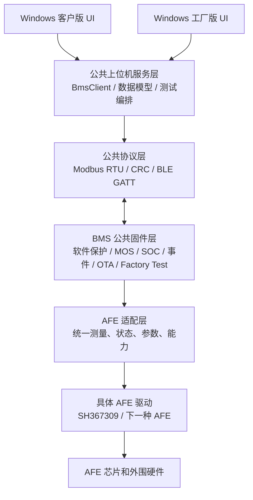

# BMS 模板化架构、通信协议与 AFE 可移植性设计

## 1. 文档目的

本文定义当前 BMS + Windows 上位机项目如何沉淀为可复用模板，目标是：

> 更换 AFE 芯片、AFE 采样驱动或 AFE 硬件保护器件时，尽可能只替换 AFE 适配层和 AFE 专属页面，不修改 BLE、Modbus、基础电池数据模型、软件保护、Factory Test、日志、OTA 和大部分上位机逻辑。

本文同时区分：

- **当前实现**：仓库现有源码已经具备的功能和真实协议；
- **模板目标**：为后续 AFE 替换应冻结的公共契约；
- **迁移工作**：更换 AFE 时必须实际修改或验证的内容。

本文不把目标架构当成当前已完成的代码。当前源码基线为 `codex-mos-protection-coordination`，对应提交 `9c9cca9`。

相关文档：

- `docs/bms_factory_test_design_and_principle.md`：Factory Test 的完整设计和原理；
- `docs/factory_test_protocol.md`：`0x41` Factory Session 协议；
- `docs/bms_windows_joint_maintenance.md`：仓库目录和联合维护规则；
- `docs/sh367309_afe_hw_parameters_modbus.md`：当前 SH367309 AFE 硬件保护参数协议。

## 2. 总体结论

当前工程已经可以抽出一套稳定的公共核心：

```text
BLE 传输
  ↓
Modbus RTU 帧、CRC、寄存器读写
  ↓
BMS 公共数据模型和公共功能
  ↓
软件保护参数/状态
  ↓
Factory Session、RAM 注入、自动测试
  ↓
Windows 客户版/工厂版 UI、日志、报告、OTA
```

真正与 AFE 相关的内容主要集中在：

```text
AFE 芯片初始化、复位、采样、通信状态
AFE 原始硬件保护寄存器读写
AFE 硬件保护状态位
AFE 特有的离散档位、单位和参数编码
AFE 专属页面和专属诊断项
```

但是当前实现还不是完全 AFE 无关模板，主要耦合点包括：

1. 固件使用 `sh367309_datadeal.*`、`SH367309_AfeParam*` 等 SH367309 专用接口；
2. Modbus `0x2400..0x2417` 是当前 SH367309 参数区；
3. AFE 硬件保护状态直接读取 `ram_reg_309.REG_BSTATUS1/2`；
4. Windows 的 `AfeHardwareParameters.cs` 和 `MainWindow.AfeHardwareUi.cs` 包含 SH367309 的参数目录、单位和写入约束；
5. Windows 必须按公共协议读取 32 个单体电压槽位，并用固件约定的 `61001` 无效值判断实际存在的串位，不能把某个产品的串数写死为 10；
6. 一些公共系统状态字段历史上带有项目特定语义，例如 `b1Status_Cool` 在当前 `app.c` 中被作为充电器在线状态使用。

因此，模板化的重点不是重写软件保护或测试协议，而是先建立明确的 AFE 适配边界和能力描述接口。

## 3. 分层架构

### 3.1 推荐分层



### 3.2 层职责

| 层 | 应负责 | 不应负责 |
| --- | --- | --- |
| BLE 传输 | GATT 发现、连接、通知、写入、分包重组、重连 | BMS 寄存器语义、AFE 参数 |
| Modbus 公共协议 | 地址、功能码、CRC、读写帧、异常响应 | 具体 AFE 芯片寄存器编码 |
| BMS 公共固件 | 公共寄存器、身份、实时数据、软件保护、MOS、SOC、事件、OTA、Factory Test | 直接散落调用具体 AFE 寄存器 |
| AFE 适配层 | 统一采样结果、AFE 状态、硬件保护状态、参数能力和参数转换 | BLE、上位机界面、Factory Session |
| 具体 AFE 驱动 | SPI/I2C/GPIO、AFE 芯片命令、原始寄存器、硬件时序 | 软件保护级别、Windows 测试流程 |
| Windows 公共服务 | 公共数据模型、公共寄存器操作、测试编排、报告、日志、OTA | SH367309 专属 UI 逻辑 |
| Windows AFE 插件/页面 | 根据能力描述显示和操作 AFE 专属参数 | 修改公共保护算法和 Factory Test 协议 |

## 4. 当前 BMS 对外功能清单

### 4.1 BLE 传输功能

当前 Windows 通过 BLE GATT 连接 BMS：

- 扫描 `BT_*` 设备；
- 发现 BMS SPP 服务和请求/响应特征；
- 开启响应通知；
- 支持 GATT 写入和通知重组；
- 连接失败时按现有策略重试和重建 GATT；
- 连接后通过 Modbus Probe 读取实时寄存器 magic，确认应用层通信可用；
- OTA 使用 Telink OTA 服务，与普通 Modbus 数据链路分开。

BLE 服务 UUID 和特征处理位于 `BmsBleTransport.cs`、`Ota.cs` 及固件 `app_att.c`。更换 AFE 不应改变 BLE 层。

### 4.2 公共 Modbus 功能码

当前固件 `modbus_on_frame()` 支持：

| 功能码 | 功能 | 方向 | 模板定位 |
| ---: | --- | --- | --- |
| `0x03` | Read Holding Registers | 读 | 公共冻结 |
| `0x06` | Write Single Register | 写 | 公共冻结；写入语义由地址决定 |
| `0x10` | Write Multiple Registers | 写 | 公共冻结；支持参数/蓝牙名/AFE 专属写入 |
| `0x41` | Factory Session | 读写测试 | 公共冻结 |
| `0x7F` | 非广播回显 | 诊断 | 可保留为开发诊断，不作为客户功能依赖 |

通用 RTU 帧：

```text
地址 | 功能码 | 数据 | CRC Lo | CRC Hi
```

CRC16 使用初值 `0xFFFF`、多项式 `0xA001`，低字节在前。地址当前为 `0x01`，广播地址 `0x00` 不回包。

### 4.3 当前公共寄存器区域

以下是当前源码已使用的公共区域。最终模板应把这些区域做成版本化的公共寄存器契约，不允许因更换 AFE 而改变地址和单位。

| 区域 | 当前用途 | 典型访问 | 模板处理 |
| --- | --- | --- | --- |
| `0x0000..0x0002` | 公共 MAC 地址，3 个 word | 读 | 公共冻结 |
| `0x0100..` | 蓝牙名，按 ASCII 两字节一个 word | 读/写 | 公共冻结 |
| `0x2100..0x2140` | MCU 软件保护参数，共 65 个 word | 读/写 | 公共冻结，不能因 AFE 替换而改变 |
| `0xC002..` | 产品序列号 | 读 | 公共冻结 |
| `0xC012..` | 硬件版本 | 读 | 公共冻结 |
| `0xC022..` | 软件版本 | 读 | 公共冻结 |
| `0xD000..0xD03E` | Legacy 电池数据窗口，共 63 个 word | 读 | 公共兼容窗口，谨慎演进 |
| `0xD100..0xD114` | 事件/错误诊断窗口 | 读 | 公共冻结或版本化 |
| `0xD115..0xD118` | 系统状态窗口 | 读 | 公共冻结，但必须明确每一位语义 |
| `0xD120..0xD12A` | Realtime 数据窗口，共 11 个 word | 读 | 公共冻结 |
| `0x2400..0x2417` | 当前 SH367309 AFE 参数 | 读/写 | 应迁移为 AFE 能力/参数接口，不应继续伪装成通用区 |
| `0x41` | Factory Session 和 STATUS | 读写测试 | 公共冻结 |

当前代码对 `0x2100..0x2140` 的写入会调用 `SaveParam()`，因此这是持久化参数区；Factory Test 不使用写参数路径。

### 4.4 当前实时数据线值和上位机显示单位

当前 Windows `BmsClient.ReadBatteryAsync()` 优先读取 `0xD120..0xD12A`。当第一个 word 为实时窗口 magic `0x4253` 时，使用该窗口覆盖 Legacy 中的实时值；SOH、容量、循环次数、最大/最小单体位置、保护字仍从 `0xD000..0xD03E` 读取。

#### Realtime `0xD120..0xD12A`

| 偏移 | 当前字段 | 线值/编码 | Windows 当前解释 |
| ---: | --- | --- | --- |
| `0` | magic | `0x4253` | 判断实时窗口有效 |
| `1` | protocol version | 无符号 word | 保存为协议版本 |
| `2` | pack voltage | 固件 `u16VCellTotle` | `/100.0` 显示为 V；该比例是当前上位机契约 |
| `3` | current | 有符号二补码 word | `/10.0` 显示为 A；正值充电、负值放电 |
| `4` | SOC | 百分比整数 | `%` |
| `5` | temperature max | 温度 raw | `raw/10 - 40` 显示为 ℃ |
| `6` | temperature min | 温度 raw | `raw/10 - 40` 显示为 ℃ |
| `7` | MOS temperature | 温度 raw | `raw/10 - 40` 显示为 ℃ |
| `8` | cell max | mV | 直接显示 mV |
| `9` | cell min | mV | 直接显示 mV |
| `10` | cell delta | mV | 直接显示 mV |

#### Legacy `0xD000..0xD03E` 中当前上位机使用的偏移

| 偏移 | 字段 | 当前解释 |
| ---: | --- | --- |
| `0..31` | 单体电压槽位 | mV；共 32 个协议槽位，`61001` 表示该串不存在，不能参与串数、平均值、最大值、最小值和压差计算 |
| `32/33/36` | 单体最大/最小/压差 | mV |
| `34/35` | 最大/最小单体位置 | 单体序号 |
| `37` | 总压 | 备用实时值；界面同样按 `/100.0` 显示 V |
| `47/48/49` | MOS/温度最大/温度最小 | 温度 raw，按 `raw/10 - 40` 显示 ℃ |
| `50/51` | 充电/放电电流 | 有符号 word；当前回退路径据此组合正充负放 |
| `52/53` | SOC/SOH | 百分比整数 |
| `54/55/56` | 当前/满充/出厂容量 | `/100.0` 显示 Ah |
| `57` | 循环次数 | 整数 |
| `58/59/60` | L1/L2/L3 保护字 | bit mask |

这些比例和索引属于当前公共协议的实际兼容内容。模板化时应把它们写入机器可读协议描述并由固件、Windows、Android/Qt 客户端共同校验；如果新 AFE 的内部单位不同，只允许在 AFE 适配层转换，不能让上位机针对芯片型号分支换算。

### 4.5 BLE 传输和 Modbus 承载

当前 Windows 通过 Telink SPP 风格的 BLE GATT 承载 Modbus RTU：

| 项目 | 当前值 |
| --- | --- |
| Service UUID | `6E400001-B5A3-F393-E0A9-E50E24DCCA9E` |
| 请求特征值 | `6E400002-B5A3-F393-E0A9-E50E24DCCA9E`，Write/Write Without Response |
| 响应特征值 | `6E400003-B5A3-F393-E0A9-E50E24DCCA9E`，Notify |
| 承载数据 | Modbus RTU 请求/响应字节流 |
| MTU 约束 | 默认 ATT MTU 23 时单次 ATT payload 为 20 字节；较长请求需按当前传输层分包/组帧策略处理 |

BLE 只负责传输，不应携带 AFE 芯片逻辑。更换 AFE 时应保持 UUID、请求/响应方向、通知机制和 Modbus 帧格式不变。

### 4.6 Windows 当前公共功能

客户版和工厂版都基于公共 Windows 功能：

1. BLE 扫描、连接、断开、自动重连；
2. 设备身份读取：蓝牙名、MAC、序列号、硬件版本、软件版本；
3. 实时电池数据读取：总压、电流、SOC、SOH、容量、循环次数、温度、MOS 温度；
4. 每串电压、最大/最小单体、压差；
5. 系统状态、MOS 状态、均衡、加热、制冷、AFE 状态；
6. L1/L2/L3 软件保护状态和故障名称解码；
7. 软件保护参数读取、单项写入、批量写入、写后回读校验；
8. SOC 和循环次数写入及校验；
9. 蓝牙名修改及回读校验；
10. 手动寄存器读写和协议诊断日志；
11. 事件日志读取、显示和导出；
12. 长期监控和 Excel 导出；
13. Telink OTA 升级、传输进度、重启后重连验证；
14. 工厂版独有的 Factory Session、自动测试、单项测试、实时有效测量和 JSON 报告。

## 5. BMS 公共软件保护原理

### 5.1 公共输入模型

软件保护不应直接依赖某一 AFE 的寄存器名，而应只读取统一的派生测量模型：

```text
cell_mv[SeriesNum]
cell_max_mv
cell_min_mv
cell_delta_mv
pack_value
charge_current_tenth_a
discharge_current_tenth_a
temperature_max_raw
temperature_min_raw
mos_temperature_raw
soc_percent
afe_ok
afe_hardware_faults
balance_flags
```

当前代码的公共承载对象是 `g_stCellInfoReport`，Factory Test 再通过 `factory_test_get_effective_measurement()` 提供临时有效值。模板化时，建议把“原始采样结构”和“保护有效测量结构”正式分开命名，避免后续 AFE 驱动直接改动软件保护字段。

### 5.2 当前真实保护调用链

```text
App_AFEGet()/MCU ADC
    -> g_stCellInfoReport
    -> factory_test_get_effective_measurement()
    -> soft_protect_update_all()
    -> soft_protect_update_item()
    -> soft_protect_update_level()
    -> soft_protect_update_report()
    -> mos_update()
    -> CHG/DSG MOS 输出
```

`soft_protect_update_all()` 使用的正式保护参数来自 `g_tParam.protect`，当前 13 组保护、每组 5 个字段：一级、二级、三级、恢复、滤波。

### 5.3 公共保护项

| 保护项 | 输入 | 方向 | 软件故障位 | AFE 替换要求 |
| --- | --- | --- | --- | --- |
| 单体过压 | cell max | 高 | `b1CellOvp` | 统一提供单体数组和 max |
| 单体欠压 | cell min | 低 | `b1CellUvp` | 统一提供单体数组和 min |
| 总压过压 | pack | 高 | `b1BatOvp` | 适配层统一总压单位 |
| 总压欠压 | pack | 低 | `b1BatUvp` | 适配层统一总压单位 |
| 充电过流 | charge current | 高 | `b1IchgOcp` | 统一为 0.1 A |
| 放电过流 | discharge current | 高 | `b1IdischgOcp` | 统一为 0.1 A |
| 充电高温 | temp max | 高 | `b1CellChgOtp` | 统一温度 raw 编码 |
| 充电低温 | temp min | 低 | `b1CellChgUtp` | 统一温度 raw 编码 |
| 放电高温 | temp max | 高 | `b1CellDischgOtp` | 统一温度 raw 编码 |
| 放电低温 | temp min | 低 | `b1CellDischgUtp` | 统一温度 raw 编码 |
| MOS 高温 | MOS temp | 高 | `b1TmosOtp` | MCU ADC/MOS 传感器不是 AFE 专属时保持独立 |
| 单体压差 | cell delta | 高 | `b1VcellDeltaBig` | 适配层计算或提供 delta |
| SOC 低 | SOC | 低 | `b1SocLow` | SOC 算法输入保持公共 |

### 5.4 哪些保护逻辑不应随 AFE 改动

除非产品需求本身变化，以下逻辑应保持不变：

- 三级保护的 `active/pending` 状态机；
- 滤波时间、恢复条件和阈值关系；
- 一级/二级离开触发条件即解除的语义；
- 三级非过流保护使用恢复值的语义；
- 三级充/放电过流约 30 秒自动重试的语义；
- 软件三级保护参与 MOS 允许/关断；
- AFE 硬件保护与 MCU 软件保护的独立性；
- AFE 通信异常时不使用无效值误恢复软件保护；
- Factory Test 只替换保护输入，不修改正式参数和原始采样。

如果新 AFE 的硬件保护行为不同，应在 AFE 适配层输出统一的硬件状态，不应把新 AFE 特殊判断散落进 `soft_protect_update_all()`。

## 6. Factory Test 公共契约

### 6.1 为什么 Factory Test 可以复用

Factory Test 的测试对象不是 AFE 寄存器，而是软件保护的统一输入和输出：

```text
注入 cell/pack/current/temp/mos-temp/SOC
    -> 公共有效测量模型
    -> 公共软件保护状态机
    -> L1/L2/L3 故障位和 MOS 状态
```

只要新 AFE 适配层能够稳定产生统一测量模型，自动测试和单项测试就不应因 AFE 更换而改变。

### 6.2 固定协议

`0x41` 应作为所有模板产品的工厂协议：

| 命令 | 作用 |
| ---: | --- |
| `0x01 OPEN` | magic 鉴权，建立临时会话，返回 token、超时、协议版本、串数 |
| `0x02 HEARTBEAT` | 刷新心跳，返回剩余秒数 |
| `0x03 INJECT` | 注入单体、总压、电流、温度、MOS 温度或 SOC |
| `0x04 CLEAR` | 清除所有 RAM 注入 |
| `0x05 CLOSE` | 清除并关闭会话 |
| `0x06 STATUS` | 返回有效测量、注入掩码、L1/L2/L3 和 MOS 状态 |

新 AFE 不应新增一套不同的工厂测试协议。AFE 专属硬件保护验证可以增加独立的 AFE capability/diagnostic 接口，但不能改变公共软件保护测试的 `0x41` 命令和 STATUS 字段。

当前协议的关键固定约束如下：

- `OPEN` magic 为大端 `0x46414354`，成功后返回随机 token、8 秒超时、协议版本和实际串数；
- 除 `OPEN` 外所有命令必须携带有效 token；`CLEAR` 清除注入，`CLOSE` 清除注入并关闭会话；
- 会话在 BLE 断连、心跳超时和复位后自动清除；
- `INJECT` 类型为：`1 cell mV`、`2 pack cV`、`3 current 0.1A`（有符号，正充负放）、`4 temp raw`、`5 MOS temp raw`、`6 SOC %`；
- 单体注入会重新计算 max/min/delta 和派生总压，显式 pack 注入优先；
- 注入只改变软件保护的有效输入，不改 AFE/ADC raw、不改正式保护参数、不写 Flash。

`STATUS` 的公共字段顺序为：

```text
token
injection_mask
cell_max_mv, cell_min_mv, cell_delta_mv
pack_cv
charge_current_tenth_a, discharge_current_tenth_a
temperature_max_raw, temperature_min_raw, mos_temperature_raw
soc_percent
protection_level1, protection_level2, protection_level3
mos_state (bit0=充电 MOS，bit1=放电 MOS)
```

Windows 工厂版应把 `SeriesCount`、`injection_mask`、有效测量和保护状态写入报告，不能只报告“通过/失败”。

### 6.3 自动测试保持不变的条件

更换 AFE 后，下列条件满足即可复用 `FactoryTestEngine`：

- `OPEN` 返回正确 `SeriesNum`；
- `STATUS` 的有效测量单位和保护输入语义不变；
- 充放电方向编码不变；
- 温度 raw 编码不变；
- 公共 L1/L2/L3 故障位不变；
- `mos_state` bit0/bit1 仍表示充电/放电 MOS；
- AFE 通信异常不会让公共测量对象进入误有效状态；
- CLEAR、CLOSE、断链、超时、复位仍能清除注入。

## 7. 当前 SH367309 耦合点

更换 AFE 前应按以下清单处理，而不是直接在公共逻辑中替换宏名。

### 7.1 固件耦合

| 当前耦合 | 位置 | 处理方式 |
| --- | --- | --- |
| SH367309 数据驱动 | `sh367309_datadeal.c/.h` | 保留为一个具体 AFE driver，公共层禁止直接调用其内部寄存器 |
| AFE 参数读写 | `SH367309_AfeParamReadReg/WriteRegs` | 移入 `afe_adapter` 接口，实现 SH367309 backend |
| AFE 参数地址 | `SH309_AFE_PARAM_REG_BASE..END`，当前映射 `0x2400..0x2417` | 作为 SH367309 backend 的兼容地址或迁移到能力描述协议 |
| AFE 硬件状态 | `ram_reg_309.REG_BSTATUS1/2` | 转换为统一 `afe_hardware_faults`，公共层不读 `ram_reg_309` |
| AFE 初始化 | `AFE_Reset()`、`AFE_IsReady()`、`App_AFEGet()` | 提取为 `afe_init/afe_read_measurement/afe_get_status` |
| AFE 错误 | `ERROR_STATUS_AFE1/AFE2` | 统一成 `afe_ok` 和 AFE 实例状态，保留多 AFE 扩展空间 |
| AFE EEPROM/参数异步更新 | `AFE_PARAM_WRITE_Flag` 及相关流程 | 由 adapter 返回写入结果和完成状态，公共 Modbus 不等待芯片细节 |
| AFE 特有离散档位 | SH367309 参数编码和离散档位 | 放在 AFE capability/codec，不进入公共软件保护参数模型 |

### 7.2 Windows 耦合

| 当前耦合 | 位置 | 处理方式 |
| --- | --- | --- |
| SH367309 参数目录 | `BmsFactoryTest.Windows/AfeHardwareParameters.cs` | 改成 capability 驱动的参数描述；SH367309 只提供一份 descriptor |
| SH367309 参数页 | `MainWindow.AfeHardwareUi.cs` | 页面通用化，标题、参数、单位、范围、离散值由 descriptor 提供 |
| AFE 参数地址 | `ModbusRtu.cs`/ `BmsClient.cs` 及地址常量 | 公共客户端只处理抽象 AFE 参数服务，不硬编码具体寄存器意义 |
| AFE 状态显示 | `BatterySnapshot`/主窗口状态文字 | 使用统一 AFE 状态模型，具体芯片状态放到可选扩展区 |
| 串数 | `BmsRegisters.CellVoltageSlotCount` / `MissingCellVoltageMv` | 固定读取 32 个协议槽位，以 `61001` 过滤实际不存在的串，并保留原始槽位编号 |
| 保护参数工程量单位 | `ProtectionParameter.cs` | 继续使用公共保护参数单位，不随 AFE 变化 |

## 8. 模板目标：AFE 适配层接口

### 8.1 固件接口建议

建议新增一个公共头文件，例如 `afe_adapter.h`，公共 BMS 层只依赖以下抽象：

```c
typedef struct
{
    uint16_t cell_mv[AFE_MAX_SERIES];
    uint16_t cell_max_mv;
    uint16_t cell_min_mv;
    uint16_t cell_delta_mv;
    uint16_t pack_value;
    uint16_t charge_current_tenth_a;
    uint16_t discharge_current_tenth_a;
    uint16_t temperature_max_raw;
    uint16_t temperature_min_raw;
    uint16_t mos_temperature_raw;
    uint16_t soc_percent;
    uint8_t  afe_ok;
    uint16_t hardware_faults;
    uint16_t balance_flags;
} bms_measurement_t;

typedef struct
{
    uint8_t present;
    uint8_t ready;
    uint8_t channel_count;
    uint8_t supports_hardware_protection;
    uint8_t supports_balance;
    uint8_t supports_temperature;
    uint16_t protocol_version;
    uint32_t capability_bits;
} afe_capability_t;

int afe_adapter_init(void);
int afe_adapter_reset(void);
int afe_adapter_poll(bms_measurement_t *measurement);
int afe_adapter_get_capability(afe_capability_t *capability);
int afe_adapter_get_hardware_status(uint16_t *faults);
int afe_adapter_read_param(uint16_t logical_id, uint16_t *value);
int afe_adapter_write_param(uint16_t logical_id, uint16_t value);
int afe_adapter_apply_pending(void);
```

上述代码是接口设计示意，不是当前仓库中已经存在的 API。实现时必须按当前工程的 `u8/u16/UINT8/UINT16` 类型体系和实际 AFE 驱动调用约定落地。

### 8.2 接口原则

- `afe_adapter_poll()` 输出统一工程单位，公共保护层不做芯片单位换算；
- AFE 原始寄存器只在具体 backend 内部出现；
- AFE 参数使用逻辑 ID，而不是让公共层知道 `0x2400` 代表哪个 SH367309 位域；
- `afe_adapter_write_param()` 必须明确“只校验”“已写芯片”“已持久化”“待应用”四种状态；
- 新 AFE 不支持某能力时返回 capability 关闭和明确的 unsupported 状态；
- 不能用 0 值同时表示“芯片不支持”“通信失败”“参数关闭”和“真实测量为 0”；
- 多 AFE 产品应保留 `afe_id`/实例编号，但公共软件保护仍读取合并后的标准测量模型。

### 8.3 数据有效性

公共层至少需要区分：

```text
AFE_NOT_PRESENT
AFE_NOT_READY
AFE_COMM_ERROR
AFE_DATA_INVALID
AFE_DATA_VALID
```

保护逻辑的策略应保持当前原则：通信或数据无效时不能使用错误清零值来解除已经存在的保护。这个规则属于公共安全逻辑，不应交给具体 AFE 驱动自行决定。

## 9. 模板化 AFE 参数协议

### 9.1 当前问题

当前 `0x2400..0x2417` 是 SH367309 专用区域，Windows 通过固定参数表解释地址、单位、范围、离散档位和写入行为。若下一种 AFE 沿用这段地址但字段含义不同，会造成严重误写。

### 9.2 推荐方案

公共协议保留两类接口：

```text
公共软件保护参数
    0x2100..0x2140，地址和单位冻结

AFE 能力/参数服务
    逻辑参数 ID + descriptor + read/write/apply 状态
```

AFE 参数 descriptor 至少包含：

| 字段 | 作用 |
| --- | --- |
| `afe_id` | AFE 型号或适配器 ID |
| `logical_id` | 稳定逻辑参数 ID |
| `name` | 显示名称 |
| `group` | 参数分组 |
| `value_kind` | 电压、电流、温度、延时、离散档位等 |
| `unit_scale` | 工程值与 raw 值换算 |
| `min/max/step` | 连续参数约束 |
| `enum_values` | 离散档位及其显示值 |
| `read_only` | 是否只读 |
| `persistent` | 写入是否持久化 |
| `apply_mode` | 立即、异步、复位后生效 |
| `capability_bit` | 当前硬件是否支持 |

在协议尚未升级前，至少要做到：

- 不同 AFE 不复用相同 SH367309 地址含义；
- Windows 读取硬件版本/AFE ID 后再启用对应参数页面；
- 不识别的 AFE 不显示可写参数，不允许误写；
- AFE 参数页不能调用公共软件保护参数写入路径。

## 10. 上位机模板化设计

### 10.1 公共服务层

以下内容应保持 AFE 无关并进入公共服务层：

- `BmsBleTransport`；
- `ModbusRtu` 的 CRC、帧构造、响应长度和异常处理；
- `BmsClient` 的连接、身份、实时数据、软件保护参数、SOC、循环、名称、日志、OTA；
- `BatterySnapshot` 公共数据模型；
- `FactorySession`、`FactoryStatus`、`FactoryTestEngine`；
- 自动重连、诊断日志和 JSON 报告；
- 公共实时监控、保护参数、专业调试、事件日志、OTA 页面。

### 10.2 AFE 插件层

以下内容应由 AFE descriptor/backend 提供：

- AFE 型号、版本、通道数、是否支持硬件保护；
- AFE 硬件保护参数目录；
- 工程单位、raw 编码、合法范围、步进和离散档位；
- AFE 硬件故障位的名称和解释；
- AFE 参数是否持久化、是否异步应用；
- AFE 特有诊断寄存器或状态项。

### 10.3 UI 行为

```text
连接设备
  -> 读取公共身份和公共能力
  -> 读取 AFE ID/capability
  -> 公共页面始终可用
  -> AFE 页面按 capability 动态加载
  -> 不支持时只读显示“不支持”，不出现可写控件
```

工厂页面中的公共软件保护测试不得依赖 AFE 页面是否存在。AFE 硬件保护测试可以是可选测试组，只有 capability 声明支持时才显示和执行。

## 11. 更换 AFE 的迁移流程

### 阶段 A：确认公共契约

- 确认新 AFE 能提供所有公共软件保护输入：单体、总压、电流、温度、MOS 温度、SOC；
- 确认总压、电流、温度的工程单位和 raw 编码可以转换到当前公共单位；
- 确认公共 `0x2100..0x2140` 软件保护参数不需要改地址；
- 确认 `0x41 STATUS` 的输入和保护位语义不变；
- 确认串数从固件能力动态传递到上位机；
- 确认新 AFE 的硬件保护不会被误当成软件保护。

### 阶段 B：实现固件 backend

1. 新建 `afe_<vendor>_<part>.c/.h`；
2. 实现初始化、复位、ready、周期采样、通信错误检测；
3. 将 raw cell、pack、current、temperature 转成统一 `bms_measurement_t`；
4. 输出 AFE 硬件故障和 capability；
5. 实现逻辑参数 ID 到芯片寄存器/位域的转换；
6. 把公共代码中直接访问 SH367309 的地方收敛到 adapter；
7. 通过源码检查、编译、链接、verify；
8. 用断链、复位、AFE 通信异常验证清理和保护保持逻辑。

### 阶段 C：更新协议能力

- 若公共实时数据无需变化，保持 `0xD120..0xD12A` 不变；
- 若 AFE 专属参数不同，新增 capability/descriptor，不覆盖 SH367309 字段含义；
- 返回实际 `SeriesNum`、AFE ID、能力版本；
- 对不支持的 AFE 参数返回明确异常，不返回 0 伪装成功；
- 更新协议版本和文档，但不要无必要地改变 Factory Test `0x41`。

### 阶段 D：更新 Windows

- 按 `BmsRegisters.CellVoltageSlotCount=32` 读取全部电压槽位，并按 `MissingCellVoltageMv=61001` 过滤无效串位；
- 公共 `BatterySnapshot` 继续保持相同字段和单位；
- 将 SH367309 参数目录变成 descriptor provider；
- 保留公共保护参数、软件保护状态、Factory Test、日志、OTA；
- 只有 AFE capability 支持时才显示对应硬件参数页；
- 将 AFE 专属故障位放在 AFE 状态区域，不污染公共 L1/L2/L3 解码；
- 分别构建客户版和工厂版，确认客户版没有工厂测试入口。

### 阶段 E：验收

按以下顺序验收：

1. BLE 扫描、连接、通知、重连；
2. 身份和 capability 读取；
3. 公共实时数据和每串数据；
4. 软件保护参数读写和回读；
5. 软件保护 L1/L2/L3 触发、恢复和 MOS；
6. Factory Test 全流程和任一单项测试；
7. Factory CLEAR、CLOSE、断链、超时、复位清理；
8. AFE 硬件保护参数和硬件故障；
9. 事件日志、长期监控、OTA；
10. 多台不同 AFE/不同串数设备连续测试和报告隔离。

## 12. 兼容性和版本策略

### 12.1 协议版本

公共协议应至少分为：

```text
TransportVersion  BLE/GATT 传输兼容性
ModbusVersion     公共 Modbus 寄存器和功能码
FactoryVersion    Factory Session 0x41
CapabilityVersion AFE 能力和 descriptor
FirmwareVersion   产品固件版本
```

不能仅通过软件版本字符串判断所有能力。上位机应读取 capability，并对缺少 capability 的设备降级显示。

### 12.2 向后兼容

- 保留现有 `0x03/0x06/0x10` 公共读写语义；
- 保留 `0xD000` Legacy 窗口供旧客户端使用；
- 优先使用 `0xD120` Realtime 窗口，依据 magic `0x4253` 判断；
- 保留旧设备的固定身份寄存器读取；
- Factory Test 协议通过协议版本和返回串数协商，不通过猜测设备型号；
- AFE 专属功能缺失时，公共页面和软件保护仍应可运行。

### 12.3 数据模型版本

公共测量数据字段一旦发布，不应因换 AFE 改变含义。新增字段应：

- 增加版本或 capability 位；
- 保留旧字段；
- 明确无效值和有效标志；
- 同时更新固件、Windows、Android/Qt 等其它客户端（如果仍维护）。

## 13. 当前需要优先整改的模板化事项

按风险和收益排序：

### 已完成：32 槽位与无效串位处理

当前公共协议由固件 `g_stCellInfoReport.u16VCell[32]` 提供 32 个电压槽位。配置串数小于 32 时，固件将不存在的槽位写为 `61001`。Windows 已按以下规则处理：

- 固定读取 `0xD000..0xD01F` 的 32 个单体电压槽位；
- `61001` 不计入有效串数、平均值、最大值、最小值和压差；
- 保留原始槽位编号，避免中间串位缺失时发生编号压缩；
- 客户版和工厂版均显示“有效串数 / 32”，并只显示有效串位。

Factory Session 的 `OPEN.SeriesNum` 仍可用于工厂协议一致性检查，但不能替代公共电压槽位的 `61001` 有效性判断。

### P0：抽离 AFE 直接访问

公共 `app.c` 不应直接出现 `ram_reg_309`、SH367309 专用状态位和参数转换。应先建立 adapter，再把 SH367309 接到 adapter 上。这样能在不改变软件保护的情况下替换 AFE。

### P1：AFE 参数 descriptor 化

将 `AfeHardwareParameters.cs` 中的静态 SH367309 表拆为：

```text
公共参数行模型
    + AFE capability provider
    + AFE 参数 descriptor
    + AFE 读写 codec
```

页面布局和确认/回读流程保留，参数名称、单位、范围和编码由 descriptor 提供。

### P1：统一公共状态语义

对 `SystemStatus` 每一位形成正式表格，区分：

- 软件 MOS 允许状态；
- 实际 MOS 驱动反馈；
- AFE 硬件保护；
- 充电器在线、加热、制冷、均衡；
- AFE 通信状态。

避免历史名称与真实语义不一致时被新 AFE 继续复用。

### P1：公共协议描述文件

建议新增机器可读的协议描述，例如 `protocol/bms_public_registers.json`，由固件检查工具和 Windows 生成/校验：

- 地址、数量、读写权限；
- 单位和缩放；
- 版本；
- 字段名；
- 故障位名称；
- capability 依赖。

这样可以减少固件和多个上位机手工维护同一寄存器表造成的漂移。

## 14. 测试策略

### 14.1 不依赖具体 AFE 的测试

这些测试在所有 AFE backend 上都应复用：

- Modbus CRC、长度、异常响应；
- 身份读取；
- 公共实时窗口；
- 公共保护参数读写校验；
- 软件保护 L1/L2/L3；
- 软件保护恢复；
- MOS 软件允许/关断；
- Factory Session 鉴权、心跳、超时、清理；
- Factory 注入 cell/pack/current/temp/mos-temp/SOC；
- 自动测试、单项测试、报告和 finally；
- BLE 断开、复位后状态隔离。

### 14.2 AFE 专属测试

以下必须由对应 AFE backend 和硬件完成：

- AFE 上电、复位、ready；
- AFE 通信错误、重试、恢复；
- AFE 原始 cell/pack/current/temp 采样精度；
- AFE 硬件 OVP/UVP/OCP/OTP/UTP/短路保护；
- AFE 参数寄存器读写、合法范围、离散档位；
- AFE 参数持久化和异步应用；
- AFE 平衡控制；
- AFE 多芯片级联或多实例；
- AFE 硬件故障与 MCU 软件保护的独立性。

### 14.3 模板准入标准

新 AFE 只有同时满足以下条件，才允许复用同一工厂上位机发布：

- 公共协议回归通过；
- 公共数据模型单位一致；
- 软件保护 Factory Test 通过；
- AFE capability 与实际硬件一致；
- 不支持的功能不会显示为可写成功；
- 断连、超时、复位清理通过；
- 客户版和工厂版功能边界通过；
- 生成固件、EXE、报告和版本清单可追溯。

## 15. 版本交付清单

每一种新 AFE 产品交付时，建议归档：

```text
产品/AFE 型号
固件 commit 和 branch
Windows 客户版 commit
Windows 工厂版 commit
AFE capability descriptor
公共协议版本
AFE 参数 descriptor
固件 BIN 和 SHA-256
Windows EXE 和 SHA-256
公共协议回归报告
Factory Test 报告样本
AFE 硬件保护测试报告
未验证项和已知限制
```

报告中必须注明实际串数、AFE 型号、硬件版本、软件版本、Factory 协议版本和测试夹具条件。

## 16. 最终模板原则

以后更换 AFE 时，代码修改范围应尽量收敛为：

```text
必须修改：
  AFE driver
  AFE adapter
  AFE capability/parameter descriptor
  AFE 专属 UI（如果存在）
  AFE 专属测试和文档

原则上不修改：
  BLE 传输
  Modbus CRC/公共功能码
  公共寄存器和实时数据模型
  软件保护状态机
  MOS 公共策略
  Factory Session/INJECT/STATUS
  自动测试和单项测试编排
  日志、报告、OTA、客户版页面
```

达到这个目标的前提，是先完成本文第 13 节中的串数动态化、AFE 直接访问抽离、AFE 参数 descriptor 化和公共状态语义固化。未完成这些整改前，新增 AFE 仍可能需要修改公共 BMS 或 Windows 逻辑，不能把当前工程直接宣称为完全通用模板。
