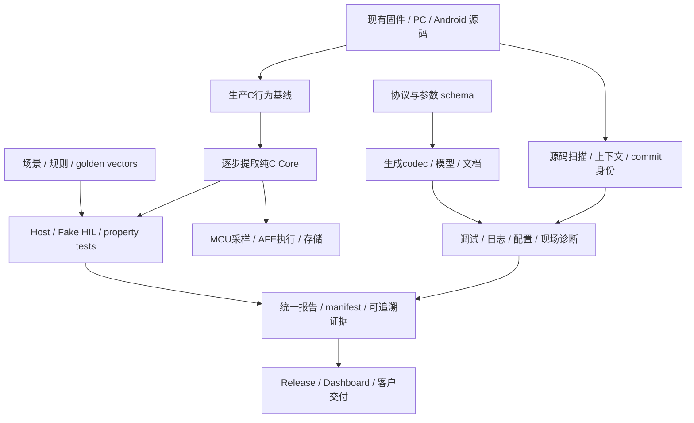

# 40 项 Embedded 工程统一路线

用户确认范围：按全部 40 项推进，本次先建立统一路线和第一批可运行工具。此文记录全部需求的归属和验收顺序，不把规划项当成已完成产品。原始需求保存在 REQUESTS.md。

## 共用基础



统一交换数据先使用有 schema_version 的 JSON；场景可选 YAML。源身份至少包括 commit、工作树状态、内容 SHA256。报告中的真实值、测量值、模型输出和推测必须分开。先 CLI 离线，再桌面 UI，不建立账号系统。独立开源工具待接口稳定后拆仓；本批在当前仓库 dogfood，未创建远端仓库或发布。

## 实施批次

| 批次 | 交付 | 验收门槛 |
|---|---|---|
| A，本次 | 生产保护 Host、Fake HIL、场景/属性报告、架构/上下文 MVP | 原生 Windows 编译运行、正反用例、当前项目 dogfood、CI 配置 |
| B | 纯 C Core / SOC / backend 资格、协议 SDK / 20 参数 schema / golden vectors | 旧/新算法逐样本差分；协议单位/地址/字节序及旧 Flash 兼容证据 |
| C | HEX/串口/双通道/CRC/CAN、日志规则和客户/现场诊断 | 合成与实采 golden log，掉帧/坏 CRC/时钟不一致；离线安装包 |
| D | ELF/MAP/HEX/OBJ 体积与 binary diff、review/impact/docs/release | GCC/ARMCC/ARMClang 真实样本；无数据时显示未知，不伪造 symbol 精度 |
| E | 多仓库/产品 Dashboard、知识库、tutor、项目模板/环境 | 仅授权仓库；commit/时间/产品组件版本；生成项目可构建 |
| F | 真 HIL、数字孪生、故障注入、删除批次 | 隔离/限流与校准、实板；关闭注入的生产产物无残留；逐批差分/资源回归 |
| G | 独立产品、官网、Free/Pro 原型和客户基础设施 | Windows release、公开样本、竞品研究、离线许可；基本功能持续可用 |

批次有依赖，不要求所有工具一起发布。每项进入实现时以实际仓库、工具链、样本和硬件证据重新确认。任何生产固件生成/烧录、远程发布和客户交付应沿对应任务的具体范围执行。

## 全部需求登记

“本批部分”表示已有可运行子集，后续要求仍待交付。软件报告通过不代替实板签核。

| # | 需求 | 批次 / 依赖 | 当前状态与后续验收 |
|---:|---|---|---|
| 1 | BMS PC 仿真器 / 纯 C Core | A→B | 本批部分：12保护执行生产C；SOC/Sleep/重入Core/后端恢复待迁移 |
| 2 | 低成本 HIL | A→F，1/3 | 本批部分：Fake逻辑backend；硬件选型/隔离/校准/真backend待实施 |
| 3 | 通用协议 SDK | B | 待：核对PC/Android唯一真源，schema、C/Python/TS/Kotlin与golden |
| 4 | BMS 工程师工具箱 | C，3/5/15 | 待：沿用现有上位机功能，补通用离线工具与安装包 |
| 5 | Log Analyzer | C，3 | 待：rules.yaml、窗口/事件、规则验证、HTML |
| 6 | Firmware Size Explorer | D | 待：ELF/MAP/OBJ/HEX、工具链样本、模块归因与预算 |
| 7 | Map 可视化 | D，6 | 待：共用解析器，treemap/symbol/module diff、release |
| 8 | Architecture Scanner | A→D | 本批词法MVP：清单、候选依赖/风险；AST、重复逻辑/栈/死码证明待扩展 |
| 9 | repo-context | A→E，8 | 本批MVP：四种上下文文件、Git文件diff；通用构建识别/MCU/AFE确定性提取待扩展 |
| 10 | 参数 schema | B，3 | 待：20参数、单地址源、范围/依赖/版本/迁移/CRC，旧设备fixture |
| 11 | Fault Injection | F，1/2 | 待：注入开关、故障边界、协议控制；生产关闭后对象/符号审计 |
| 12 | Firmware Fuzzer | A→B/F，1/3/10 | 本批部分：固定seed随机属性；libFuzzer/AFL、帧/参数fuzz、最小反例待扩展 |
| 13 | 自动文档 | D，3/8/10/39 | 待：生成区与人工认证区分离，Markdown/HTML/PDF |
| 14 | Release 工厂 | D，3/6/10/13 | 待：沿现有bms_tools/OTA格式接入tag流水线、产物身份/CRC/manifest |
| 15 | 轻量串口 / 双通道 | C，3 | 待：raw日志、frame gap、CRC、时间对齐、Windows EXE |
| 16 | Serial Logic Analyzer | C/F，15 | 待：采集协议、模拟时轴、DE/gap分析，之后真采集硬件 |
| 17 | PR Review Bot | D，6/8/37 | 待：diff风险与测试提示；发PR评论仅在获授权的任务执行 |
| 18 | AI Review Dashboard | E，6/8/9/37 | 待：本地repo状态/测试/资源/风险，生成审核prompt |
| 19 | 工程知识库 | E，8/9 | 待：实体/标签/源码引用；仅用户授权仓库，不改Codex全局记忆 |
| 20 | 多仓库产品驾驶舱 | E，3/10/14 | 待：产品组织、Actions/releases、组件协议/参数版本匹配 |
| 21 | BMS Project Generator | E，1/3/10/30 | 待：简单模板、MCU/AFE capability、host可构建例程 |
| 22 | Configuration Studio | B/C，10/14 | 待：schema校验、JSON/Header；Flash image需要确定布局/版本 |
| 23 | CAN/Modbus协议转换网关 | B/C/F，3/10 | 待：JSON映射、PC模拟、Modbus↔CAN↔MQTT↔BLE，再接MCU硬件 |
| 24 | BMS Black Box Logger | C/F，3/5/15 | 待：记录格式、PC Reader、模拟Firmware；SD环形缓存故障前后各5分钟 |
| 25 | 副业工具产品 / 竞品 | G，4/6/7/15/31/33 | 待：主来源竞品研究、离线MVP产品化、截图、Windows打包 |
| 26 | 客户版报告 | C，5/27 | 待：事实/可能原因分区，参数/version/log交叉验证，PDF/HTML |
| 27 | Field Diagnostic Bundle | C，3/5/10 | 待：一键只读采集、版本/状态/AFE/SOC/校准/counter、zip诊断 |
| 28 | Digital Twin | F，1 | 待：简化电池闭环、SOC/电阻/OCV与模型误差标识 |
| 29 | Firmware Tutor | E，8/9/19 | 待：源码学习路径/问题/练习、个人进度与项目dogfood |
| 30 | 通用嵌入式模板 | E | 待：host样例、CMake/GCC、静态检查、metadata、渐进平台接入 |
| 31 | Binary Inspector | D/G，6 | 待：bin/hex/elf、range/gap/vector/string/entropy/CRC/地址diff |
| 32 | 协议逆向辅助 | C/G，15/33 | 待：聚类/固定字段/counter/endian/CRC候选，推测置信与反例 |
| 33 | CRC/Checksum Explorer | C/G | 待：离线多帧候选匹配、CLI/GUI、已知golden |
| 34 | 产品官网 | G，24/25 | 待：静态站/下载/Release版本/icon/截图/自动部署 |
| 35 | License prototype | G | 待：本地签名验证原型、Free/Pro界限，不向现有工具植入限制 |
| 36 | 个人公司基础设施 | E/G，14/26/30 | 待：轻量客户目录CLI和需求/设计/交付/RCA模板 |
| 37 | Change Impact Report | D，8/9/39 | 本批部分：Git文件diff入口；函数/参数/协议/保护影响推导待扩展 |
| 38 | 安全删除专项 | F，6/8/39 | 待：固定baseline、候选表、每次小删除及build/size/行为差分 |
| 39 | Safety Property | A→B/F，1 | 本批部分：MOS阻断等seed属性和恢复固定案例；SOC/新Core/缩减反例待扩展 |
| 40 | 统一开发体验 | E，30 | 待：VSCode/CMake/compiler/debug工具渐进指南，保留Keil/TC32生产权威 |

## MCU 接入目标

```text
MCU定时采样 / AFE有效性与物理状态
    -> bms_input_t（带时戳、单位、valid，不含寄存器）
    -> bms_core_step(context, params, input)
    -> bms_command_t / event / persist_request
    -> 现有AFE/board/Flash执行函数
    -> 执行结果/下一次有效采样反馈
```

目标只需要 init、step、参数校验及持久状态载入/导出等少量接口，不引入运行时factory或多层service。每设备context独立，配置/测量/运行状态分开。Core不执行Flash、不等待I2C/SPI、不清芯片锁存、不代替AFE硬件保护。

迁移次序：冻结生产基线 → 当前Host建立行为golden → 软件滤波状态与测量改为context/input → 旧接口薄接入且逐样本差分 → SOC迁移（资格/存储请求拆开） → guard/MOS请求仲裁提取 → Sleep只提取许可判定，MCU仍执行PM。只有差分与实板证据齐全才移除旧入口。

## 后续删除候选与条件

| 候选 | 可以删除的条件 |
|---|---|
| AFE backend中的重复软件三级阈值算法 | 所有真实编译产品均走同一个Core，状态/边界差分一致 |
| 临时生成param.h的Host桥接 | 正式纯C参数类型/接口稳定，MCU/Host共用同一源码 |
| PC/Android重复寄存器地址/codec | 从唯一schema生成，旧设备golden帧和write事务兼容 |
| 参数默认值/min/max/文档的重复表 | schema生成已接入各端，旧Flash迁移fixture通过 |
| 多份map/size/log解析脚本 | 共用解析器支持全部真实样本，历史报告可回放 |
| 无效产品compat wrapper/死功能 | 核对source order、调用、状态副作用、MAP与差分；小批次删除 |

保留：芯片SC/load/body-diode/WDT时序、SPI/I2C寄存器编码、Flash掉电事务、PM进入/唤醒、boot/OTA边界。它们是实际安全职责，不是因为Core出现就能删除。

## CI 与 fuzzer 技术依据

Host matrix与产物上传按 [GitHub Actions 官方 workflow syntax](https://docs.github.com/en/actions/reference/workflows-and-actions/workflow-syntax) 配置。本批随机属性不是coverage-guided fuzz；后续使用 [LLVM libFuzzer](https://llvm.org/docs/LibFuzzer.html)，UB检查按 [Clang UBSan](https://clang.llvm.org/docs/UndefinedBehaviorSanitizer.html) 接入。
