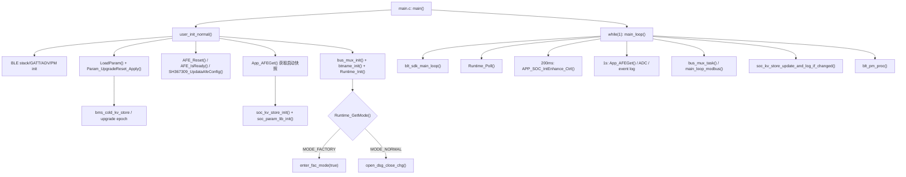

# ble_sample 项目源码逻辑全量梳理与风险审查

日期：2026-05-24

## 1. 文档定位

本文以 `tc_ble_single_sdk/vendor/ble_sample` 源码为准，梳理 `ble_sample` 的启动链路、主循环调度、SOC、KV 存储、老化工厂模式、低功耗、BLE/Modbus 通信路径，并记录源码审查中发现的疑似 bug 与验证建议。

建议长期维护方式：

- `ble_sample_full_logic_review_20260524.md` 作为可 diff、可长期维护的源文档。
- `ble_sample_full_logic_review_20260524.html` 作为便于浏览、评审、归档的阅读版。
- SOC 用户体验、校准策略和可调参数详见 `soc_user_experience_tuning_20260524.md`。

## 2. 结论摘要

当前工程的核心运行模型是：

- `main.c` 完成 32k 时钟、wakeup、RF、GPIO、系统时钟、watchdog 初始化，然后进入 `user_init_normal()` 或 `user_init_deepRetn()`，最终无限循环调用 `main_loop()`。
- `user_init_normal()` 先初始化 BLE stack，再初始化 BMS 外设、参数、事件日志、AFE、ADC、SOC KV、SOC 算法、通信总线、BT 名称、Runtime 老化计时，最后根据充电唤醒或 Runtime 工厂状态决定 MOS 控制策略。
- `main_loop()` 每轮执行 BLE stack、`Runtime_Poll()`、总线任务、SOC KV 即时持久化、低功耗处理；其中 200ms 周期执行 SOC 更新和充电/key 逻辑，1s 周期采集 AFE/ADC 并刷新事件日志。
- SOC 算法采用 “电流积分 + 端点/OCV 修正 + real/display 分离 + SOH/循环次数” 的组合方式，真实 SOC 每次修正最多 1%，对外显示 SOC 再按约 1s/1% 平滑跟随。
- Flash 存储分为 `flash_kv32` 通用 append-only KV、`soc_kv_store` 热数据、`bms_cold_kv_store` 冷参数、`runtime` 老化计时记录、event log 等区域。
- 低功耗分两层：一层是主动 `DEEPSLEEP_MODE`，另一层是 BLE suspend + `enter_rtc_mode()` 关闭 ADC 相关电源。老化模式允许 deep sleep，但不允许 RTC mode，且 deep sleep 时间不补偿进老化 runtime。

本次源码审查发现 4 个需要优先处理或确认的问题：

| ID | 优先级 | 模块 | 结论 |
| --- | --- | --- | --- |
| BUG-001 | P0 | 全局数据/链接 | `g_stCellInfoReport` 在 `app.c` 和 `modbus_rtu.c` 中重复定义，存在链接失败或 common symbol 依赖风险。 |
| BUG-002 | P1 | 老化工厂模式 | Modbus 写 `0x1102 = 0x0003` 只调用 `enter_fac_mode(true)`，没有重置/进入 `Runtime` 工厂计时状态；老化完成后再次写入可能只打开 MOS，不会重新计时，也不会按工厂模式禁止 RTC mode。 |
| BUG-003 | P1 | 低功耗命令 | Modbus 写 `0x1102 = 0x000A` 只设置 `deepsleep_en = true`，但 `blt_pm_proc()` 中相关判断已注释，命令实际不触发 deep sleep。 |
| BUG-004 | P1/P2 | SOC OCV | OCV 表覆盖到 `4180mV = 100%`，但 OCV 有效样本最大值是 `4000mV`，4000mV 以上 OCV 样本会被过滤。当前高 SOC 主要依赖满电端点同步，是否放开高压 OCV 需要实测确认。 |

## 3. 一页调用链



## 4. 关键配置

当前配置文件显示的关键约束：

| 配置 | 源码位置 | 当前值/含义 |
| --- | --- | --- |
| 目标型号 | `conf.h:44` | `FD_BMS_TYPE C700` |
| 串数/容量 | `conf.h:77-83` | `SeriesNum = 10`，`CapacityFactory = 87` |
| 工厂初始 SOC | `conf.h:182` | `FAC_INIT_soc = 60` |
| 低功耗阈值 | `conf.h:23-26` | `<3000mV` 24h，`<2800mV` 1h |
| wakeup pin | `conf.h:221-229` | `SW_PIN PA0`，`CHG_IN_PIN PB1`，`OWC_TX PC2`，`OWC_RX PC3` |
| BLE PM | `app_config.h:28-32` | `BLE_APP_PM_ENABLE=1`，deep retention 关闭，OTA 开启 |
| Flash 保护 | `app_config.h:43-46` | Flash protection 开启，但 `APP_BATT_CHECK_ENABLE=0` |

注意：当前工程存在运行中写 Flash 的路径，包括 SOC KV、冷参数、Runtime、event log。`APP_BATT_CHECK_ENABLE=0` 不一定是 bug，因为 BMS 自身有 AFE 电压逻辑，但从 Flash 可靠性角度需要硬件验证低压写擦是否被业务状态充分拦截。

## 5. 启动流程

### 5.1 `main()`

`main.c:53-99` 的流程：

1. 选择 internal 32k：`blc_pm_select_internal_32k_crystal()`。
2. 初始化 wakeup、RF、GPIO、系统时钟。
3. 启动 watchdog。
4. 如果是 deep retention wakeup，调用 `user_init_deepRetn()`；否则调用 `user_init_normal()`。
5. 开 IRQ，循环清 watchdog 并调用 `main_loop()`。

IRQ 总入口在 `main.c:37-44`，会依次处理 BLE SDK IRQ、Modbus UART IRQ、timer IRQ、bus mux GPIO IRQ。

### 5.2 `user_init_normal()`

`app.c:1318-1619` 是普通上电/非 deep retention 唤醒初始化主线：

1. 初始化随机数、debug、Flash size、SDK customized parameters、Flash protection。
2. 初始化 BLE controller/host/GATT/OTA/ADV/PM，并注册连接、断开、suspend exit、DLE 等回调。
3. 初始化 BMS 业务：
   - `init_bms_io()`
   - `LoadParam()`
   - `Param_UpgradeReset_Apply()`
   - `bms_event_log_init()`
   - `i2c_master_test_init()`
   - `AFE_Reset()`、`AFE_IsReady()`、`SH367309_UpdataAfeConfig()`
   - `adc_init_common()`
   - 配置 `CHG_IN_PIN`、`SW_PIN` 为 deep sleep wakeup pad
4. 先执行一帧 `App_AFEGet()`，再初始化 SOC：
   - `soc_kv_store_init()`
   - `soc_kv_store_get()`
   - `soc_param_lib_init(&d)`
5. 初始化通信和运行状态：
   - `app_timer_test_init()`
   - `bus_mux_init()`
   - `btname_init()`
   - `bms_event_log_note_startup()`
   - `Runtime_Init()`
6. MOS 策略：
   - 充电唤醒：`open_chg_close_dsg()`
   - 非充电且 `MODE_FACTORY`：`enter_fac_mode(true)`
   - 非充电且普通模式：`open_dsg_close_chg()`
7. 写默认生产信息并 `open_ctlc()`。

这个顺序对 SOC 很关键：源码先取一帧 AFE 快照，再从 hot KV 读取 SOC/DSG/CYCLE，最后初始化 SOC 算法。这样启动 OCV 校正至少有当前电压/电流输入。

## 6. 主循环调度

`app.c:1803-1864` 是 `main_loop()` 主体：

| 频率 | 调用 | 作用 |
| --- | --- | --- |
| 每轮 | `blt_sdk_main_loop()` | BLE stack 主循环 |
| 每轮 | `Runtime_Poll()` | 用 32k tick 累加工厂老化 runtime |
| 200ms | `APP_SOC_IntEnhance_Ctrl()` | SOC 电流积分、OCV/端点策略、结果发布 |
| 200ms | `charger_detect_and_keyLogi_200ms()` | 充电检测与 key 逻辑 |
| 1s | `App_AFEGet()` | AFE 采样、电压/温度/电流刷新、错误处理 |
| 1s | `app_adc_multi_sample()` | ADC 多路采样 |
| 1s | `app_event_log_1s_task()` | 事件日志 1s 采样 |
| 每轮 | `bus_mux_task()` | OWC/UART 复用状态机 |
| 每轮 | `main_loop_modbus()` | UART Modbus 收发 |
| 每轮 | `soc_kv_store_update_and_log_if_changed()` | SOC/DSG/CYCLE 变化即落 hot KV |
| 每轮 | `blt_pm_proc()` | deep sleep 条件、BLE suspend、RTC mode |

## 7. AFE 与运行数据主线

核心共享运行数据是 `g_stCellInfoReport`。`app.c:54` 定义该全局变量，SOC、SIF、Modbus、AFE 都围绕它读写。

AFE 采样入口是 `App_AFEGet()`：

- `sh367309_datadeal.c:1889-1909`：I2C CRC 读取成功后更新 `ram_reg_309`，刷新电芯电压、最高/最低电压、温度、电流、MOS 状态和 fault 状态，并清除 AFE 通信错误。
- `sh367309_datadeal.c:1911-1919`：读取失败时立即清电流；连续 10 次失败后置 `u8ErrFlag_Com_AFE1`，并清空 AFE report，但保留 SOC 和 MAC。
- `sh367309_datadeal.c:19-30`：电流原始值经 `DataLoad_CurrentRawToScaled_mA()` 缩放，最后写入 `u16Ichg`/`u16IDischg`。
- `sh367309_datadeal.c:1372-1382`：非 `C11` 型号下，电流最终约按 0.1A 单位写入，`<=2` 被置 0，即约 0.2A deadband。

这条链路决定 SOC 的输入质量：SOC 200ms 更新读的是 `g_stCellInfoReport.u16Ichg/u16IDischg/u16VCellMin/u16VCellMax/u16VCellDelta`，这些字段主要由 1s AFE 采样刷新。

## 8. SOC 模块逻辑

### 8.1 状态与单位

SOC 源文件是 `SocEnhance.c/.h`，持久化接口是 `soc_kv_store.c/.h`。

关键常量：

- `SOC_100_VAL = 4180`，`SOC_0_VAL = 3000`：见 `SocEnhance.c:53-54`。
- 电流积分周期 `SOC_INTEGRAL_PERIOD_MS = 200`：见 `SocEnhance.c:90`。
- 容量内部单位 `SOC_CAPACITY_UNITS_PER_AH = 3600 * 10`：见 `SocEnhance.c:92`。
- OCV 有效电压范围 `2000mV ~ 4000mV`：见 `SocEnhance.c:101-102`。
- 显示 SOC 跟随速度 `SOC_DISPLAY_STEP_TICKS = 5`，约 1s/1%。
- 满电同步锁定 `SOC_FULL_LOCK_TICKS = 5 * 60`，约 60s；满电同步速度 `SOC_FULL_SYNC_STEP_TICKS = 10`，约 2s/1%。
- 静置 OCV 稳定/目标评估 tick 均为 `5 * 60`，约 60s；长静置向下例外 `SOC_LONG_REST_DOWN_STEP_TICKS = 5 * 60 * 30`，约 30min/1%。

SOC 主状态在 `SOC_Calculate_Element` 中，包含：

- `u8SOC_Now`：内部真实 SOC，也是 hot KV 持久化的 SOC。
- `g_soc_display_soc`：显示 SOC，对外上报前按 `SOC_DISPLAY_STEP_TICKS` 跟随真实 SOC。
- `u8DSG_SOC_Int`：放电累计百分比，用于换算循环次数。
- `u32Cycle_times`：循环次数。
- `u32CapFactory/u32CapFull/u32CapNow`：工厂容量、SOH 后满容量、当前容量。

### 8.2 初始化

启动路径：

1. `App_AFEGet()` 先提供电压/电流快照。
2. `soc_kv_store_init()` 初始化 hot KV。
3. `soc_kv_store_get()` 读取 `SOC/DSG/CYCLE`，空 Flash 时用默认值。
4. `soc_param_lib_init(&d)` 将 KV 值写入 SOC 状态并调用 `SOC_Result_Pass()`。

默认值来自 `soc_kv_store.h:28-37`：

- `SOC_PARAM_DEFAULT_SOC = FAC_INIT_soc`
- `SOC_PARAM_DEFAULT_DSG = 0`
- `SOC_PARAM_DEFAULT_CYCLE = 0`

当前 `FAC_INIT_soc = 60`，见 `conf.h:182`。

### 8.3 电流积分

SOC 200ms 更新入口是 `APP_SOC_IntEnhance_Ctrl()`，由 `main_loop()` 的 200ms 分支调用。

核心规则：

- 充电：`SOC_Cont_AH_Int_CHG()` 根据 `u16Ichg` 积分，容量增加后计算新的百分比，只有新 SOC 大于旧 SOC 才更新，见 `SocEnhance.c:1017-1033` 与 `SocEnhance.c:375-397`。
- 放电：`SOC_Cont_AH_Int_DSG()` 根据 `u16IDischg` 积分，容量减少后计算新的百分比，若电压仍高于 `SOC_0_VAL`，放电积分不会直接把 SOC 打到 0，而是先钳到 1%，见 `SocEnhance.c:398-425`。
- 放电 SOC 下降会累计 `u8DSG_SOC_Int`，每累计 100% 增加 1 次 cycle，并根据 cycle 重新计算 SOH/full capacity，见 `SocEnhance.c:335-360`。
- SOH 策略：`0~80` 次为 100%，`>=800` 次为 80%，中间分段下降，见 `SocEnhance.c:19-48`。

### 8.4 OCV 与端点修正

当前策略顺序在 `soc_strategy_update()`：

1. 启动 OCV 修正。
2. 满电/空电端点同步。
3. 放电低压端点表跟踪。
4. 延迟 OCV 目标在充/放电运行中消化。
5. 放电 OCV 跟踪。
6. 静置 OCV 目标记录。

修正节奏受 `soc_apply_step_towards_value()` 控制，每次只移动 1%。这是体验上比较关键的约束：真实 SOC 自动修正不会一次跳很多，对外显示 SOC 还会再按约 1s/1% 平滑跟随。

主要策略：

- OCV 表：`3000mV = 0%` 到 `4180mV = 100%`，见 `SocEnhance.c:167-181`。
- 启动 OCV：仅在样本有效且静置时执行一次；目前只在 OCV 判为 0 且最低电压低于等于 `SOC_0_VAL` 时向 0 修正。
- 满电端点：只看电压，不要求 `isCHG()`；`VCELLMAX >= 4180` 且 `VCELLMIN >= 3980` 持续约 60s 后，按约 2s/1% 向 100% 靠近。
- 空电端点：静置且 `VCELLMIN <= 3000`、`VCELLMAX <= 3200`，锁定约 5s 后按约 1s/1% 向 0% 靠近。
- 静置 OCV：要求静置且样本有效；稳定约 60s 后每约 60s 评估一次 OCV 目标。差值小于 3% 不修正；差值达到阈值时只记录 `deferred_ocv_target`，不在静置时快速跳变。
- 延迟 OCV 目标：目标高于真实 SOC 时只在充电中上调，目标低于真实 SOC 时只在放电中下调，运行中约 2s/1%。长静置向下例外按约 30min/1% 慢速下调。
- 放电 OCV：按放电电流分档，电流越大阈值越保守；只允许向下修正，并受大电流压降 holdoff 阻断。
- 放电低压端点表：最低电压低于 3300/3200/3150/3050/3000mV 时，SOC 上限分别压到 12/6/3/1/0%；不同电流档使用不同步进速度，非 0% 规则受压降 holdoff 阻断。

### 8.5 SOC 输出与持久化

`SOC_Result_Pass()` 将 SOC 状态同步到 `g_stCellInfoReport.SocElement`，供 BLE/Modbus/SIF 上报。当前对外 `u16Soc` 使用 `get_soc_display()`，`u16CapacityNow` 使用显示 SOC 换算；真实 SOC 仍保存在 `SOC_Calculate_Element.u8SOC_Now`，并用于积分、校准和 KV 持久化。

`main_loop()` 每轮调用：

```c
soc_kv_store_update_and_log_if_changed(
    SOC_Calculate_Element.u8SOC_Now,
    SOC_Calculate_Element.u8DSG_SOC_Int,
    SOC_Calculate_Element.u32Cycle_times);
```

见 `app.c:1845`。`soc_kv_store_update_and_log_if_changed()` 会先读当前 KV，只有 SOC/DSG/CYCLE 变化时才写入，见 `soc_kv_store.c:166-180`。因此不是每 200ms 固定写 Flash，而是状态变化即写。

SOC 体验调参表、各参数增减影响、验证场景详见 `soc_user_experience_tuning_20260524.md`。

## 9. KV 与 Flash 存储

### 9.1 Flash 分区

`flash_store_cfg.h` 定义统一布局：

| Flash | event log | btname legacy | runtime | run/SOC KV | cold/protect KV |
| --- | --- | --- | --- | --- | --- |
| 512K | `0x40000` | `0x50000` | `0x51000` | `0x53000` | `0x5B000` |
| 1M | `0xC7000` | `0xC0000` | `0xC1000` | `0xB0000` | `0xB8000` |
| 2M | `0x1C7000` | `0x1C0000` | `0x1C1000` | `0x1B0000` | `0x1B8000` |

扇区数量：

- runtime：2 个 4KB sector，见 `flash_store_cfg.h:21`。
- run/SOC KV：8 个 4KB sector，见 `flash_store_cfg.h:22`。
- event log：8 个 4KB sector，见 `flash_store_cfg.h:23`。

布局保护：

- OTA 开启时，512K 只接受 boot addr `0x20000`。
- 827x/TC321X 的 1M Flash 若 boot addr 是 `0x80000`，当前布局不支持。
- 判断逻辑见 `flash_store_cfg.h:44-62`。

### 9.2 `flash_kv32`

`flash_kv32` 是通用 append-only KV：

- 每个 sector 有 32B header。
- 每次写入是 transaction：16B tx header + N 个 8B item + 4B commit magic。
- 扫描 active sector 时，只有 header、CRC、commit 都有效的 transaction 才进入 cache，见 `flash_kv32.c:480-575`。
- 写 transaction 先写 header/item，最后写 commit，见 `flash_kv32.c:381-465`。
- 扇区尾部脏或空间不足时 compact 到下一个 sector，写完整 snapshot 并标记 active，再擦旧 sector，见 `flash_kv32.c:605-667`。
- `flash_kv32_write_pairs()` 会拒绝重复 key、未知 key，并在值未变化时直接返回成功，见 `flash_kv32.c:765-820`。

这个设计对掉电相对友好：未写 commit 的尾部不会被加载，下一次初始化会触发 compact。

### 9.3 SOC hot KV

`soc_kv_store.c` 只保存 3 个 hot key：

| key | 含义 | 默认 |
| --- | --- | --- |
| `0x0001` | SOC | `FAC_INIT_soc` |
| `0x0002` | DSG accumulator | 0 |
| `0x0003` | cycle | 0 |

源码位置见 `soc_kv_store.c:7-20`。

注意点：

- `soc_kv_store_init()` 要求 Flash layout 支持且 sector 数至少 2，见 `soc_kv_store.c:90-111`。
- `soc_kv_store_write_all()` 会在未初始化时自动 init，见 `soc_kv_store.c:145-164`。
- `soc_kv_store_update_and_log_if_changed()` 不自动 init，如果上层没有先 init，会直接返回，见 `soc_kv_store.c:166-180`。
- `soc_kv_store_factory_reset()` 直接调用 `flash_kv32_format()`，没有自动 init，见 `soc_kv_store.c:182-185`。当前启动流程一般已 init，但这个 API 作为公共接口仍有边界风险。
- `SOC_ITEM_SOH = SOC_ITEM_DSG`，见 `soc_kv_store.h:52-56`。这是兼容别名，不是独立 SOH 存储，接口语义容易误解。

### 9.4 cold KV 与升级一次性重置

`bms_cold_kv_store.c` 保存 protect/system/control/btname：

- protect 参数 key base：`0x1000`
- system 参数 key base：`0x2000`
- upgrade control epoch key base：`0x3000`
- btname suffix key base：`0x4000`

见 `bms_cold_kv_store.c:7-12`。

`LoadParam()` 和 `Param_UpgradeReset_Apply()` 的逻辑：

- `LoadParam()` 初始化 cold KV，读取 protect 参数；失败时写默认 protect，见 `param.c:78-95`。
- `Param_UpgradeReset_Apply()` 根据 `FW_UPGRADE_RESET_*_EPOCH` 判断是否执行一次性重置，成功后写入 control epoch，见 `param.c:105-150`。
- SOC 升级重置会调用 `soc_kv_store_init()` 和 `soc_kv_store_write_all(defaults)`，见 `param.c:56-66`。
- Runtime 升级重置会调用 `Runtime_FactoryReset()`，见 `param.c:73-76`。

## 10. 老化工厂模式

### 10.1 模式状态

Runtime 模块使用 `MODE_FACTORY` 和 `MODE_NORMAL` 两态，见 `runtime.h:9-13`。

`FACTORY_TIME_LIMIT_MIN` 当前是 `60 * 24 * 3`，即 3 天，见 `runtime.h:6`。同一行注释仍显示乱码的 “7??”，这与宏值不一致，需要修正文档/注释。

### 10.2 计时与持久化

Runtime 记录结构包含：

- `seq`
- `runtime_min`
- `flag`
- `crc`
- `commit`

见 `runtime.c:31-38`。

计时规则：

- `Runtime_Init()` 先扫描 Flash 中最新有效记录；如果没有记录但 layout 支持，则以 factory 模式从 0 开始，见 `runtime.c:373-408`。
- 如果 layout 不支持，`Runtime_Init()` 会强制把 `runtime_min` 设为 limit 并进入 normal，避免在不能持久化的布局中长期停留 factory，见 `runtime.c:380-388`。
- `Runtime_Poll()` 每轮读取 `pm_get_32k_tick()`，将 32k tick 转换为分钟，见 `runtime.c:415-428`。
- 每增加 `RUNTIME_SAVE_INTERVAL_MIN` 分钟写一次 Flash，目前是 1 分钟，见 `runtime.c:11-15` 和 `runtime.c:350-355`。
- 达到 limit 后，`runtime_finish_factory_mode()` 切到 normal，保存记录，并调用 `enter_fac_mode(false)`，见 `runtime.c:325-332` 和 `runtime.c:342-347`。

### 10.3 deep sleep 计时口径

当前口径是：老化 runtime 只累计 BMS awake 且主循环正常运行的时间，deep sleep 期间不计入 3 天老化时间。

实现上，`Runtime_PrepareForDeepSleep()` 不再写 analog register，也不保存 sleep enter tick；它只在尝试进入 deep sleep 前重锚当前 32k tick，见 `runtime.c:358-363`。

deep sleep 唤醒后 MCU 会复位重启，`Runtime_Init()` 只从 Flash runtime record 恢复已经保存的 `runtime_min`，然后把当前 32k tick 作为新的 awake 计时起点；不读取 analog sleep tick，也不执行 deep sleep elapsed time 补偿，见 `runtime.c:310-336`。

边界：因为 runtime 按整分钟累计并每 1 分钟保存一次，进入 deep sleep 前不足 1 分钟的 awake 残余 tick 不会跨复位保存。这个误差符合“只按运行分钟累计”的当前实现口径。

### 10.4 factory MOS 行为

`enter_fac_mode(true)` 会：

- 设置 AFE `CADCON=1`
- 打开 `CHGMOS`
- 打开 `DSGMOS`
- 写 `MTP_CONF`
- `gpio_write(MCC_C_PIN, 1)`

见 `app.c:370-385`。

退出 factory 时调用 `open_dsg_close_chg()`，不是简单关闭所有 MOS。

## 11. 低功耗逻辑

### 11.1 deep sleep 入口

`app_note_sleep_and_enter_deepsleep()` 负责真正进入 `DEEPSLEEP_MODE`：

1. 如果充电唤醒 pad 已 active，直接拒绝进入。
2. 记录 sleep event。
3. 可选 `AFE_Sleep()`。
4. `Runtime_PrepareForDeepSleep()`。
5. `cpu_sleep_wakeup(DEEPSLEEP_MODE, PM_WAKEUP_PAD, 0)`。
6. 如果返回，调用 `Runtime_CancelPendingDeepSleep()`。

源码见 `app.c:138-160`。

### 11.2 deep sleep 条件

`blt_pm_proc()` 使用 32k elapsed seconds 计数，见 `app.c:1086-1193`：

| 条件 | 触发时间 | 动作 |
| --- | --- | --- |
| `_DI_SWITCH_SYS_ONOFF` 开启，且无 charger、无 key | 3s | deep sleep |
| `u16VCellMin < 2550` | 1h | deep sleep |
| `u16VCellMin < __SLEEP_VLOW__` | `__SLEEP_TIMEVLOW__`，当前 1h | deep sleep |
| `u16VCellMin < __SLEEP_VNORMAL__` 且无充电 | `__SLEEP_TIMENORMAL__`，当前 24h | deep sleep |
| AFE 通信错误 | 30min | deep sleep |

### 11.3 BLE suspend 与 RTC mode

`blt_pm_proc()` 后半段默认允许 `SUSPEND_ADV | SUSPEND_CONN` 并设置 `sys_time.low_power_mode = true`，见 `app.c:1261-1263`。

以下任一条件会禁用 suspend 并退出 RTC mode：

- 充电 pin active
- `bus_mux_get_state() != BUS_STATE_OWC_IDLE`
- 放电电流存在
- `Runtime_GetMode() == MODE_FACTORY`
- OTA working

见 `app.c:1288-1301`。

连接态也会退出 RTC mode，见 `app.c:1302-1306`。只有以上条件都不满足时才会 `enter_rtc_mode()`，关闭 `ADC_BUSEN_PIN` 和 `ADC_EN_PIN`，见 `app.c:739-749` 与 `app.c:1308-1309`。

## 12. BLE、Modbus 与总线复用

### 12.1 BLE SPP 到 Modbus

`app_att.c` 中的 SPP write callback 是 `module_onReceiveData()`：

- 从 ATT write packet 取 payload。
- 调用 `modbus_on_frame(data, len, ble_rsp_buf, &rsp_len)`。
- 有响应时用 `notify_big_packet()` 按 20B 分片 notify。

源码见 `app_att.c:423-443`。

注意：属性命名和实际方向容易混淆：

- `TelinkSppDataServer2ClientUUID` 对应的 value 注册了 `module_onReceiveData()`，即手机写入入口，见 `app_att.c:537-542`。
- 回包 notify 使用 `SPP_CLIENT_TO_SERVER_DP_H`，见 `app_att.c:434-438`。

如果上位机已经按现有 UUID 使用，这不是运行 bug；但文档和客户端命名需要明确，避免后续接入误判方向。

### 12.2 UART Modbus

UART Modbus 由 `modbus_uart.c` 管理：

- `modbus_uart_init()` 配置 DMA RX buffer、PC2/PC3 UART pin、UART、DMA IRQ，见 `modbus_uart.c:16-46`。
- DMA RX IRQ 只置 `s_rx_ready` 并通知 `bus_mux_on_uart_rx_byte()`，见 `modbus_uart.c:48-70`。
- `main_loop_modbus()` 拉取一帧后调用 `modbus_on_frame()`，无论成功失败都 reset RX，见 `modbus_uart.c:122-145`。
- 1s 没有成功响应时会清错误位并重新 arm RX，见 `modbus_uart.c:147-155`。

### 12.3 OWC/UART 复用

`bus_mux.c` 的状态机：

- 初始 `BUS_STATE_OWC_IDLE`，PC3 作为 OWC_RX 输入下拉，PC2 高阻，开启 RISC0 下降沿中断，见 `bus_mux.c:56-80` 和 `bus_mux.c:168-180`。
- idle 下 18ms 窗口内累计 3 个下降沿，进入 `BUS_STATE_UART_MODBUS`，见 `bus_mux.c:147-165` 与 `bus_mux.c:183-191`。
- idle 下 RX 高稳定 50ms，进入 `BUS_STATE_OWC_TX`，见 `bus_mux.c:193-210`。
- UART 模式 5s 无 RX，回到 OWC idle，见 `bus_mux.c:211-219`。

低功耗会在总线不是 OWC idle 时禁用，避免通信期间 suspend。

## 13. Bug 与风险清单

| ID | 优先级 | 模块 | 源码证据 | 影响 | 建议 |
| --- | --- | --- | --- | --- | --- |
| BUG-001 | P0 | 全局数据/链接 | `app.c:54` 和 `modbus_rtu.c:42` 都定义了 `struct stCell_Info g_stCellInfoReport;` | GCC `-fno-common` 或部分工具链下可能链接失败；即使用 common symbol 合并，也依赖旧行为，不利于长期维护。 | `modbus_rtu.c` 改为 `extern struct stCell_Info g_stCellInfoReport;`，只保留 `app.c` 一个定义。 |
| BUG-002 | P1 | 老化工厂模式 | `modbus_rtu.c:229-245` 写 `0x1102=0x03` 只调用 `enter_fac_mode(true)`；`Runtime_FactoryReset()` 已存在于 `runtime.c:381-402` 但该命令未调用；启动时老化状态依赖 `Runtime_GetMode()`，见 `app.c:1597-1612` 和 `app.c:1288-1293`。 | 老化完成后再通过上位机进入 factory，可能只打开 MOS，不会重新计时、不会到期退出，也不会按 factory 禁止 RTC mode。 | 增加明确 API，例如 `Runtime_EnterFactoryMode()` 或复用 `Runtime_FactoryReset()` 后再 `enter_fac_mode(true)`；同步定义退出命令语义。 |
| BUG-003 | P1 | 低功耗命令 | `modbus_rtu.c:245` 设置 `deepsleep_en = true`；但 `app.c:1136-1145` 中使用 `deepsleep_en` 的判断被注释。 | 写 `0x1102=0x0A` 看似成功，但不会触发 deep sleep，容易误导产测/上位机。 | 恢复受控命令路径，或删除寄存器语义并更新上位机。建议命令入口直接调用封装后的 sleep request，而不是只置 flag。 |
| BUG-004 | P1/P2 | SOC OCV | OCV 表到 `4180mV=100%`，但 `SOC_OCV_VALID_MAX_MV` 当前是 `4000mV`，4000mV 以上样本会被 `soc_ocv_sample_valid()` 过滤。 | 高 SOC 区间主要依赖满电端点同步；重启或静置时，4000mV 以上 OCV 不参与高 SOC 校准。 | 如果这是规避高压平台误差的有意策略，应在注释中明确；如果后续希望高压 OCV 参与，需要基于实测曲线调整 `SOC_OCV_VALID_MAX_MV` 或区分启动/静置/放电策略。 |
| BUG-005 | P2 | Runtime 文档一致性 | `FACTORY_TIME_LIMIT_MIN (60 * 24 * 3)`，但注释仍是乱码 “7??”，见 `runtime.h:6`。 | 产测/文档容易误判老化时长。 | 修正注释为 `3 days` 或改宏为真实需求。 |
| BUG-006 | P2 | SOC KV API | `soc_kv_store_factory_reset()` 直接 `flash_kv32_format(&g_soc_kv)`，见 `soc_kv_store.c:182-185`。 | 若在 `soc_kv_store_init()` 前调用，format 失败且无错误返回。 | 改为返回 `int` 并确保 init；或至少内部执行 `soc_kv_store_init()`。 |
| BUG-007 | P2 | BLE SPP 文档/命名 | 手机写入的 attribute 使用 `TelinkSppDataServer2ClientUUID` 且绑定 `module_onReceiveData()`，回包 notify 使用 `SPP_CLIENT_TO_SERVER_DP_H`，见 `app_att.c:423-443`、`app_att.c:537-547`。 | 客户端对接时容易把收发方向接反。 | 文档明确“按现有实现：写 S2C UUID，监听 C2S notify”；后续可改名但要考虑兼容。 |
| BUG-008 | P2 | 上位机/固件语义 | 固件 `0x1103` 分支当前没有有效动作，见 `modbus_rtu.c:247-258`；但 BMSAssistant/Qt 仍保留“写 0x1103 = 0x0003”的快捷入口。 | 上位机显示成功但固件无动作，测试结果容易误判。 | 要么恢复 `0x1103` 的明确功能，要么从上位机去掉或改名为“保留/无动作”。 |
| RISK-001 | P2 | Flash 低压写入 | `APP_BATT_CHECK_ENABLE=0`，见 `app_config.h:45-46`；运行中存在 SOC KV、Runtime、event log、cold KV 写 Flash。 | 如果 AFE 电压逻辑不能覆盖所有写擦场景，低压写 Flash 有损坏风险。 | 用板级测试确认低压、掉电、充电唤醒期间 Flash 写擦策略；必要时增加业务层写 Flash 电压门槛。 |

## 14. 建议修复优先级

1. 先修 `BUG-001`，这是构建/链接级问题，改动小且收益高。
2. 明确工厂模式寄存器语义，修 `BUG-002` 和 `BUG-008`。建议把 Runtime 状态和 MOS 行为统一封装，避免上位机只改变 MOS。
3. 修 `BUG-003`。如果保留 deep sleep 命令，应走可返回状态的命令路径，确保 charger pad active 时能反馈拒绝。
4. 对 `BUG-004` 做需求确认。若电池平台确实不希望高压 OCV 修正，需要写清楚；若希望重启后高 SOC 合理恢复，则调整 `SOC_OCV_VALID_MAX_MV` 或增加高压 OCV 策略。
5. 修 Runtime 注释、SOC KV factory reset 返回值、SPP 文档命名等 P2 项。

## 15. 验证建议

### 15.1 静态验证

```sh
rg -n "struct stCell_Info g_stCellInfoReport" tc_ble_single_sdk-V3.4.2.8_Patch_0001/tc_ble_single_sdk/vendor/ble_sample
python3 tc_ble_single_sdk-V3.4.2.8_Patch_0001/tc_ble_single_sdk/vendor/ble_sample/tests_flash_quick_check.py
```

如果有可用固件工具链，还应执行实际 Keil/CMake/IAR 构建，确认是否存在 duplicate symbol 或 section/linker 问题。

### 15.2 板级验证

| 场景 | 操作 | 期望 |
| --- | --- | --- |
| 工厂模式重新进入 | 老化完成后写 `0x1102=0x0003` | Runtime 进入 factory，runtime 从 0 或定义值开始，RTC mode 被 factory mode 阻断，deep sleep 不补偿，到期自动退出。 |
| 工厂模式退出 | 写定义好的退出寄存器 | Runtime mode、MOS 状态、低功耗阻断同时一致。 |
| 手动 deep sleep | 写 `0x1102=0x000A` | 无 charger 时进入 deep sleep；charger pad active 时明确拒绝或无动作有日志。 |
| SOC 高压 OCV | SOC KV 写低值，电芯静置在 4050-4150mV 后重启 | 若需求允许高压 OCV，应逐步向 OCV 目标修正；若需求不允许，文档应说明原因。 |
| Flash 掉电 | SOC 写入、Runtime 分钟保存、event log 写入中掉电 | 重启后 KV 回到最后完整 commit，不能读到半写 transaction。 |
| AFE 失败 | 连续 I2C CRC 失败 10 次 | 清 AFE report 但保留 SOC/MAC；30min AFE 通信错误可进入 deep sleep。 |

## 16. 维护建议

- 后续所有跨模块逻辑变更，优先更新 Markdown，再生成 HTML。
- 文档中所有判断都保留源码位置，避免后续只凭旧文档理解工程。
- SOC 改动要同步检查 `SocEnhance.c`、`soc_kv_store.c`、`modbus_rtu.c`、`app.c main_loop()` 和上位机写寄存器路径。
- 老化/低功耗改动要同步检查 `runtime.c`、`app.c blt_pm_proc()`、`modbus_rtu.c` 和 BMSAssistant/Qt 快捷按钮。
