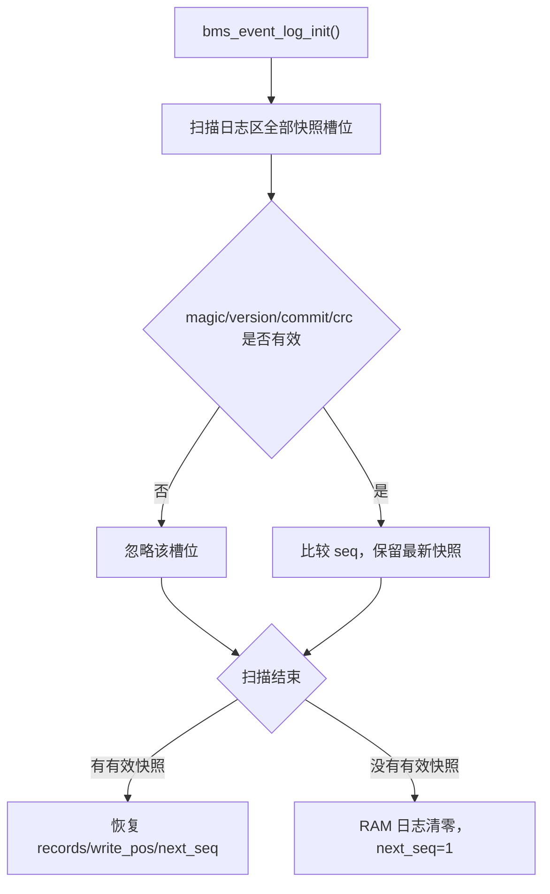
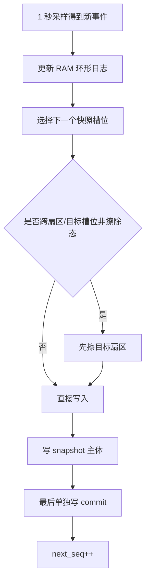

# BMS Event Log 设计与兼容说明

## 1. 目标

当前事件日志模块基于旧项目的 [Sci_Upper.c](D:/telink/tc_ble_single_sdk-V3.4.2.8_Patch_0001%20(1)/tc_ble_single_sdk-V3.4.2.8_Patch_0001%20(1)/tc_ble_single_sdk-V3.4.2.8_Patch_0001/old%20project/Sci_Upper.c:159) 和旧版 `LogRecord.c/.h` 行为重建，目标是：

- 保持旧事件 ID 定义不变
- 保持上位机读取日志时的 2 字节条目格式不变
- 存储介质从 EEPROM 切换为 Flash
- 启动恢复、掉电中断、日志清空都具备明确语义

## 2. 文件分工

- 新模块头文件: [bms_event_log.h](D:/telink/tc_ble_single_sdk-V3.4.2.8_Patch_0001%20(1)/tc_ble_single_sdk-V3.4.2.8_Patch_0001%20(1)/tc_ble_single_sdk-V3.4.2.8_Patch_0001/tc_ble_single_sdk/vendor/ble_sample/bms_event_log.h:1)
- 新模块实现: [bms_event_log.c](D:/telink/tc_ble_single_sdk-V3.4.2.8_Patch_0001%20(1)/tc_ble_single_sdk-V3.4.2.8_Patch_0001%20(1)/tc_ble_single_sdk-V3.4.2.8_Patch_0001/tc_ble_single_sdk/vendor/ble_sample/bms_event_log.c:1)
- 1 秒采样接入: [app.c](D:/telink/tc_ble_single_sdk-V3.4.2.8_Patch_0001%20(1)/tc_ble_single_sdk-V3.4.2.8_Patch_0001%20(1)/tc_ble_single_sdk-V3.4.2.8_Patch_0001/tc_ble_single_sdk/vendor/ble_sample/app.c:46)
- 通信兼容接入: [modbus_rtu.c](D:/telink/tc_ble_single_sdk-V3.4.2.8_Patch_0001%20(1)/tc_ble_single_sdk-V3.4.2.8_Patch_0001%20(1)/tc_ble_single_sdk-V3.4.2.8_Patch_0001/tc_ble_single_sdk/vendor/ble_sample/modbus_rtu.c:18)
- 升级一次性重置接入: [param.c](D:/telink/tc_ble_single_sdk-V3.4.2.8_Patch_0001%20(1)/tc_ble_single_sdk-V3.4.2.8_Patch_0001%20(1)/tc_ble_single_sdk-V3.4.2.8_Patch_0001/tc_ble_single_sdk/vendor/ble_sample/param.c:1)
- 冷区控制 epoch 扩展: [bms_cold_kv_store.h](D:/telink/tc_ble_single_sdk-V3.4.2.8_Patch_0001%20(1)/tc_ble_single_sdk-V3.4.2.8_Patch_0001%20(1)/tc_ble_single_sdk-V3.4.2.8_Patch_0001/tc_ble_single_sdk/vendor/ble_sample/bms_cold_kv_store.h:27)

## 3. 协议兼容点

### 3.1 旧协议地址

旧项目定义在 [Sci_Upper.h](D:/telink/tc_ble_single_sdk-V3.4.2.8_Patch_0001%20(1)/tc_ble_single_sdk-V3.4.2.8_Patch_0001%20(1)/tc_ble_single_sdk-V3.4.2.8_Patch_0001/old%20project/Sci_Upper.h:175) 和 [Sci_Upper.h](D:/telink/tc_ble_single_sdk-V3.4.2.8_Patch_0001%20(1)/tc_ble_single_sdk-V3.4.2.8_Patch_0001%20(1)/tc_ble_single_sdk-V3.4.2.8_Patch_0001/old%20project/Sci_Upper.h:199)：

- 日志读取入口: `0xC008`
- 日志清空命令: `0x1007`

### 3.2 数据格式

旧日志每条记录 2 字节：

- Byte0: 事件 ID
- Byte1: 与上一条事件的时间编码

当前新模块保持完全一致，`0x03` 读回时仍然按“最新事件在前”的顺序输出 100 条，共 200 字节。

### 3.3 当前项目里的兼容折中

当前项目已经把 `0xC002 ~ 0xC032` 用于生产信息字符串读取，见 [modbus_rtu.h](D:/telink/tc_ble_single_sdk-V3.4.2.8_Patch_0001%20(1)/tc_ble_single_sdk-V3.4.2.8_Patch_0001%20(1)/tc_ble_single_sdk-V3.4.2.8_Patch_0001/tc_ble_single_sdk/vendor/ble_sample/modbus_rtu.h:14)。

这和旧项目把 `0xC008` 作为日志页入口存在重叠。因此当前实现采用以下兼容策略：

- 当 `0x03` 读寄存器请求的起始地址恰好是 `0xC008` 时，优先返回事件日志
- 其它 `0xC0xx` 读取继续按当前产品信息寄存器逻辑处理
- 当 `0x06` 写单寄存器地址是 `0x1007` 且值为 `0x0001` 时，执行日志清空

这意味着：

- 旧上位机如果按“从 `0xC008` 发起日志读取”的方式访问，可以继续工作
- 当前生产信息寄存器映射不会被整段破坏
- 如果后续需要兼容“从 `0xC009`、`0xC00A` 开始的日志分段续读”，需要单独再扩展兼容窗口

## 4. 事件集合

事件 ID 直接沿用旧版顺序，定义在 [bms_event_log.h](D:/telink/tc_ble_single_sdk-V3.4.2.8_Patch_0001%20(1)/tc_ble_single_sdk-V3.4.2.8_Patch_0001%20(1)/tc_ble_single_sdk-V3.4.2.8_Patch_0001/tc_ble_single_sdk/vendor/ble_sample/bms_event_log.h:25)。

当前 1 秒轮询接入的事件包括：

- `BMS_START_UP`
- `BMS_SLEEP`
- `BALANCE_OPEN`
- `HEAT_OPEN`
- `COOL_OPEN`
- `VCELL_OVP`
- `VBUS_OVP`
- `CHG_OCP`
- `VCELL_UVP`
- `VBUS_UVP`
- `DSG_OCP`
- `CHG_UTP`
- `DSG_UTP`
- `CHG_OTP`
- `DSG_OTP`
- `VDELTA_OP`
- `AFE2_ERR`
- `EEPROM_ERR`
- `CBC_ERR`

说明：

- `AFE1_ERR` 目前继续不记录，和旧 `LogRecord.c` 的实际行为保持一致
- `BMS_SLEEP` 现阶段使用 `sys_time.low_power_mode` 作为睡眠进入标志

## 5. 时间编码规则

时间编码保持旧规则：

- `<= 60s` 编码为 `171`
- `<= 7d` 编码为按小时向上取整
- `> 7d` 编码为 `170`
- `BMS_START_UP` 的时间字节固定为 `0`

## 6. Flash 存储模型

日志区使用 [flash_store_cfg.h](D:/telink/tc_ble_single_sdk-V3.4.2.8_Patch_0001%20(1)/tc_ble_single_sdk-V3.4.2.8_Patch_0001%20(1)/tc_ble_single_sdk-V3.4.2.8_Patch_0001/tc_ble_single_sdk/vendor/ble_sample/flash_store_cfg.h:17) 预留的独立区域：

- Base: `FLASH_ADDR_LOG_BASE`
- Sectors: `FLASH_ADDR_LOG_SECTORS`
- Sector size: `FLASH_SECTOR_SIZE`

逻辑模型不是“逐条事件直接写 Flash”，而是：

- RAM 中维护 100 条逻辑环形日志
- 每次新增事件后，把当前整包日志快照追加写入 Flash
- 启动时扫描所有快照，选出 `seq` 最大且 `crc/commit` 都有效的一份恢复

### 6.1 快照字段

每个快照固定长度 224B，包含：

- `magic`
- `version`
- `payload_len`
- `seq`
- `write_pos`
- `records[100][2]`
- `crc32`
- `commit`

### 6.2 为什么选整包快照

这个方案相对“事件流逐条追加”写放大更高，但这里更看重：

- 和旧 100 条环形日志模型天然一致
- 启动恢复逻辑简单
- 半写入快照容易判定为无效
- 不需要单独做逻辑重放

保护、异常、热/冷、启动类事件通常都是低频，当前 8 个扇区足够覆盖长期使用。

## 7. 启动恢复流程



## 8. 新事件写入流程



## 9. app.c 里的调用路径

启动阶段：

- `LoadParam()`
- `Param_UpgradeReset_Apply()`
- `bms_event_log_init()`
- `bms_event_log_note_startup()`

运行阶段：

- 在 [app.c](D:/telink/tc_ble_single_sdk-V3.4.2.8_Patch_0001%20(1)/tc_ble_single_sdk-V3.4.2.8_Patch_0001%20(1)/tc_ble_single_sdk-V3.4.2.8_Patch_0001/tc_ble_single_sdk/vendor/ble_sample/app.c:1643) 的 1 秒路径里
- `App_AFEGet()` 和 `app_adc_multi_sample()` 更新状态后
- 调用 `app_event_log_1s_task()`
- `app_event_log_1s_task()` 把当前状态整理成 `bms_event_log_sample_t`
- 再调用 `bms_event_log_poll_1s()`

## 10. 升级后一次性清日志

当前日志也接入了“升级后只执行一次”的 epoch 策略。

宏定义位置在 [conf.h](D:/telink/tc_ble_single_sdk-V3.4.2.8_Patch_0001%20(1)/tc_ble_single_sdk-V3.4.2.8_Patch_0001%20(1)/tc_ble_single_sdk-V3.4.2.8_Patch_0001/tc_ble_single_sdk/vendor/ble_sample/conf.h:123)：

```c
#define FW_UPGRADE_RESET_EVENT_LOG_EPOCH 0u
```

规则：

- `0u`：这版固件不清日志
- 改成新的非 0 值：设备首次启动到这版固件时清一次日志
- 同一个值不会重复清

控制值落在冷区 control key 中，由 [param.c](D:/telink/tc_ble_single_sdk-V3.4.2.8_Patch_0001%20(1)/tc_ble_single_sdk-V3.4.2.8_Patch_0001%20(1)/tc_ble_single_sdk-V3.4.2.8_Patch_0001/tc_ble_single_sdk/vendor/ble_sample/param.c:95) 统一执行。

## 11. 调试建议

联调上位机时，优先验证这 3 项：

1. 上电后是否先出现一条 `BMS_START_UP`
2. 从 `0xC008` 读取 100 个寄存器时，返回长度是否为 200 字节
3. 写 `0x1007 = 0x0001` 后，再读 `0xC008` 是否全为 `0x0000`

如果日志读不到，先排查：

- 请求是否从 `0xC008` 开始
- 请求数量是否不超过 100
- 工程是否已经把 [bms_event_log.c](D:/telink/tc_ble_single_sdk-V3.4.2.8_Patch_0001%20(1)/tc_ble_single_sdk-V3.4.2.8_Patch_0001%20(1)/tc_ble_single_sdk-V3.4.2.8_Patch_0001/tc_ble_single_sdk/vendor/ble_sample/bms_event_log.c:1) 编进构建

## 12. 休眠日志补充

当前实现把 `BMS_SLEEP` 分成两条进入路径：

- `app_event_log_1s_task()` 继续跟踪 `sys_time.low_power_mode`，用于记录 RTC 低功耗入口
- 所有实际 `cpu_sleep_wakeup(DEEPSLEEP_MODE, ...)` 休眠入口，都会先调用 `bms_event_log_note_sleep()` 再进入深休眠

这样可以避免只靠 1 秒轮询而错过真正的深休眠事件。
