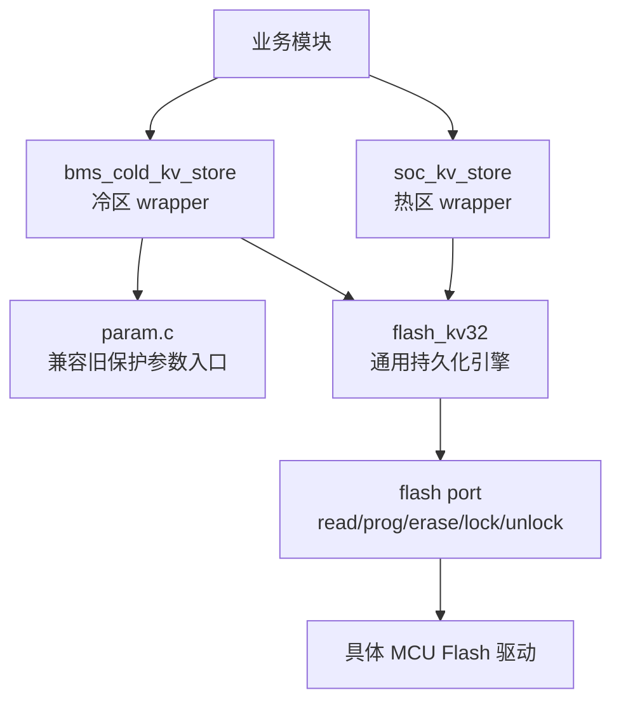
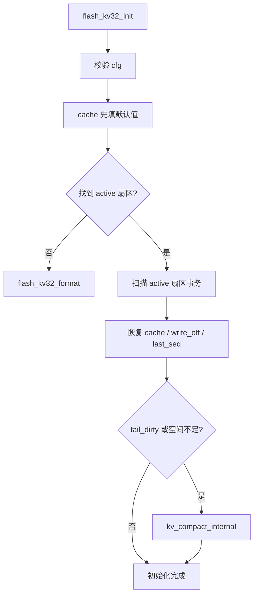
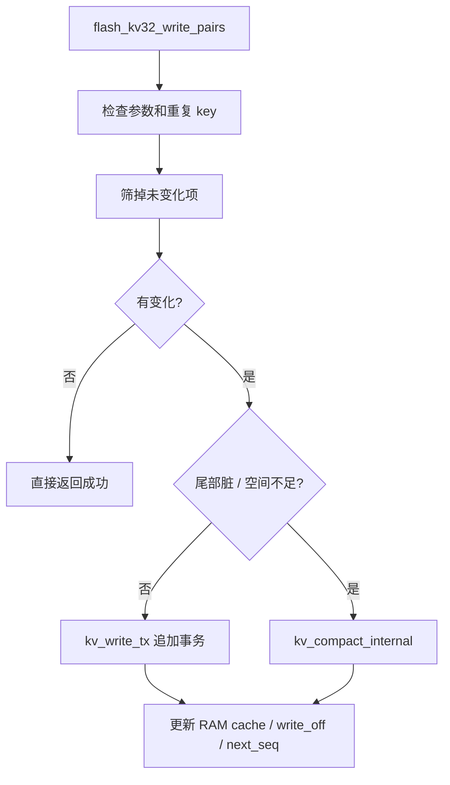
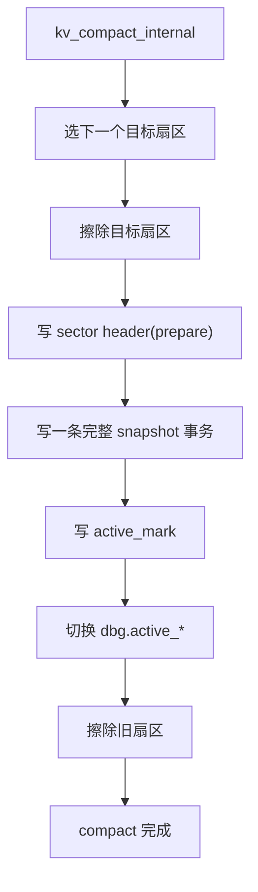

# flash_kv32 源码导读

## 1. 文档目标

这份文档不是 API 手册，也不是设计背景复述，而是给“要快速读懂源码的人”准备的导读。

目标只有 4 个：

1. 看懂 `flash_kv32` 解决了什么问题。
2. 看懂启动恢复、正常写入、compact、掉电恢复这 4 条关键路径。
3. 看懂当前仓库里热区、冷区 wrapper 是怎么接入的。
4. 给出推荐阅读顺序，方便你用最短时间掌握这套实现。

配套文档：

- `doc/flash_kv32_design.md`：偏设计与约束
- `doc/flash_kv32_usage.md`：偏后续接入和调用方法
- `doc/bms_cold_kv_store_usage.md`：偏冷区 wrapper 的使用说明

这份文档重点看“源码怎么组织、运行时到底发生了什么”。

## 2. 先建立全局图

### 2.1 模块分层

可以把它理解成三层：

- 最上层：业务语义，例如 `SOC`、保护参数、BMS 系统参数。
- 中间层：wrapper，只做“结构体/字段 <-> key”的映射。
- 最底层：`flash_kv32`，只关心 `key -> u32` 如何可靠落盘。

### 2.2 当前仓库里的几个关键文件

- `tc_ble_single_sdk/vendor/ble_sample/flash_kv32.h`
- `tc_ble_single_sdk/vendor/ble_sample/flash_kv32.c`
- `tc_ble_single_sdk/vendor/ble_sample/soc_kv_store.h`
- `tc_ble_single_sdk/vendor/ble_sample/soc_kv_store.c`
- `tc_ble_single_sdk/vendor/ble_sample/bms_cold_kv_store.h`
- `tc_ble_single_sdk/vendor/ble_sample/bms_cold_kv_store.c`
- `tc_ble_single_sdk/vendor/ble_sample/param.c`

## 3. 核心思想

`flash_kv32` 的核心思想可以压缩成一句话：

“把 Flash 当成顺序追加日志，不做原地更新；RAM 里维护当前值；空间不够或尾部脏了时，用 compact 把当前状态重新压成一份完整快照。”

这套思路专门针对这类数据：

- 条目数量不大
- 每个值都是 `u32`
- 需要掉电恢复
- 不想每次更新都整扇区擦写
- 希望容易移植到别的 MCU

它不是文件系统，也不是通用对象存储。它刻意把能力限制在 `key -> u32`，用“约束换稳定”。

## 4. 对外接口先看什么

先看 `flash_kv32.h`，这是整个框架的入口。

### 4.1 port 抽象

`flash_kv32_port_t` 定义了平台相关能力：

- `read`
- `prog`
- `erase_sector`
- `lock`
- `unlock`

这意味着 `flash_kv32` 本身不依赖 Telink，只依赖这几个最小原语。移植时通常只需要重做这层。

### 4.2 配置结构

`flash_kv32_cfg_t` 定义一个实例长什么样：

- `sector_addrs`：本实例管理哪些扇区
- `keys`：有哪些 key 及默认值
- `sector_count`
- `sector_size`
- `write_align`
- `key_count`

这也是为什么它天然支持：

- 可扩展扇区大小
- 可扩展扇区数量
- 同一工程里同时存在热区实例、冷区实例

### 4.3 运行时状态

`flash_kv32_t` 里包含两部分：

- `cache`：RAM 中当前值
- `dbg`：活动扇区、代次、写偏移、下一事务序号等调试状态

因此：

- 读操作直接查 RAM cache，不需要每次扫 Flash
- 写操作成功后同步更新 cache
- 启动时只扫一次 Flash

### 4.4 公开 API

最重要的 6 个接口：

- `flash_kv32_init`
- `flash_kv32_format`
- `flash_kv32_get`
- `flash_kv32_set`
- `flash_kv32_write_pairs`
- `flash_kv32_compact`

推荐理解方式：

- `init`：恢复状态
- `get`：读当前值
- `set/write_pairs`：追加事务
- `compact`：整理扇区并轮转
- `format`：清空后重建

## 5. Flash 上实际存了什么

`flash_kv32` 的 Flash 组织分成两层：

1. 扇区头
2. 扇区里的事务记录

### 5.1 扇区头

扇区头固定 32 字节，关键字段有：

- `magic`
- `version`
- `header_size`
- `generation`
- `record_area_offset`
- `header_crc32`
- `prepare_mark`
- `active_mark`

语义上可以这样理解：

- `prepare_mark`：这个扇区头已经写完整
- `active_mark`：这个扇区已经正式切成当前活动扇区
- `generation`：扇区代次，用来判断谁更新

这解决了旧版 `soc_kv_store` 里最关键的一个问题：

- 不再靠“哪个扇区写得更满”来猜新旧
- 改成明确代次 + active 标记

### 5.2 事务记录

每条事务记录由三部分组成：

1. 事务头
2. 若干 `key/value`
3. 尾部 `commit_magic`

事务头里有这些关键字段：

- `magic`
- `version`
- `item_count`
- `seq`
- `payload_len`
- `total_len`
- `crc32`

`payload` 里每个 item 固定 8 字节：

- `key`
- `value`

尾部再写一个 `commit_magic`，表示“这条记录完整提交”。

### 5.3 为什么不用可变长复杂格式

这里的取舍非常明确：

- 只存 `u32`
- 每个 item 固定 8B
- 每条事务固定格式
- 每个扇区固定头格式

好处是：

- 扫描逻辑简单
- 校验路径清晰
- 掉电语义容易定义
- 移植时不依赖编译器结构体对齐

## 6. 读源码的推荐顺序

如果你第一次读，建议按这个顺序：

1. `flash_kv32.h`
2. `flash_kv32.c` 里的 `flash_kv32_init`
3. `flash_kv32.c` 里的 `kv_scan_active_sector`
4. `flash_kv32.c` 里的 `flash_kv32_write_pairs`
5. `flash_kv32.c` 里的 `kv_compact_internal`
6. `soc_kv_store.c`
7. `bms_cold_kv_store.c`
8. `param.c`

这样看会最顺，因为顺序刚好对应：

- 接口长什么样
- 启动怎么恢复
- 平时怎么写
- 空间不够怎么切扇区
- wrapper 怎么把业务字段映射成 key

## 7. 启动恢复路径

### 7.1 建议先看的函数

关键函数位置：

- `kv_parse_sector_header()`：`flash_kv32.c:265`
- `kv_scan_active_sector()`：`flash_kv32.c:480`
- `kv_select_active_sector()`：`flash_kv32.c:577`
- `flash_kv32_init()`：`flash_kv32.c:669`

### 7.2 启动流程图

### 7.3 实际恢复步骤

启动恢复的逻辑分 5 步：

1. 校验配置是否合法  
   包括端口函数、扇区数、key 数量、写对齐、最小事务是否放得下。

2. 把 cache 先填成默认值  
   这是整个框架的“基准状态”。

3. 扫描所有扇区头，选出 active 且 generation 最大的扇区  
   这一步只看扇区头，不扫 payload。

4. 顺序扫描 active 扇区里的事务  
   每扫到一条合法事务，就把其中 key 覆盖到 cache。

5. 得到最终恢复结果  
   此时 cache 就是“最后一次有效状态”。

### 7.4 为什么恢复结果不会拼出伪状态

旧版 `soc_kv_store` 的核心问题是“默认值 + 局部日志”会拼出一个从未真实存在过的状态。

`flash_kv32` 的规避方式是：

- 普通写入允许只写变化项
- 但 compact 时一定写一份完整快照
- 扇区恢复是“默认值 + 一串完整合法事务”

因此只要事务合法，恢复出来的状态一定能对应到一条真实历史路径，不再是“半默认半真实”的随机拼接。

## 8. 正常写入路径

### 8.1 建议先看的函数

关键函数位置：

- `kv_write_tx()`：`flash_kv32.c:381`
- `flash_kv32_write_pairs()`：`flash_kv32.c:765`

### 8.2 正常写入流程图

### 8.3 `kv_write_tx()` 到底做了什么

`kv_write_tx()` 的动作顺序非常关键：

1. 先算出 `item_count/payload_len/total_len`
2. 先在 RAM 里把 CRC 算出来
3. 先写事务头
4. 再写每个 `key/value`
5. 最后写 `commit_magic`

最后一步才是“提交”。

因此掉电时会有 3 种情况：

- 头没写完：扫描时直接判坏
- item 没写完：CRC 或 commit 不成立
- commit 没写完：事务不成立

只有“头、payload、commit 都成立”的事务才会在下次启动时生效。

### 8.4 为什么推荐优先用 `write_pairs`

因为多个参数如果属于同一个业务状态，应该一起写。

例如 `soc/dsg/cycle`：

- 如果拆成 3 次 `set`
- 中间任意一次掉电，就可能恢复到一个中间态

如果一次 `write_pairs`：

- 这 3 个值在事务层面一起提交
- 要么都生效，要么都不生效

这就是它的“批量事务语义”。

## 9. compact 与扇区轮转

### 9.1 建议先看的函数

关键函数位置：

- `kv_select_active_sector()`：`flash_kv32.c:577`
- `kv_compact_internal()`：`flash_kv32.c:605`
- `flash_kv32_compact()`：`flash_kv32.c:822`

### 9.2 compact 流程图

### 9.3 compact 的本质

compact 不是“简单搬运日志”，而是：

- 重新选下一个扇区
- 用当前 cache 生成一条完整快照事务
- 把这一条快照当成新扇区的起点
- 再废弃旧扇区

所以 compact 同时完成三件事：

1. 回收空间
2. 生成完整快照
3. 做一次扇区轮转

### 9.4 磨损均衡是怎么体现的

当前策略是顺序轮转：

- 当前 active 是 0，就切到 1
- 当前 active 是 1，就切到 2
- 最后一个再回到 0

因此每次 compact 都会把“擦写压力”往下一个扇区移动，不会永远打在同一个扇区上。

这不是复杂的动态 wear leveling，但对“小规模参数存储区”已经足够实用，而且实现简单、行为可预测。

## 10. 掉电与异常语义

### 10.1 掉电保护靠什么成立

框架的掉电恢复语义主要靠 4 个机制：

1. 事务尾部 `commit_magic`
2. 事务内容 `crc32`
3. 扇区头 `prepare_mark`
4. 扇区激活 `active_mark + generation`

### 10.2 扫描时如何处理脏尾

`kv_scan_active_sector()` 在遇到这些情况时会停下并标记 `tail_dirty`：

- 事务头 magic/version 不对
- `item_count/payload_len/total_len` 不合法
- commit 标记不对
- CRC 不对
- 事务超出扇区边界

一旦 `tail_dirty = 1`：

- 说明当前扇区尾部已经不适合继续追加
- 后续初始化或写入会触发 compact
- 不会尝试在脏记录位置原地续写

这正是旧版实现里缺失的关键保护。

### 10.3 扇区切换窗口为什么不会回退

关键在顺序：

1. 新扇区先写完整 header
2. 新扇区写完整 snapshot 事务
3. 新扇区最后写 `active_mark`
4. 内存状态切换到新扇区
5. 再去擦旧扇区

因此只要新扇区还没写 `active_mark`，它就不会被当成当前扇区。  
一旦写了 `active_mark`，它又会因为 `generation` 更大而被优先选中。

这就避免了“新扇区明明已经有效，重启却选回旧扇区”的问题。

## 11. RAM cache 的角色

很多人第一次读这类代码，会下意识把注意力都放在 Flash 上，但 `flash_kv32` 真正的性能关键其实是 RAM cache。

cache 的职责很简单：

- 启动时承接恢复结果
- 运行时保存每个 key 当前值
- compact 时提供完整快照源数据

所以你可以把整个系统理解成：

- Flash：历史日志 + 最终落盘介质
- RAM cache：当前真实状态

这也是为什么 `flash_kv32_get()` 很轻：

- 不扫 Flash
- 直接按 key 找 cache 下标

## 12. 当前仓库里的两个 wrapper 怎么看

### 12.1 热区 wrapper：`soc_kv_store`

看 `soc_kv_store.h/.c` 时，重点只看两件事：

1. 它定义了哪些 key
2. 它如何把业务动作翻译成 `flash_kv32` 调用

这个 wrapper 非常薄：

- 3 个 key：`SOC/DSG/CYCLE`
- 启动时组好 sector 地址和 port
- 读操作转成 `flash_kv32_get`
- 单项写转成 `flash_kv32_set`
- 批量更新转成 `flash_kv32_write_pairs`

它是“最小业务封装样板”。

### 12.2 冷区 wrapper：`bms_cold_kv_store`

这个 wrapper 更值得看，因为它更接近以后扩展时的真实需求。

它展示了 3 件事：

1. 冷区也可以复用同一个 `flash_kv32`
2. 一组大结构体可以拆成很多独立 key
3. wrapper 可以同时管理“保护参数”和“系统参数”两类数据

它的做法不是手工一个个写 getter/setter，而是：

- 用字段描述表
- 记录 `key + offsetof(field)`
- 启动时从默认结构体里自动抽默认值
- 读写时按表循环映射

这套方式适合参数很多的结构体。

### 12.3 冷区 wrapper 的数据组织

`bms_cold_kv_store` 里有两组 key：

- 保护参数 key，基址 `0x1000`
- 系统参数 key，基址 `0x2000`

当前它已经提供了两类接口：

- 结构体级读写
- 单个系统参数读写

因此后面你要加新的 BMS 系统参数，通常只需要：

1. 在结构体里加字段
2. 在字段表里加 key 映射
3. 在默认值函数里补默认值

底层 `flash_kv32` 不用改。

## 13. 旧参数入口是怎么迁移的

`param.c` 现在扮演的是“兼容层”。

`LoadParam()` 的思路是：

1. 先把旧 `PARAM_T` 原始内容从老地址读出来
2. 再初始化 `bms_cold_kv_store`
3. 优先从新的冷区 KV 恢复保护参数
4. 如果新 KV 里目前还是默认保护参数，而旧 Flash 里有合法旧参数
5. 就把旧参数迁进新 KV

这个设计的作用是：

- 老数据不会因为新框架初始化而直接丢失
- 首次升级时可以平滑迁移
- 后续业务代码仍然沿用 `LoadParam/SaveParam`

也就是说，上层调用点几乎不用因为底层存储重构而大改。

## 14. 推荐的源码阅读路线

如果你要带着问题读，建议按下面路线走。

### 14.1 第 1 轮：只看主流程

目标：先建立“脑图”，不要陷进细节。

顺序：

1. `flash_kv32.h`
2. `flash_kv32_init()`
3. `flash_kv32_write_pairs()`
4. `kv_compact_internal()`
5. `soc_kv_store_update_and_log_if_changed()`
6. `bms_cold_kv_store_set_protect()`

看完这一轮，你应该能回答：

- 初始化怎么恢复
- 写入为什么是事务
- compact 什么时候发生
- 热区和冷区怎么共用同一引擎

### 14.2 第 2 轮：细看异常路径

目标：确认掉电、脏尾、回滚语义。

顺序：

1. `kv_parse_sector_header()`
2. `kv_scan_active_sector()`
3. `kv_write_tx()`
4. `kv_compact_internal()`

看完这一轮，你应该能回答：

- 什么情况下事务算无效
- 为什么不会原地续写坏尾巴
- 扇区切换为什么不靠猜

### 14.3 第 3 轮：看 wrapper 的扩展方式

目标：搞清以后怎么继续加参数。

顺序：

1. `soc_kv_store.c`
2. `bms_cold_kv_store.h`
3. `bms_cold_kv_store.c`
4. `param.c`

看完这一轮，你应该能回答：

- 新建一个热区/冷区 wrapper 要做什么
- 大结构体如何拆 key
- 老模块如何无感迁移到底层新框架

## 15. 你读源码时最该盯住的几个变量

### 15.1 `write_off`

表示当前活动扇区下一个可写偏移。

你可以把它理解成日志尾指针。

### 15.2 `next_seq`

表示下一条事务要用的序号。

它用来表达事务先后顺序，不直接参与 active 扇区选择。

### 15.3 `active_generation`

表示当前活动扇区代次。

它才是扇区新旧判断的核心。

### 15.4 `tail_dirty`

这是排查掉电/尾部损坏最有用的标志之一。

它表示：

- 当前 active 扇区尾部不是干净的可追加区域
- 后续应该 compact，而不是继续顺写

## 16. 以后扩展时的思维模型

如果以后要加新参数，建议先问自己 3 个问题：

1. 这是“当前值”还是“历史事件”？
2. 它是高频还是低频？
3. 它是否天然适合 `u32`？

推荐分法：

- 当前值、高频：放热区 wrapper
- 当前值、低频：放冷区 wrapper
- 历史事件流：不要塞进 `flash_kv32`，另做 event log

因为 `flash_kv32` 的模型是：

- 保存“当前状态”
- 不是保存“无限历史”

## 16.1 tc32 工具链注意点

当前 Telink tc32 SDK 的 `common/types.h` 会自己定义 `size_t`。  
因此在 wrapper 里如果只是为了取字段偏移，不要顺手引入标准 `stddef.h`，否则容易出现 `size_t` 冲突。

更稳妥的做法是：

- 继续只依赖 SDK 自己的基础类型
- 在 wrapper 内部定义本地 `offsetof` 宏
- 让 `flash_kv32` 和业务 wrapper 尽量少碰标准库类型系统

`bms_cold_kv_store.c` 现在就是按这个方式处理的。

## 17. 一句话总结这套框架

如果要把 `flash_kv32` 用一句工程化的话概括：

它本质上是一个“面向 MCU 参数持久化”的小型事务日志引擎。

它不是靠复杂度取胜，而是靠这几个明确取舍：

- 只做 `key -> u32`
- 顺序追加，不原地改写
- RAM cache 保存当前值
- compact 生成完整快照
- 扇区切换靠 `generation + active_mark`
- 掉电恢复靠 `commit + crc`

这也是它为什么适合作为后续热区/冷区参数持久化底座。
