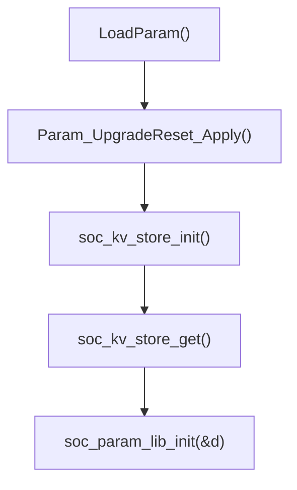

# SOC KV Store 使用说明

## 1. 目的

这份文档说明当前工程里 `SOC` 持久化参数的完整生效链路，以及后续应该如何正确修改和使用：

- 空 Flash 或 format 后，`SOC/DSG/cycle` 用哪组默认值
- 固件升级后，`FW_UPGRADE_RESET_SOC_EPOCH` 到底会重置成什么
- `soc_kv_store_factory_reset()` 的真实行为
- 运行中如果想恢复默认值，正确调用顺序是什么

本次修正后的核心原则只有一条：

- `SOC` 默认值只保留一套定义

## 2. 最终规则

当前统一默认值定义在 [soc_kv_store.h](D:/telink/tc_ble_single_sdk-V3.4.2.8_Patch_0001%20(1)/tc_ble_single_sdk-V3.4.2.8_Patch_0001%20(1)/tc_ble_single_sdk-V3.4.2.8_Patch_0001/tc_ble_single_sdk/vendor/ble_sample/soc_kv_store.h:44)：

```c
#define SOC_PARAM_DEFAULT_SOC    ((u32)FAC_INIT_soc)
#define SOC_PARAM_DEFAULT_DSG    0u
#define SOC_PARAM_DEFAULT_CYCLE  0u
```

兼容旧代码的别名仍然保留，但它们现在只是同义映射：

```c
#define SOC_KV_DEFAULT_SOC    SOC_PARAM_DEFAULT_SOC
#define SOC_KV_DEFAULT_DSG    SOC_PARAM_DEFAULT_DSG
#define SOC_KV_DEFAULT_CYCLE  SOC_PARAM_DEFAULT_CYCLE
```

因此现在这 3 条路径已经统一：

1. 空仓启动默认值
2. `soc_kv_store_factory_reset()` 后的默认值
3. `FW_UPGRADE_RESET_SOC_EPOCH` 触发后的重置值

## 3. 启动链路

启动顺序在 [app.c](D:/telink/tc_ble_single_sdk-V3.4.2.8_Patch_0001%20(1)/tc_ble_single_sdk-V3.4.2.8_Patch_0001%20(1)/tc_ble_single_sdk-V3.4.2.8_Patch_0001/tc_ble_single_sdk/vendor/ble_sample/app.c:1383) 附近：



这里要点是：

- `Param_UpgradeReset_Apply()` 比 `soc_kv_store_get()` 更早执行
- 所以如果 `FW_UPGRADE_RESET_SOC_EPOCH` 发生变化，会先把 SOC 参数重置，再由后续启动流程读出来

## 4. 各场景行为

### 4.1 新板子 / 空 Flash

`soc_kv_store_get()` 会从 [soc_kv_store.c](D:/telink/tc_ble_single_sdk-V3.4.2.8_Patch_0001%20(1)/tc_ble_single_sdk-V3.4.2.8_Patch_0001%20(1)/tc_ble_single_sdk-V3.4.2.8_Patch_0001/tc_ble_single_sdk/vendor/ble_sample/soc_kv_store.c:112) 的统一默认值开始构造：

```c
soc_kv_data_t data = soc_kv_store_get_default_data();
```

最终启动值就是：

- `soc = SOC_PARAM_DEFAULT_SOC`
- `dsg = SOC_PARAM_DEFAULT_DSG`
- `cycle = SOC_PARAM_DEFAULT_CYCLE`

### 4.2 旧板子正常启动

如果 Flash 里已经有有效记录，`soc_kv_store_get()` 会优先返回存储值，不会因为你改了默认宏就自动覆盖旧设备。

### 4.3 修改 `FW_UPGRADE_RESET_SOC_EPOCH`

升级重置逻辑在 [param.c](D:/telink/tc_ble_single_sdk-V3.4.2.8_Patch_0001%20(1)/tc_ble_single_sdk-V3.4.2.8_Patch_0001%20(1)/tc_ble_single_sdk-V3.4.2.8_Patch_0001/tc_ble_single_sdk/vendor/ble_sample/param.c:121)。

当冷区里记录的 epoch 和 `FW_UPGRADE_RESET_SOC_EPOCH` 不一致时，会执行一次：

```c
soc_kv_data_t defaults = soc_kv_store_get_default_data();
soc_kv_store_update_and_log_if_changed(defaults.soc, defaults.dsg, defaults.cycle);
```

也就是说，升级重置现在和空仓默认值完全一致，不再维护第二套 `60/0/100` 或其他字面量。

### 4.4 调用 `soc_kv_store_factory_reset()`

`soc_kv_store_factory_reset()` 最终调用的是 [flash_kv32.c](D:/telink/tc_ble_single_sdk-V3.4.2.8_Patch_0001%20(1)/tc_ble_single_sdk-V3.4.2.8_Patch_0001%20(1)/tc_ble_single_sdk-V3.4.2.8_Patch_0001/tc_ble_single_sdk/vendor/ble_sample/flash_kv32.c:719) 的 `flash_kv32_format()`。

它会：

1. 擦除整个 SOC 热区
2. 把 cache 先恢复成 key 默认值
3. 重新写入第一份默认快照

所以它不是“只清空不写值”，而是“格式化并恢复统一默认值”。

## 5. 如何修改默认值

以后如果你要调整 `SOC` 缺省值，只改 [soc_kv_store.h](D:/telink/tc_ble_single_sdk-V3.4.2.8_Patch_0001%20(1)/tc_ble_single_sdk-V3.4.2.8_Patch_0001%20(1)/tc_ble_single_sdk-V3.4.2.8_Patch_0001/tc_ble_single_sdk/vendor/ble_sample/soc_kv_store.h:44) 里的这 3 个宏：

```c
#define SOC_PARAM_DEFAULT_SOC    ((u32)FAC_INIT_soc)
#define SOC_PARAM_DEFAULT_DSG    0u
#define SOC_PARAM_DEFAULT_CYCLE  100u
```

推荐规则：

- 想改默认 `soc`：改 `SOC_PARAM_DEFAULT_SOC`
- 想改默认 `dsg`：改 `SOC_PARAM_DEFAULT_DSG`
- 想改默认 `cycle`：改 `SOC_PARAM_DEFAULT_CYCLE`

不推荐再直接改 `SOC_KV_DEFAULT_*`，因为它现在只是兼容别名。

## 6. 如何触发升级后重置一次

在 [conf.h](D:/telink/tc_ble_single_sdk-V3.4.2.8_Patch_0001%20(1)/tc_ble_single_sdk-V3.4.2.8_Patch_0001%20(1)/tc_ble_single_sdk-V3.4.2.8_Patch_0001/tc_ble_single_sdk/vendor/ble_sample/conf.h:136) 修改：

```c
#define FW_UPGRADE_RESET_SOC_EPOCH  8u
```

规则：

- `0u`：本次固件不触发 SOC 重置
- 改成新的非 0 值：设备第一次跑到这版固件时执行一次重置
- 后续重启不会重复执行

例子：

```c
#define FW_UPGRADE_RESET_SOC_EPOCH  2026040301u
```

## 7. 运行中如何安全恢复默认值

如果设备已经跑起来了，不能只调用：

```c
soc_kv_store_factory_reset();
```

因为 RAM 里的旧 `SOC` 运行态还在，主循环后续可能又把旧值写回热区。

运行中正确做法是：

```c
soc_kv_data_t d = soc_kv_store_get_default_data();

soc_kv_store_factory_reset();
soc_param_lib_init(&d);
soc_kv_store_update_and_log_if_changed(d.soc, d.dsg, d.cycle);
```

更稳的方式是：

- 执行上面 3 步
- 然后软件重启一次

## 8. 关键接口

### 8.1 读取默认值

```c
soc_kv_data_t soc_kv_store_get_default_data(void);
```

用途：

- 获取当前工程统一 SOC 默认值
- 供升级重置、工厂恢复、运行中恢复默认值复用

### 8.2 读取当前持久化值

```c
soc_kv_data_t soc_kv_store_get(void);
```

用途：

- 读取热区 KV 里的 SOC 参数
- 如果 KV 为空，则返回统一默认值

### 8.3 更新当前持久化值

```c
void soc_kv_store_update_and_log_if_changed(u32 soc, u32 dsg, u32 cycle);
```

用途：

- 批量写入 3 个字段
- 仅在值变化时落盘

### 8.4 格式化并恢复默认值

```c
void soc_kv_store_factory_reset(void);
```

用途：

- 清空热区并重建默认快照
- 只处理存储，不会自动同步运行态 RAM

## 9. 当前源码里的关键位置

- 默认值定义：[soc_kv_store.h](D:/telink/tc_ble_single_sdk-V3.4.2.8_Patch_0001%20(1)/tc_ble_single_sdk-V3.4.2.8_Patch_0001%20(1)/tc_ble_single_sdk-V3.4.2.8_Patch_0001/tc_ble_single_sdk/vendor/ble_sample/soc_kv_store.h:44)
- SOC 默认值构造：[soc_kv_store.c](D:/telink/tc_ble_single_sdk-V3.4.2.8_Patch_0001%20(1)/tc_ble_single_sdk-V3.4.2.8_Patch_0001%20(1)/tc_ble_single_sdk-V3.4.2.8_Patch_0001/tc_ble_single_sdk/vendor/ble_sample/soc_kv_store.c:112)
- 升级重置逻辑：[param.c](D:/telink/tc_ble_single_sdk-V3.4.2.8_Patch_0001%20(1)/tc_ble_single_sdk-V3.4.2.8_Patch_0001%20(1)/tc_ble_single_sdk-V3.4.2.8_Patch_0001/tc_ble_single_sdk/vendor/ble_sample/param.c:59)
- 启动读取并灌入运行态：[app.c](D:/telink/tc_ble_single_sdk-V3.4.2.8_Patch_0001%20(1)/tc_ble_single_sdk-V3.4.2.8_Patch_0001%20(1)/tc_ble_single_sdk-V3.4.2.8_Patch_0001/tc_ble_single_sdk/vendor/ble_sample/app.c:1403)
- SocEnhance 工厂初始化默认值：[SocEnhance.c](D:/telink/tc_ble_single_sdk-V3.4.2.8_Patch_0001%20(1)/tc_ble_single_sdk-V3.4.2.8_Patch_0001%20(1)/tc_ble_single_sdk-V3.4.2.8_Patch_0001/tc_ble_single_sdk/vendor/ble_sample/SocEnhance.c:191)

## 10. 本次修正点

这次修正做了 3 件事：

1. 增加 `SOC_PARAM_DEFAULT_*`，作为唯一默认值定义
2. 让 `soc_kv_store_get()`、升级重置、`SocEnhance` 工厂初始化复用同一套值
3. 增加 `soc_kv_store_get_default_data()`，避免外部再次手写默认结构体

修正后，不会再出现：

- 改了 `SOC_KV_DEFAULT_*`，但升级重置出来还是另一套值
- 空仓启动一套值，升级重置另一套值，工厂初始化再另一套值
