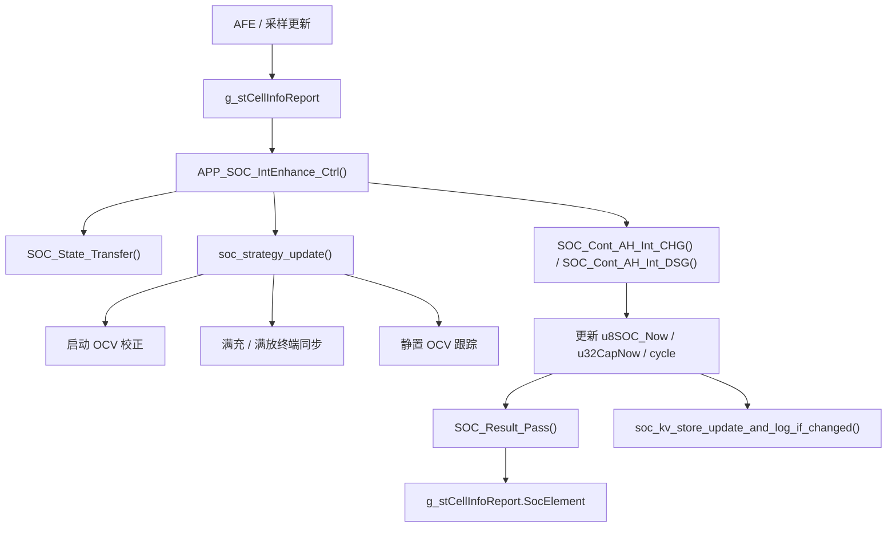

# SOC 逻辑梳理

日期：2026-04-10

## 1. 目标

当前工程里的 `SOC` 逻辑不是单一算法，而是一个混合框架：

- 以安时积分作为主更新手段
- 以静置 OCV、电压边界和满充/满放条件做修正
- 以 KV 存储保证掉电保持
- 以 cycle 推导 SOH

相关核心文件：

- `vendor/ble_sample/SocEnhance.c`
- `vendor/ble_sample/SocEnhance.h`
- `vendor/ble_sample/soc_kv_store.c`
- `vendor/ble_sample/soc_kv_store.h`
- `vendor/common/battery_check.c`

## 2. 总体流程

## 3. 核心数据结构

### 3.1 `SOC_Calculate_Element`

定义在 `vendor/ble_sample/SocEnhance.h`，是内部计算核心。

主要字段：

- `u8SOC_Now`：当前 SOC
- `u32CapNow`：当前剩余容量
- `u32CapFull`：当前满容量
- `u32CapFactory`：出厂容量
- `u32CapChange`：本轮累计变化量
- `u8DSG_SOC_Int`：放电积分累计
- `u32Cycle_times`：循环次数
- `soh`：健康度

### 3.2 `g_stCellInfoReport.SocElement`

这是对外输出的 SOC 结果：

- `u16Soc`
- `u16Soh`
- `u16CapacityNow`
- `u16CapacityFull`
- `u16CapacityFactory`
- `u16Cycle_times`

## 4. 状态机

当前 SOC 逻辑的运行状态分为 3 类：

- `SOC_CALI_STATE_TRANSFER`：转移态，判断当前是充电、放电还是静置
- `SOC_CALI_CONT_CHG`：持续充电积分态
- `SOC_CALI_CONT_DSG`：持续放电积分态

入口函数：

- `APP_SOC_IntEnhance_Ctrl()`

它的执行顺序是：

1. `SOC_State_Transfer()`
2. `soc_strategy_update()`
3. `SOC_Result_Pass()`

## 5. 充放电积分

### 5.1 充电积分

`SOC_Cont_AH_Int_CHG()` 的关键逻辑：

- 当 `u16Ichg >= SOC_VIRTUAL_CURRENT_CHG` 时，先累计连续命中次数
- 连续稳定一段时间后，设置 `u8CHG_AHCalcu_Flag`
- 进入有效积分后：
  - `u32CapChange += Ichg`
  - `u32CapNow += Ichg`
  - 按 `u32CapFull` 计算当前 SOC

### 5.2 放电积分

`SOC_Cont_AH_Int_DSG()` 的关键逻辑：

- 当 `u16IDischg >= SOC_VIRTUAL_CURRENT_DSG` 时，先累计连续命中次数
- 连续稳定一段时间后，设置 `u8DSG_AHCalcu_Flag`
- 进入有效积分后：
  - `u32CapChange += IDischg`
  - `u32CapNow -= IDischg`
  - 按 `u32CapFull` 计算当前 SOC
- 放电积分会推动 `u8DSG_SOC_Int`
- `u8DSG_SOC_Int` 累加到阈值后，`u32Cycle_times++`

## 6. 修正策略

### 6.1 启动 OCV 校正

函数：`soc_apply_startup_ocv_correction()`

触发条件：

- 设备启动后只做一次
- 当前处于静置
- 电压有效
- 电芯压差在允许范围内

处理方式：

- 通过静置电压估算 OCV SOC
- 如果 OCV 和当前 SOC 差异明显，则直接修正

### 6.2 满充 / 满放终端同步

函数：`soc_apply_terminal_sync()`

满充同步：

- 处于充电状态
- `VCELLMAX >= SOC_100_VAL`
- `VCELLMIN >= SOC_FULL_SYNC_MIN_MV`
- 持续命中足够长时间后，强制同步到 `100%`

满放同步：

- 处于静置状态
- `VCELLMIN <= SOC_0_VAL`
- `VCELLMAX <= SOC_EMPTY_SYNC_MAX_MV`
- 持续命中足够长时间后，强制同步到 `0%`

### 6.3 静置 OCV 跟踪

函数：`soc_apply_idle_ocv_tracking()`

逻辑：

- 只有在静置且电压有效时才参与
- 先累计静置稳定时长
- 再按固定周期比较当前 SOC 与 OCV SOC
- 如果偏差超过阈值，则每次只调整 1%

这个设计的目的，是避免长时间静置时 SOC 漂移过大，同时不让修正动作太激进。

## 7. SOH 与循环次数

SOH 通过循环次数映射：

- `0 ~ 80`：`SOH = 100`
- `81 ~ 500`：从 `100` 线性降到 `90`
- `501 ~ 799`：从 `90` 线性降到 `80`
- `>= 800`：固定 `80`

对应函数：

- `bms_soh_from_cycle()`

说明：

- 当前 SOH 是经验映射，不是在线容量辨识
- `SOC_Result_Pass()` 会把 SOH 同步到 `SocElement`

## 8. OCV 估算

当前 OCV 估算采用电芯电压到 SOC 的线性映射：

- `SOC_0_VAL`：0% 对应电压
- `SOC_100_VAL`：100% 对应电压
- 中间值按比例线性换算

相关函数：

- `soc_estimate_percent_from_cell_mv()`
- `soc_estimate_ocv_percent()`

当前代码里还保留了旧的 OCV 逻辑，但主流程已经以 `soc_strategy_update()` 中的策略为准。

## 9. 持久化

`soc_kv_store.c` 负责持久化以下 3 个值：

- `soc`
- `dsg`
- `cycle`

主要接口：

- `soc_kv_store_init()`
- `soc_kv_store_get()`
- `soc_kv_store_write_all()`
- `soc_kv_store_update_and_log_if_changed()`

特点：

- 只有值变化时才写 flash
- 掉电后从 KV 恢复
- 默认值由 `SOC_PARAM_DEFAULT_*` 提供

## 10. 上报链路

最终对外输出由 `SOC_Result_Pass()` 统一整理：

- `u16Soc`
- `u16Soh`
- `u16CapacityNow`
- `u16CapacityFull`
- `u16CapacityFactory`
- `u16Cycle_times`

因此外部模块看到的 SOC 结果，实际上是：

1. 采样输入
2. 安时积分
3. OCV / 边界修正
4. SOH 映射
5. 结果封装上报

## 11. 代码层面的结论

当前 SOC 逻辑可以概括为：

- 主算法：安时积分
- 修正算法：启动 OCV、满充/满放同步、静置 OCV 追踪
- 状态控制：三态切换
- 掉电保持：KV
- SOH 计算：按 cycle 经验映射

如果后续要继续优化，优先关注的方向是：

- 积分阈值和稳定判定时间是否需要按业务重新标定
- OCV 修正是否要引入更高阶滤波或置信度
- cycle 累计条件是否要和真实放电深度进一步关联
