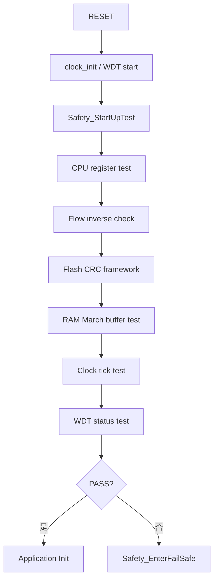
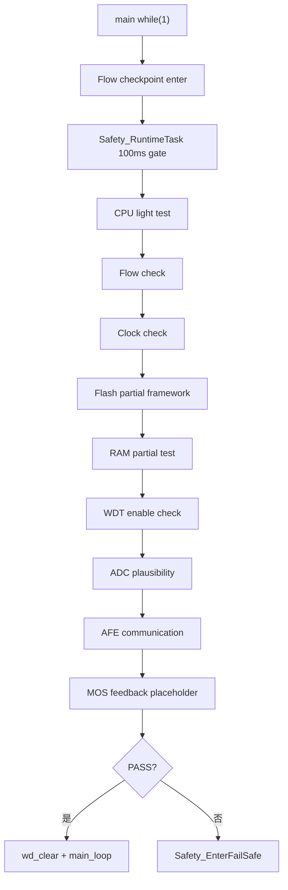

# Safety Architecture

## 测试目的

建立 Telink TLSR8251 BMS 的软件安全自检框架，在不破坏现有 BLE、OTA、保护逻辑和低功耗逻辑的前提下，提供启动自检、运行期自检、应用诊断、故障记录和 Fail Safe 统一出口。

## 测试原理

参考 IEC 60335 Class B / IEC 60730 Class B 的分层思想：

- MCU 相关诊断：CPU、Flash、RAM、Clock、Watchdog、控制流。
- 应用相关诊断：ADC 合理性、AFE 通信、MOS 输出一致性。
- 所有关键安全状态使用 normal + inverse 冗余保存。
- 任一安全故障统一进入 `Safety_EnterFailSafe()`。

## 测试步骤

1. 上电启动后执行 `Safety_StartUpTest()`。
2. 业务初始化完成后调用 `Safety_NotifyApplicationReady()`。
3. 主循环周期调用 `Safety_RuntimeTask()`。
4. 触发故障时检查 MOS/危险输出是否关闭。
5. 检查 WDT 是否能在 Fail Safe 后复位 MCU。

## 故障注入方法

在 `safety_config.h` 中打开：

```c
#define SAFETY_TEST_ENABLE 1
#define SAFETY_INJECT_CPU_FAULT 1
```

可分别模拟 CPU、Flash、RAM、Clock、WDT、ADC、AFE 通信故障。

## PASS 条件

- 固件能完成 clean build。
- 未注入故障时 BLE、OTA、BMS 主循环保持原行为。
- 注入故障后进入 Fail Safe。
- Fail Safe 后危险输出关闭。

## FAIL 条件

- 未注入故障时误进入 Fail Safe。
- 故障注入后仍继续打开 MOS 或危险输出。
- 自检阻塞 BLE/低功耗关键流程。

## 启动自检流程图



## 运行自检流程图


