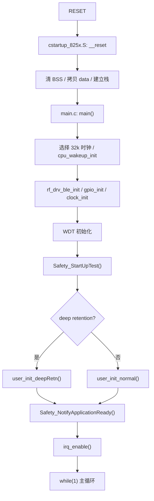

# Telink TLSR8251 BMS 安全架构现状分析

本文面向当前 `vendor/ble_sample` BMS 工程，记录启动流程、任务流程、内存布局和安全代码插入点。设计参考 ST AN3307 / IEC 60335 Class B 的思路：MCU 自诊断与应用相关诊断分层实现，启动阶段执行不破坏性自检，运行阶段执行周期性轻量自检。

## 工程入口

- BMS 应用目录：`tc_ble_single_sdk/vendor/ble_sample`
- main 入口：`vendor/ble_sample/main.c`
- BLE/BMS 主循环：`vendor/ble_sample/app.c:main_loop`
- 启动汇编：`tc_ble_single_sdk/boot/B85/cstartup_825x.S`
- 链接脚本：`project/tlsr_tc32/B85/boot.link`
- B85 make 工程：`project/tlsr_tc32/B85/825x_ble_sample`

## 当前启动流程



## 当前任务流程

`main.c` 的主循环负责喂狗并调用 `main_loop()`。`app.c:main_loop()` 内部执行：

- `blt_sdk_main_loop()`：BLE 协议栈调度。
- `Runtime_Poll()`：运行时间、低功耗相关状态维护。
- 200 ms 任务：SOC 增强、充电器检测、按键逻辑。
- 1 s 任务：`App_AFEGet()`、`app_adc_multi_sample()`、事件日志。
- `bus_mux_task()`：总线复用任务。
- `main_loop_modbus()`：串口 Modbus 任务，受 `_FUNC_UART_` 控制。
- `soc_kv_store_update_and_log_if_changed()`：SOC 持久化。
- `blt_pm_proc()`：BLE 低功耗处理。

新增安全任务接入在 `main.c` 主循环中：

```text
Safety_FlowCheckPoint(MAIN_LOOP_ENTER)
Safety_RuntimeTask()
wd_clear()
main_loop()
Safety_FlowCheckPoint(MAIN_LOOP_EXIT)
```

`Safety_RuntimeTask()` 内部自带 100 ms 周期门限，不会每轮都执行完整检查。

## 中断入口

中断入口为 `main.c:irq_handler()`，当前调用顺序：

1. `irq_blt_sdk_handler()`
2. `modbus_uart_irq_proc()`
3. `app_timer_test_irq_proc()`
4. `bus_mux_irq_handler()`

安全框架当前没有改动中断入口，避免影响 BLE timing、UART 接收和 bus mux 时序。后续若要做中断自检，应以计数器/心跳方式在运行期任务中检查，不建议在 IRQ 内做耗时诊断。

## 时钟初始化

时钟初始化位于 `main.c`：

```c
clock_init(SYS_CLK_TYPE);
```

系统时钟配置来自 `app_config.h`：

```c
#define CLOCK_SYS_CLOCK_HZ 16000000
```

安全框架在 `clock_init()` 之后运行启动自检，`safety_clock_test.c` 检查：

- `clock_get_system_clk()` 与 `SYS_CLK_TYPE` 是否一致。
- `clock_time()` 在短循环内是否前进。

独立双时钟交叉测量当前只作为后续增强项保留，因为现有工程没有稳定封装一个不影响 BLE/低功耗的 32k 与系统时钟比较接口。

## Flash 布局

现有 Flash 布局主要由 `flash_store_cfg.h` 管理。

512K 常用布局：

| 区域 | 地址 |
| --- | --- |
| Log | `0x40000` |
| BT name | `0x50000` |
| Runtime | `0x51000` |
| Run KV | `0x53000` |
| Soft protect | `0x5B000` |

1M/2M 布局也在 `flash_store_cfg.h` 中定义。OTA 开启时，还要结合 `blc_ota_getCurrentUsedMultipleBootAddress()` 判断当前运行镜像与存储区是否冲突。

安全框架预留 Flash CRC 元数据地址：

```c
#define SAFETY_FLASH_CRC_INFO_ADDR 0x7F000u
```

当前默认 `SAFETY_FLASH_CRC_ENFORCE=0`，原因是现有固件生产流程还没有写入 CRC/Version/Length 元数据。直接强制校验会导致所有现有板上电进入 Fail Safe。

## RAM 布局

链接脚本 `boot.link` 定义：

- `.vectors` 从 `0x0` 开始。
- `.ram_code` 紧随向量表。
- retention data 加载到 `0x840000`。
- `.data` 运行地址从 `0x840900 + retention_size` 附近开始。
- `.bss`、`.data_no_init` 随后放置。
- 链接断言 `_ram_use_end_ < (__SRAM_SIZE - 600)`，预留约 600 字节栈空间。

启动自检的完整 RAM March C 如果直接覆盖全 SRAM，会破坏当前栈、BSS、data 和 BLE/SDK 全局区。因此本次实现只对安全框架自有 RAM 缓冲区做 March 风格检查，后续要实现认证级全 RAM 测试，需要在 startup 汇编阶段划出测试窗口，明确排除栈、retention、data/bss 和 BLE 必需 RAM。

## BMS 关键硬件控制点

- ADC 采样：`app_adc_multi_sample()`，读取 `ADC_NTC_PIN`、`ADC_NMOS_PIN`、`ADC_VBUS_PIN`。
- AFE 通信：`App_AFEGet()`、`MTPRead()`、`MTPWrite()`、`SH367309_UpdataAfeConfig()`。
- AFE 通信错误：`System_ErrFlag.u8ErrFlag_Com_AFE1`。
- MOS/控制输出：
  - `open_chg_close_dsg()`
  - `open_dsg_close_chg()`
  - `close_chg()`
  - `close_dsg()`
  - `open_ctlc()`
  - `close_ctlc()`
- Watchdog：`wd_set_interval_ms()`、`wd_start()`、`wd_clear()`。

Fail Safe 优先直接拉低 `AFE_CTL_PIN`、`MCC_C_PIN`、`ADC_BUSEN_PIN`、`ADC_EN_PIN`；业务初始化完成后，再尝试调用原有 `close_ctlc()`、`close_chg()`、`close_dsg()`。

## 可插入安全代码位置

| 阶段 | 位置 | 当前实现 |
| --- | --- | --- |
| startup 汇编前 | `cstartup_825x.S` | 暂不修改，避免破坏启动 ABI |
| C 入口早期 | `main.c` 的 `clock_init()` 和 `user_init_*()` 之间 | `Safety_StartUpTest()` |
| 业务初始化完成 | `user_init_*()` 后 | `Safety_NotifyApplicationReady()` |
| 主循环入口 | `while(1)` 顶部 | `Safety_RuntimeTask()` 与流程检查 |
| Fail Safe | 安全框架内部 | 关闭危险输出并等待 WDT 复位 |
| BLE/Modbus 读取 | 后续扩展 | 当前提供 `Safety_GetFaultLog()` 接口，尚未映射寄存器 |

## 当前实现边界

本次提交建立了可编译、可运行、默认不破坏业务行为的安全框架。以下能力已经实现：

- 安全状态和故障枚举。
- 启动自检入口。
- 100 ms 运行自检入口。
- CPU 轻量汇编寄存器测试。
- Flow counter + inverse counter。
- Flash CRC32 框架与元数据格式。
- RAM 自有缓冲区 March 风格测试。
- Clock tick 与系统时钟配置检查。
- Watchdog 启用状态检查。
- ADC 合理性检查。
- AFE 通信连续异常检查。
- Fail Safe 统一出口。
- 故障快照 RAM 记录。
- 故障注入宏。

以下能力需要后续认证阶段继续补齐：

- startup 汇编级完整 RAM March C。
- Program Counter 破坏性测试。
- 独立双时钟源频率量化比较。
- WDT 上电复位闭环测试。
- Flash CRC 元数据生产写入工具。
- MOS 独立反馈硬件输入及一致性判断。
- BLE/Modbus 安全日志读取寄存器映射。
- 第三方认证用故障注入台架记录。
