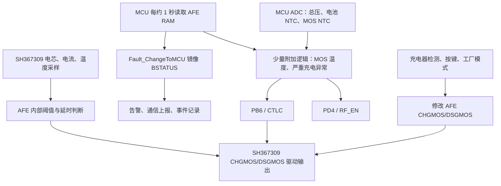

# BMS 多重保护架构检查报告

## 1. 文档信息

| 项目 | 内容 |
|---|---|
| 检查对象 | `vendor/ble_sample` BMS 工程 |
| SDK | Telink TC BLE Single SDK V3.4.2.8 Patch 0001 |
| 检查日期 | 2026-07-30 |
| 检查方式 | 静态源码审查、调用路径追踪、当前编译配置核对、链接产物核对、AFE 数据手册对照 |
| AFE | SH367309 |
| 当前板型配置 | `FD_BMS_TYPE = D3PRO` |
| 当前串数配置 | 10 串 |
| 本次范围 | 只分析，不修改程序代码 |

本报告检查目标是确认工程是否完整实现以下三重保护架构：

1. AFE 独立硬件保护；
2. MCU 独立软件保护；
3. 三端保险丝最终永久保护。

检查不只根据函数名或变量名判断，而是追踪：

```text
采样或 AFE 故障产生
→ 阈值判断
→ 滤波或延时
→ 故障状态
→ CTLC/CHG/DSG 控制
→ 实际关断确认
→ 恢复、锁定或保险丝触发
```

## 2. 执行摘要

当前工程**没有完整实现目标中的三重保护架构**。

| 保护层 | 当前完成度 | 结论 |
|---|---:|---|
| AFE 硬件保护 | 较高，但有关键缺口 | SH367309 已配置电压、电流、短路和温度保护，理论上可独立关断 MOS；但 AFE 看门狗、二级过压/PF、采样线断线保护被禁用，硬件连接尚未验证 |
| MCU 软件保护 | 很低 | MCU 能采样，但没有独立、完整的软件过压、欠压、过流、短路和充放电温度保护状态机；绝大部分故障只是镜像 AFE 状态 |
| 三端保险丝保护 | 原型级 | 存在 `RF_EN` 触发代码和少量计数确认，但没有可靠防误触发、持久化状态、受控触发脉冲、硬件反馈和完整 MOS 关断失效判定 |

最关键问题：

1. 缺少独立 MCU 软件保护层，风险等级为**严重**。
2. AFE 初始化、就绪或配置失败后，启动流程仍可能打开 CTLC，风险等级为**严重**。
3. 保险丝触发逻辑不足以安全控制永久性器件，存在误触发及复位后重复触发风险，风险等级为**严重**。
4. 多个模块可以直接打开或关闭 CTLC、修改 CHG/DSG，存在安全条件未解除却被其他逻辑重新打开的冲突，风险等级为**严重**。
5. 没有完成 MOS 指令到物理断流的闭环确认，风险等级为**高**。
6. AFE 的二级过压/PF、断线保护和通信看门狗当前被关闭，风险等级为**高**。

因此，当前工程可以认定具备 SH367309 基础硬件保护配置，但不能认定已具备完整、相互独立并能逐级升级的三重保护架构。

## 3. 检查范围与有效构建路径

当前 BMS 应用位于：

```text
vendor/ble_sample
```

当前构建目标和链接产物中可以确认以下关键函数已被链接：

- `open_ctlc`
- `close_ctlc`
- `charger_detect`
- `app_adc_multi_sample`
- `MTPWrite`
- `Fault_ChangeToMCU`
- `AFE_IsReady`
- `SH367309_UpdataAfeConfig`
- `App_AFEGet`

因此，本报告所分析的上述函数属于当前有效编译路径，不是未参与构建的孤立源码。

测试用途的 `test_SH367309_UpdataAfeConfig` 未进入正常保护调用链，其调用在主循环中被注释，不能作为量产保护功能的实现证据。

## 4. 当前实际保护架构

### 4.1 实际数据与控制链路



### 4.2 当前不存在统一执行器仲裁

当前有多条路径直接控制功率执行器：

- `open_ctlc()`、`close_ctlc()` 直接操作 PB6；
- 充电器检测和按键状态直接写 AFE `CHGMOS/DSGMOS`；
- 工厂模式可以直接修改 CHG、DSG 和 `MCC_C`；
- MOS 温度逻辑可直接关闭或重新打开 CTLC；
- 严重故障逻辑也可直接关闭或重新打开 CTLC；
- 保险丝逻辑可直接置高 `RF_EN`。

关键证据：

| 文件 | 函数、变量或宏 | 证据 |
|---|---|---|
| `vendor/ble_sample/app.c:163` | `open_ctlc()`、`close_ctlc()` | CTLC 高低电平直接控制 |
| `vendor/ble_sample/app.c:327` | AFE MOS 配置函数 | 直接修改 `CHGMOS/DSGMOS` 并写 MTP/CONF |
| `vendor/ble_sample/app.c:410` | `charger_detect()` 等状态逻辑 | 周期性选择充电或放电 MOS |
| `vendor/ble_sample/app.c:624` | MOS 温度逻辑 | 直接调用 `close_ctlc()` 和 `open_ctlc()` |
| `vendor/ble_sample/app.c:646` | `rong_fuse`、`RF_EN` 逻辑 | 直接控制 CTLC 和保险丝触发输出 |
| `vendor/ble_sample/conf.h:222` | `RF_EN`、`AFE_CTL`、`MCC_C` | 分别映射 PD4、PB6、PA1 |

这类分散控制使“关断优先、所有故障解除后才允许恢复”的安全规则无法得到保证。

## 5. AFE 型号、工作模式与保护输出

### 5.1 AFE 型号

工程使用 SH367309：

- `AFE_ID` 定义为 `0x34`；
- 使用带 CRC 的 TWI 通信；
- MCU 周期读取 AFE RAM `0x40～0x71`；
- 解析单体电压、温度、电流和 `BSTATUS`；
- 通过 AFE 配置位控制 CHG、DSG 和 CTLC 行为。

证据：

- `vendor/ble_sample/sh367309_datadeal.h:428`：`AFE_ID`
- `vendor/ble_sample/sh367309_datadeal.c:250`：`CRC8cal`
- `vendor/ble_sample/sh367309_datadeal.c:295`：带 CRC 的读取及重试
- `vendor/ble_sample/sh367309_datadeal.c:1897`：`App_AFEGet`

### 5.2 CTLC 与 AFE 独立保护

`SCONF2.CTLC` 最终被设置为 3。按 SH367309 定义：

- CTL 拉低时强制关断 CHG、DSG、PCHG；
- CTL 拉高后，由 AFE 内部保护逻辑决定 MOS 状态；
- `CHGMOS/DSGMOS=1` 时，相应 MOS 交由 AFE 内部保护逻辑控制。

因此，如果以下硬件条件成立：

1. SH367309 MODE 位于正确模式；
2. MCU PB6 确实连接 AFE CTL；
3. CTL 极性和电平转换正确；
4. AFE CHG/DSG 输出正确连接实际 MOS；
5. AFE 供电在 MCU 异常时仍保持；

则 AFE 在 MCU 死机时仍能独立检测电压、电流和温度故障并关断功率回路。

上述结论目前只能认定为“软件配置意图成立”，不能替代原理图和实机验证。

证据：

- `vendor/ble_sample/sh367309_datadeal.c:537`：CTLC 配置
- `vendor/ble_sample/sh367309_datadeal.c:785`：另一参数加载路径中的 CTLC 配置
- `vendor/ble_sample/sh367309_datadeal.h:321`：CTLC 相关位宏
- `vendor/ble_sample/app.c:163`：PB6 的 CTLC 控制

## 6. 当前 AFE 保护配置

当前编译配置：

```text
FD_BMS_TYPE = D3PRO
SeriesNum = 10
CS_Res = 2
CS_Res_Num = 2
g_u32CS_Res_AFE = 1000
```

根据当前代码换算，等效按 1 mΩ 采样电阻配置。以下电流值依赖实物采样电阻、放大链路和代码配置一致。

| AFE 保护项 | 当前目标值 | 延时/恢复 | AFE 动作 | 结论 |
|---|---:|---:|---|---|
| 单体过压 | 4.250 V | 约 1 s；4.150 V 恢复 | 关 CHG | 已配置 |
| 单体欠压 | 2.750 V 附近 | 约 1 s；3.000 V 恢复 | 关 DSG | 已配置 |
| 充电过流 | 约 20 A | 约 100 ms | 关 CHG | 已配置 |
| 放电过流 1 | 约 30 A | 约 1 s | 关 DSG | 已配置 |
| 放电过流 2 | 约 50 A | 查表编码后约 600 ms | 关 DSG | 已配置 |
| 放电短路 | 约 200 A | 约 256 μs | 关 DSG | 已配置 |
| 充电高温 | 55°C | 45°C 恢复 | 关 CHG | 已配置 |
| 充电低温 | -7°C | 0°C 恢复 | 关 CHG | 已配置 |
| 放电高温 | 75°C | 60°C 恢复 | 关 DSG | 已配置 |
| 放电低温 | -20°C | -10°C 恢复 | 关 DSG | 已配置 |
| 二级过压/PF | 代码中有阈值参数 | 代码中有时间参数 | PF 输出 | 明确禁用 |
| 采样线断线保护 | AFE 支持 | — | 关 MOS/PF | 随 `DIS_PF` 被禁用 |
| AFE 通信看门狗 | AFE 支持 | — | 通信超时关 MOS | 未使能 |
| 预充 | — | — | PCHG | 未使能 |

主要证据：

| 文件位置 | 证据 |
|---|---|
| `vendor/ble_sample/sh367309_datadeal.h:18` | OV/UV 默认阈值和延时 |
| `vendor/ble_sample/sh367309_datadeal.h:39` | 充放电高低温阈值 |
| `vendor/ble_sample/sh367309_datadeal.h:56` | 充电过流阈值和延时 |
| `vendor/ble_sample/sh367309_datadeal.h:88` | 短路阈值和延时 |
| `vendor/ble_sample/conf.h:132` | D3PRO 的 OCD1/OCD2 配置 |
| `vendor/ble_sample/sh367309_datadeal.c:202` | 电流与延时编码查找表 |
| `vendor/ble_sample/sh367309_datadeal.c:517` | `Refresh_Parameters()` 实际配置路径 |
| `vendor/ble_sample/sh367309_datadeal.h:307` | `BIT_ENPCH` 为零 |
| `vendor/ble_sample/sh367309_datadeal.h:318` | `BIT_DIS_PF` 被置位 |

### 6.1 AFE 看门狗实际未使能

函数名 `SH367309_Enable_AFE_Wdt_Cadc_Drivers()` 容易造成已经使能 AFE WDT 的误解，但函数实际只：

- 设置 CADC；
- 清除或调整 CHGMOS、DSGMOS；
- 没有设置 `CONF.ENWDT`。

所以 MCU 停止与 AFE 通信时，AFE 不会因为通信看门狗超时而主动关闭 MOS。AFE 自己的电压、电流、温度比较器仍可能独立工作，但“MCU 死机本身”不会触发 AFE WDT 保护。

证据：

- `vendor/ble_sample/sh367309_datadeal.c:682`
- `vendor/ble_sample/sh367309_datadeal.h:283`

### 6.2 二级过压、PF 与断线保护被禁用

`BIT_DIS_PF` 被定义为置位状态。根据 SH367309 寄存器含义，这会禁止 PF/二级过压相关功能，并影响采样线断线保护。

代码中虽有 PF 电压和时间参数，但在当前配置下不能形成有效最终保护。

风险等级：**高**。

### 6.3 预充未实现

`BIT_ENPCH` 为零，代码没有形成 PCHG MOS 的完整控制流程。结构体中即使存在 PCHG 状态字段，也不能证明实际预充功能已实现。

如果当前硬件不需要预充，此项属于功能不适用；如果存在大电容负载、浪涌限制或分口预充要求，则属于保护和可靠性缺失。

风险等级：**中，取决于硬件需求**。

## 7. AFE 配置、通信与故障处理

### 7.1 已实现

- CRC8；
- 最多 3 次通信重试；
- MTP 写入；
- 写后单字节校验；
- 最终完整参数镜像比较；
- AFE 就绪轮询；
- 约 1 秒周期读取保护状态；
- BSTATUS 到 MCU 故障字段的镜像；
- 部分故障事件记录。

证据：

| 文件位置 | 函数 |
|---|---|
| `sh367309_datadeal.c:250` | `CRC8cal` |
| `sh367309_datadeal.c:295` | 读 CRC 和重试 |
| `sh367309_datadeal.c:328` | 写 CRC |
| `sh367309_datadeal.c:349` | 写后读回检查 |
| `sh367309_datadeal.c:405` | `MTPWrite` |
| `sh367309_datadeal.c:598` | `Write_Parameters` |
| `sh367309_datadeal.c:654` | `AFE_IsReady` |
| `sh367309_datadeal.c:693` | `SH367309_UpdataAfeConfig` |
| `sh367309_datadeal.c:1430` | `Fault_ChangeToMCU` |
| `sh367309_datadeal.c:1897` | `App_AFEGet` |

### 7.2 AFE ALARM 未接入

未找到 AFE `ALARM` 引脚的中断配置和中断服务路径。MCU主要依赖 `App_AFEGet()` 周期轮询。

影响：

- AFE内部仍可能快速关闭 MOS；
- MCU获知故障、记录日志、锁定或执行保险丝升级最多可能延迟一个轮询周期；
- 如果轮询任务异常，MCU不会及时感知 AFE故障。

风险等级：**中**。

### 7.3 AFE 配置失败后仍可能开放 CTLC

初始化流程大致为：

```text
初始化 IO 并关闭 CTLC
→ 加载参数
→ AFE 复位
→ 等待 AFE Ready
→ 更新 AFE 参数
→ 读取 AFE 数据
→ 根据状态选择 CHG/DSG
→ open_ctlc()
```

存在以下问题：

- `AFE_IsReady()` 有失败返回值，但上层没有以此阻止开放；
- `SH367309_UpdataAfeConfig()` 的错误没有形成全局安全门；
- `Refresh_Parameters()` 为 `void`，部分读取失败后仍可能继续；
- `AFE_Reset()` 失败主要增加错误计数；
- 最后仍可能执行 `open_ctlc()`。

证据：

- `vendor/ble_sample/app.c:1601`
- `vendor/ble_sample/app.c:1653`
- `vendor/ble_sample/sh367309_datadeal.c:517`
- `vendor/ble_sample/sh367309_datadeal.c:625`
- `vendor/ble_sample/sh367309_datadeal.c:654`
- `vendor/ble_sample/sh367309_datadeal.c:693`

风险等级：**严重**。

### 7.4 AFE 错误标志处理存在脆弱性

AFE错误回调采用 `uint8_t` 递增方式，而保险丝/失联分支部分判断写成：

```text
错误标志 == 1
```

如果初始化过程中产生多次错误，错误值可能变为 2 或更大，从而绕过只匹配 1 的分支。运行期连续读取失败后又会直接赋值为1，错误语义不一致。

此外，一次成功 `App_AFEGet()` 会清除 AFE通信错误，但不能证明此前的 MTP或配置错误已经恢复。

风险等级：**高**。

### 7.5 没有运行期间 AFE 配置巡检

工程启动时会比较 AFE参数，但运行期间没有周期读取关键配置并与期望镜像比较。无法发现：

- AFE异常复位；
- 寄存器被干扰改写；
- MTP加载异常；
- CTLC、WDT或MOS控制位发生意外变化。

风险等级：**高**。

## 8. MCU 软件保护检查

### 8.1 MCU 当前能够采集的数据

MCU能够获得：

- 单体电压；
- AFE总线中的温度数据；
- AFE CADC电流；
- AFE状态；
- 独立 ADC总压；
- 电池 NTC；
- MOS NTC。

主要路径：

```text
App_AFEGet()
→ 读取 AFE RAM
→ UpdateVoltageFromBqMaximo()
→ 更新单体、电流、温度和状态
```

以及：

```text
app_adc_multi_sample()
→ MCU ADC采样
→ 电池温度、MOS温度、总压
```

证据：

- `vendor/ble_sample/sh367309_datadeal.c:1025`
- `vendor/ble_sample/sh367309_datadeal.c:1041`
- `vendor/ble_sample/app.c:604`

### 8.2 独立软件保护主体缺失

以下保护没有形成独立于 AFE 的完整软件闭环：

- MCU单体过压；
- MCU单体欠压；
- MCU总压过压；
- MCU总压欠压；
- MCU充电过流；
- MCU放电过流；
- MCU短路；
- MCU充电高温；
- MCU充电低温；
- MCU放电高温；
- MCU放电低温。

缺少的共同环节：

- 输入有效性前置条件；
- 阈值判断；
- 时间滤波或连续计数；
- 进入和恢复迟滞；
- 独立故障状态；
- CHG/DSG禁止权限；
- 故障锁定；
- 恢复延时；
- 人工解除策略；
- 故障优先级；
- 关断结果确认。

`Fault_ChangeToMCU()` 主要把 AFE `BSTATUS` 转换为 MCU故障字段并记录状态变化，并没有用 MCU采样值重新进行独立保护判断。

证据：

- `vendor/ble_sample/sh367309_datadeal.c:1430`
- `vendor/ble_sample/todo.md:184`

风险等级：**严重**。

### 8.3 参数结构存在，但未进入实际保护链

`param.h` 中定义了保护阈值、恢复值和延时，Modbus也能读写相关参数，但正常运行路径并没有把它们用于完整的软件保护。

AFE启动配置使用固定的 `AFE_Parameters_RS485_Struction` 默认值。基于 `g_tParam.protect` 的 `load_protectParam()` 主要进入测试更新函数，而该测试函数未在主循环启用。

Modbus保存参数后，用于重新更新 AFE 的调用也被注释。

影响：

- 用户看到参数可读写，容易误认为参数已生效；
- 参数显示值和实际 AFE保护值可能不一致；
- 软件保护仍未使用这些参数；
- Modbus写入缺乏完善范围与交叉约束校验，未来直接接入会带来新风险。

证据：

- `vendor/ble_sample/param.h:38`
- `vendor/ble_sample/param.h:119`
- `vendor/ble_sample/sh367309_datadeal.c:517`
- `vendor/ble_sample/sh367309_datadeal.c:765`
- `vendor/ble_sample/sh367309_datadeal.c:842`
- `vendor/ble_sample/app.c:1884`
- `vendor/ble_sample/modbus_rtu.c:379`
- `vendor/ble_sample/modbus_rtu.c:400`

风险等级：**高**。

### 8.4 MOS 温度是当前较明确的 MCU独立保护

当前逻辑：

```text
MOS 温度 >= 95°C
→ close_ctlc()
→ 记录 RAM 故障

MOS 温度 <= 75°C
→ open_ctlc()
```

存在问题：

- 没有独立延时或滤波；
- 没有锁定；
- 没有恢复延时；
- 没有执行器仲裁；
- 没有关断后实际电流确认；
- 只记录到 RAM故障结构，没有完整持久化事件。

风险等级：**高**。

证据：

- `vendor/ble_sample/app.c:624`
- `vendor/ble_sample/sh367309_datadeal.c:1402`

## 9. 三端保险丝保护检查

### 9.1 当前保险丝控制链

根据命名和使用方式，推测：

```text
RF_EN = PD4
```

为三端保险丝触发控制。

现有两条主要触发链：

#### AFE 通信异常分支

```text
AFE 错误标志 == 1
→ close_ctlc()
→ 独立总压 >= 4.28 V × 串数，或电池温度 >= 85°C
→ 计数达到约 10 次
→ RF_EN 置高
```

#### AFE 正常但严重充电异常分支

```text
单体最高 >= 4.280 V
或独立总压 >= 4.280 V × 串数
或电池温度 >= 85°C
→ 同时检测到非零充电电流
→ 计数达到约 15 次
→ RF_EN 置高
```

调用周期约为1秒，因此计数大致对应10秒和15秒，但实际时间仍取决于主循环调度。

证据：

- `vendor/ble_sample/app.c:646`
- `vendor/ble_sample/app.c:704`
- `vendor/ble_sample/conf.h:222`

### 9.2 已有的积极措施

- 不是第一次异常就立即触发；
- 使用连续或累计计数；
- 在严重故障前先关闭 CTLC；
- 部分场景检查关闭后是否仍有充电电流；
- AFE失联时使用独立总压和电池温度作为补充信息。

这些措施说明代码已经尝试形成二级升级保护，但距离安全控制永久性保险丝仍有明显差距。

### 9.3 防误触发缺失

缺少：

- 板型和串数硬件身份确认；
- 两个真正独立的严重故障证据；
- 电压、温度和电流采样有效性门控；
- AFE配置完整性门控；
- 连续样本严格清零逻辑；
- 触发前的状态持久化；
- 上电默认禁止触发的硬件联锁；
- 双通道或硬件二次授权；
- 调试、工厂模式下的明确隔离策略。

AFE失联分支的计数器在中间样本不满足时没有可靠清零，可能累计非连续异常。

工程 `todo.md` 也记录了错误13串/10串固件可能导致保险丝风险，进一步说明板型和串数识别没有形成可靠安全门。

风险等级：**严重**。

### 9.4 触发状态与重复触发保护缺失

缺少持久化状态：

- `FUSE_ARMED`
- `FUSE_TRIGGERING`
- `FUSE_FIRED`
- `FUSE_FAILED`

当前 `RF_EN` 置高后，在同一次上电周期中没有主动清除，但 MCU复位后 IO会重新初始化，软件无法区分：

- 从未触发；
- 已成功熔断；
- 触发失败；
- 驱动开路；
- 保险丝已断但输出端仍异常。

没有持久 `fuse_fired` 标志，因此不能阻止复位后重复触发。

风险等级：**严重**。

### 9.5 触发脉冲与硬件反馈缺失

当前触发方式是直接将 RF_EN保持为高，未见：

- 最大触发时长；
- 电流或驱动电压监控；
- 驱动过温保护；
- 保险丝断开反馈；
- 熔断完成后的自动停止；
- 触发失败告警；
- 输出回路断开确认。

风险等级：**严重**。

### 9.6 保险丝事件没有完整持久记录

`bms_event_log` 有一般 AFE故障事件，但事件枚举中没有完整的保险丝武装、触发、成功、失败和重复触发拦截记录。

当前部分故障写入的是 RAM环形结构，掉电后无法保留。

证据：

- `vendor/ble_sample/bms_event_log.h:20`
- `vendor/ble_sample/bms_event_log.c`
- `vendor/ble_sample/sh367309_datadeal.c:1402`

风险等级：**高**。

## 10. 逐项故障闭环检查

| 故障 | 采样或产生 | 判定与延时 | 故障状态 | 执行器动作 | 实际关断确认 | 恢复、锁定或保险丝 |
|---|---|---|---|---|---|---|
| AFE 单体过压 | AFE内部采样 | AFE内部阈值和延时 | BSTATUS镜像到MCU | AFE关CHG | 无物理确认 | AFE自动恢复；无MCU独立锁定 |
| AFE 单体欠压 | AFE内部采样 | AFE内部阈值和延时 | BSTATUS镜像到MCU | AFE关DSG | 无物理确认 | AFE自动恢复 |
| AFE 充电过流 | AFE内部采样 | AFE内部阈值和延时 | BSTATUS镜像到MCU | AFE关CHG | 无物理确认 | AFE恢复；无完整升级状态机 |
| AFE 放电过流 | AFE内部采样 | 两级AFE判断 | BSTATUS镜像到MCU | AFE关DSG | 无物理确认 | 无保险丝升级 |
| AFE 短路 | AFE内部采样 | AFE微秒级判断 | BSTATUS镜像到MCU | AFE关DSG | 无物理确认 | 无MCU锁定或升级 |
| AFE 温度 | AFE NTC | AFE内部判断 | BSTATUS镜像到MCU | AFE关CHG/DSG | 无物理确认 | AFE恢复 |
| MCU 单体过压/欠压 | 已获得采样 | 缺失 | 缺失 | 缺失 | 缺失 | 严重充电条件仅局部进入保险丝原型 |
| MCU 总压过压/欠压 | 独立ADC已采样 | 仅严重过压局部判断 | 无统一故障态 | CTLC/RF_EN局部动作 | 无 | 无完整恢复或锁定 |
| MCU 充放电过流 | 已获得电流 | 缺失 | 缺失 | 缺失 | 缺失 | 缺失 |
| MCU 充放电高低温 | 已获得温度 | 只实现少量高温特殊条件 | 临时RAM状态 | CTLC/RF_EN局部动作 | 无 | 无完整状态机 |
| MOS 过温 | MCU MOS NTC | 95°C立即判断 | 临时RAM状态 | 关闭CTLC | 无 | 75°C直接打开，无仲裁 |
| AFE通信异常 | CRC失败 | 约10次失败后置错 | 错误标志 | 关闭CTLC | 无 | 下次成功读取可能清错；部分条件触发RF_EN |
| 温度传感器异常 | 极端值判断 | 简单计数 | 错误位 | 未明确关断 | 无 | 无 |
| 充电MOS关断失败 | 关闭后仍检测充电电流 | 严重条件约15次 | 无统一状态 | RF_EN | 无熔断反馈 | 无持久记录 |
| 放电MOS关断失败 | 电流可采样 | 缺失 | 缺失 | 缺失 | 缺失 | 缺失 |
| MCU死机 | MCU WDT | 约2秒 | 无保护锁定状态 | MCU复位 | 无 | 初始化后可能重新开放CTLC |

## 11. 采样与诊断能力检查

### 11.1 AFE 通信异常

已有：

- CRC；
- 最多3次单次通信重试；
- 连续约10次周期读取失败后设置通信错误；
- 失败时清除电流值。

不足：

- 从首次失联到关断最长可能约10秒；
- 前9次失败期间部分电压和温度仍可能保留旧值；
- 通信失败和配置失败共用或混用错误标志；
- 恢复条件过于简单，一次读取成功即可清除部分错误；
- 没有重新检查关键配置后再恢复功率通路。

风险等级：**高**。

### 11.2 采样有效性

没有形成系统性诊断：

- 单体电压越界；
- 单体电压突变；
- 单体值冻结；
- 单体通道顺序错误；
- 总压与单体和不一致；
- 电流跳变或冻结；
- 静止零点漂移；
- 温度跳变；
- 采样时间戳超期；
- ADC饱和；
- 多个通道同时异常。

`UpdateVoltageFromBqMaximo()` 直接使用读取值进行换算，缺少全面前置校验；特定原始温度值还可能使计算分母接近或等于零。

风险等级：**高**。

### 11.3 温度传感器开短路

`Monitor_TempBreak()` 主要根据极端低温编码计数：

- 多个传感器共用静态计数器；
- 没有明确区分开路和短路；
- 主要设置错误位；
- 未形成对应的 CHG/DSG禁止策略；
- MCU ADC侧电池NTC和MOS NTC也没有独立开短路状态机。

证据：

- `vendor/ble_sample/sh367309_datadeal.c:51`
- `vendor/ble_sample/app.c:604`

风险等级：**高**。

### 11.4 电流与采样电阻漂移

AFE RAM中存在不同电流测量相关数据，但当前主要使用 CADC结果，没有建立：

- CADC/VADC交叉检查；
- 静止零点自动校准；
- 充电器状态与电流方向合理性检查；
- 分流电阻漂移或焊接异常诊断；
- 大电流时总压下降与电流的合理性检查；
- 运行期采样电阻参数校准。

当前电流阈值依赖编译期固定 `g_u32CS_Res_AFE`。如果实物电阻、并联数量、板型或固件选择不一致，保护电流会整体偏移。

风险等级：**高**。

## 12. MOS 指令与实际关断确认

代码读取 AFE `BSTATUS3` 中的 `CHG_FET/DSG_FET` 状态，但该状态最多证明 AFE内部逻辑或驱动命令状态，不能证明实际功率MOS已经断开。

当前缺少：

- MOS栅极电压反馈；
- MOS VDS反馈；
- PACK端输出电压反馈；
- 关断后电流下降至安全值的统一超时判断；
- 充电和放电双向失效判断；
- MOS击穿、短路或驱动失效区分；
- 关断失败锁定；
- 关断失败到保险丝触发的完整状态机。

当前保险丝代码只在部分严重充电异常下，间接使用“仍有充电电流”推断关断失败，没有覆盖放电方向。

风险等级：**高**。

## 13. MCU 复位、死机与安全启动

### 13.1 MCU 看门狗

当前配置了约2秒 MCU WDT，并在主循环中喂狗。

问题：

- 喂狗动作不依赖保护任务是否成功执行；
- AFE采样卡死、保护状态未更新或执行器未刷新时，主循环仍可能喂狗；
- `Feed_IWatchDog` 宏为空，AFE初始化和MTP流程中的标称喂狗没有实际效果；
- 没有独立任务截止时间监督；
- 没有读取和持久记录复位原因。

证据：

- `vendor/ble_sample/main.c:74`
- `vendor/ble_sample/main.c:90`
- `vendor/ble_sample/conf.h:219`

风险等级：**高**。

### 13.2 初始化未完成时的安全状态

`init_bms_io()` 会将 CTLC、RF_EN、MCC_C拉低，这是正确方向，但在 MCU从复位到执行该函数之前，引脚默认状态仍依赖芯片复位配置和外部硬件上下拉。

当前代码未形成明确的 `SAFETY_INIT_COMPLETE` 状态。AFE错误、参数不一致或采样无效也没有统一阻止后续 `open_ctlc()`。

风险等级：**严重**。

### 13.3 看门狗复位后可能重新开放

没有：

- WDT复位原因读取；
- WDT复位事件记录；
- 异常复位锁定；
- 复位后人工或通信授权恢复；
- 保险丝触发状态恢复；
- 连续有效采样门控。

因此 MCU看门狗复位后，会重新进入普通启动流程，并可能再次开放 CTLC。

风险等级：**严重**。

## 14. 控制冲突检查

### 14.1 MOS 温度保护可能被其他模块恢复

一个真实的冲突示例：

1. MOS温度达到95°C；
2. MOS温度分支执行 `close_ctlc()`；
3. 同一采样函数后续的另一状态分支只检查电池温度和最高单体；
4. 该分支认为恢复条件成立；
5. 执行 `open_ctlc()`；
6. MOS仍然过温，但CTLC已重新打开。

这说明当前恢复不是“所有故障都解除后恢复”，而是“某个局部模块自行恢复”。

风险等级：**严重**。

### 14.2 充电器、按键和工厂模式直接修改 MOS

充电器检测和状态逻辑约每200 ms调整 AFE `CHGMOS/DSGMOS`。工厂模式还可能使两路MOS同时处于由AFE逻辑控制的状态，并控制 `MCC_C`。

这些路径没有统一查询：

- 当前是否有软件保护；
- 是否有传感器故障；
- 是否处于保险丝武装状态；
- 是否刚发生看门狗复位；
- AFE配置是否有效。

风险等级：**高**。

### 14.3 写配置失败未形成安全处置

部分 MOS控制函数调用 `MTPWrite()` 后没有使用返回值阻止后续状态变化。软件命令与 AFE实际配置可能不一致。

风险等级：**高**。

## 15. 告警、故障优先级与事件记录

### 15.1 AFE故障在 MCU侧主要用于镜像和上报

`Fault_ChangeToMCU()` 将 AFE保护状态映射到 MCU错误位，并记录部分变化。`sif_send.c` 再把状态映射为外部通信故障码。

MCU侧通常没有基于这些状态再次执行独立 CTLC关断，所以实际保护依赖 AFE内部动作。

这不等同于 AFE故障“完全只告警”，因为 AFE自身可能已经关 MOS；但它意味着没有形成 MCU冗余执行层。

### 15.2 故障优先级没有明确设计

通信上报中多个 `if` 可能依次覆盖故障码，最终显示结果依赖代码顺序，而不是明确的严重性表或优先级状态机。

没有完整定义：

- 严重程度；
- CHG/DSG动作矩阵；
- 是否锁定；
- 是否允许自动恢复；
- 是否进入保险丝观察；
- 是否允许低功耗。

风险等级：**中**。

### 15.3 事件记录不足

持久事件日志主要覆盖部分 AFE故障，没有完整记录：

- AFE配置失败；
- AFE配置漂移；
- 采样无效；
- MOS关断失败；
- CTLC命令；
- 看门狗复位；
- 保险丝武装；
- 保险丝触发；
- 保险丝反馈成功或失败；
- 触发瞬间完整测量快照。

风险等级：**高**。

## 16. 已完整实现的项目

以下属于代码路径较完整的部分，但硬件闭环仍需确认：

1. SH367309 CRC通信和最多3次重试；
2. 启动阶段的 AFE参数写入和读回比较；
3. AFE单体过压、欠压配置；
4. AFE充电过流配置；
5. AFE两级放电过流配置；
6. AFE短路配置；
7. AFE充放电高低温配置；
8. 周期读取 AFE采样和BSTATUS；
9. AFE状态镜像和部分事件记录；
10. MCU独立ADC总压、电池NTC、MOS NTC采样；
11. CTLC拉低的软件接口；
12. MCU基础看门狗。

这些项目不能单独证明整体保护架构完整。

## 17. 部分实现但存在风险的项目

1. AFE独立保护输出路径：软件配置具备，物理连接未确认；
2. AFE通信异常：检测较慢、恢复过于直接；
3. AFE状态处理：有轮询，无ALARM中断；
4. MOS温度保护：有动作，无滤波、锁定、仲裁和关断确认；
5. 严重充电异常保险丝升级：有局部计数，无安全状态机；
6. 保护参数管理：可存储、可通信修改，但未进入实际保护；
7. MOS状态读取：有AFE逻辑状态，无物理反馈；
8. 事件记录：有一般故障，无保险丝和关断失败完整记录；
9. MCU WDT：有复位，无任务健康监督；
10. 低功耗保护：计数会被清除，AFE睡眠时保护能力待确认；
11. 工厂模式与正常模式的MOS控制：缺少统一安全授权。

## 18. 完全缺失的项目

1. 独立 MCU单体过压、欠压保护；
2. 独立 MCU总压过压、欠压保护；
3. 独立 MCU充电、放电过流保护；
4. 独立 MCU短路保护；
5. 独立 MCU充放电高低温完整保护；
6. 统一保护状态机；
7. 故障优先级和动作矩阵；
8. 故障锁定、恢复延时和人工解除；
9. 唯一执行器仲裁；
10. 运行期间AFE配置巡检；
11. 单体、总压、电流、温度系统性有效性诊断；
12. 电流冗余和采样电阻漂移诊断；
13. MOS物理关断闭环；
14. 完整充电MOS和放电MOS关断失败检测；
15. 保险丝持久状态、硬件反馈和重复触发保护；
16. 保险丝受控脉冲；
17. 安全启动授权状态机；
18. 复位原因记录和异常复位锁定；
19. 预充控制；
20. 系统化故障注入或HIL自动测试。

## 19. 无法仅通过软件确认的硬件问题

以下必须结合原理图、PCB、BOM和实机测试：

1. SH367309 `MODE` 是否被可靠固定在预期模式；
2. PB6是否真实连接 AFE CTL；
3. CTL中间是否有反相、隔离或电平转换；
4. MCU复位、掉电或高阻时，CTL是否有外部硬件下拉；
5. SH367309 CHG/DSG输出是否连接实际MOS栅极；
6. MOS拓扑、方向、共口/分口方式是否与软件控制一致；
7. AFE掉电、异常复位或MTP损坏时MOS输出默认状态；
8. PF引脚是否连接二级保护或保险丝电路；
9. `RF_EN/PD4` 是否确实连接三端保险丝驱动；
10. RF_EN是否高有效，是否有反相；
11. RF_EN是否有外部下拉和硬件防误触发；
12. 保险丝驱动电流、持续时间和热设计；
13. 是否有保险丝熔断完成反馈；
14. `MCC_C` 的实际硬件作用；
15. 预充MOS及预充电阻是否存在；
16. 实物采样电阻是否与1 mΩ配置一致；
17. 采样电阻精度、温漂、并联数量和PCB Kelvin走线；
18. 独立总压和MCU NTC是否真正独立于AFE链路；
19. 板型和串数是否有硬件编码；
20. AFE睡眠模式下保留哪些保护；
21. 是否能测量MOS栅压、VDS或PACK输出用于关断反馈；
22. AFE供电是否在MCU异常时保持；
23. CTLC拉低是否能在所有工作模式下强制关闭全部功率MOS。

## 20. 风险分级

本报告采用：

- **严重**：可能直接导致功率回路无法关断、永久保险丝误触发或多层保护同时失效；
- **高**：会失去一层保护、造成故障不能及时发现或恢复逻辑不安全；
- **中**：影响故障响应、诊断或特定工况可靠性；
- **低**：主要影响维护性、可追溯性或非关键功能。

| 编号 | 风险 | 等级 |
|---|---|---|
| R01 | 缺少独立 MCU软件保护层 | 严重 |
| R02 | AFE初始化或配置失败后仍开放CTLC | 严重 |
| R03 | 保险丝缺乏防误触发、反馈、持久化和重复保护 | 严重 |
| R04 | 多模块直接控制CTLC/MOS，可能相互覆盖 | 严重 |
| R05 | MCU复位和初始化未完成时缺乏完整安全门控 | 严重 |
| R06 | MOS过温关闭后可能被其他恢复路径重新打开 | 严重 |
| R07 | AFE PF、二级过压和断线保护被禁用 | 高 |
| R08 | AFE通信看门狗未使能 | 高 |
| R09 | 没有MOS物理关断确认和完整失效升级 | 高 |
| R10 | 采样无效、开短路、漂移和合理性诊断不足 | 高 |
| R11 | AFE通信异常约10秒后才关断，前期数据可能陈旧 | 高 |
| R12 | 保护参数和实际运行逻辑脱节 | 高 |
| R13 | MCU看门狗不是保护任务健康看门狗 | 高 |
| R14 | 保险丝事件和看门狗复位缺少持久记录 | 高 |
| R15 | 只有轮询，没有使用AFE ALARM | 中 |
| R16 | 预充未实现 | 中，取决于硬件需求 |
| R17 | 13串映射表存在重复索引，当前10串配置暂不触发 | 中 |
| R18 | 故障上报优先级依赖代码顺序 | 中 |
| R19 | 缺少自动化故障注入和保护时序测试 | 中 |

## 21. 最小改动方案

### 21.1 P0：安全启动和初始化失败保持关断

最小修改原则：

1. IO初始化后立即保持：
   - `CTLC = 关闭`
   - `RF_EN = 无效`
   - CHG/DSG不允许开放
2. 建立 `safety_init_ok`；
3. 只有满足以下全部条件才置位：
   - AFE Ready成功；
   - AFE复位成功；
   - 关键参数写入和读回一致；
   - CTLC配置正确；
   - 连续若干帧AFE采样有效；
   - 独立总压、NTC有效；
   - 串数与板型有效；
   - 当前无任何保护故障。
4. 任何失败保持CTLC关闭；
5. AFE错误判断统一改为非零错误，而不是 `==1`；
6. 错误恢复后必须重新检查配置和连续有效采样，不能单帧成功立即恢复。

### 21.2 P0：暂时隔离保险丝自动触发

在硬件和完整状态机验证前：

- 增加编译级 `BMS_FUSE_AUTO_TRIGGER_ENABLE`；
- 量产默认关闭；
- 工厂测试使用专用命令和物理授权；
- RF_EN上电默认低；
- 确认外部硬件下拉；
- 禁止普通通信参数直接打开保险丝功能。

### 21.3 P1：最小 MCU软件保护模块

新增：

```text
bms_sw_protection.c
bms_sw_protection.h
```

最少实现：

- 单体OV/UV；
- 总压OV/UV；
- 充电OC；
- 放电OC；
- 充放电高低温；
- MOS过温；
- AFE失联；
- 采样无效。

每项统一具有：

```text
输入有效
→ 进入阈值
→ 连续计数或时间延时
→ 故障置位
→ CHG/DSG禁止
→ 恢复阈值
→ 恢复延时
→ 自动恢复或锁定
```

最小阶段可以先使用经过评审的编译期固定阈值，避免立即启用尚未充分校验的远程可写参数。

### 21.4 P1：唯一执行器仲裁

新增：

```text
bms_actuator.c
bms_actuator.h
```

禁止业务模块直接 `open_ctlc()`。

推荐最小接口：

```c
void bms_set_charge_inhibit(uint32_t reason, bool active);
void bms_set_discharge_inhibit(uint32_t reason, bool active);
void bms_set_global_inhibit(uint32_t reason, bool active);
void bms_actuator_update(void);
```

规则：

- 任一禁止位存在，禁止对应MOS；
- 全局禁止存在，CTLC必须关闭；
- 关闭动作优先；
- 只有全部相关故障解除、恢复延时满足且安全启动完成，才允许打开；
- 普通模块不能直接清除其他模块的禁止位；
- 工厂模式也必须经过仲裁。

### 21.5 P1：最小采样诊断

至少增加：

- 单体合法范围；
- 单体跳变限制；
- 总压合法范围；
- 总压与单体和误差；
- 温度开路/短路；
- 电流原始值饱和；
- 采样时间戳超期；
- 连续通信失败快速关断；
- 恢复前连续有效帧。

### 21.6 P2：最小 MOS 关断失败检测

当命令关闭 CHG或DSG后：

1. 记录关断时刻；
2. 检查 AFE FET逻辑状态；
3. 在规定宽限时间后检查实际电流；
4. 充电和放电方向分别判断；
5. 如果电流仍超限，锁定 `FET_OFF_FAILED`；
6. 保持 CTLC低；
7. 进入保险丝观察状态，而不是立即触发。

没有物理栅压或VDS反馈时，电流判断只能视为最低限度方案。

### 21.7 P2：最小保险丝安全状态机

新增：

```text
bms_fuse.c
bms_fuse.h
```

状态至少包括：

```text
FUSE_DISABLED
FUSE_MONITORING
FUSE_ARMED
FUSE_TRIGGERING
FUSE_FIRED
FUSE_FAILED
```

触发前必须满足：

- 严重故障持续；
- 两个独立测量证据；
- 所有采样均有效；
- 板型、串数和参数CRC有效；
- 已命令CTLC/MOS关闭；
- 等待关断宽限时间；
- 电流仍持续超过安全阈值；
- 触发原因和测量快照已写入掉电存储；
- 非工厂测试或调试误操作；
- 没有已触发持久标志。

触发过程必须：

- 使用有上限的脉冲时间；
- 监控驱动反馈；
- 超时后强制停止驱动；
- 读取熔断反馈；
- 成功则持久记录 `FUSE_FIRED`；
- 失败则持久记录 `FUSE_FAILED` 并保持所有MOS关闭；
- 后续复位不得重复触发，除非经过专用维修流程。

## 22. 推荐完整方案

推荐将安全功能分层：

| 模块 | 职责 |
|---|---|
| `bms_measurement` | 统一采集、时间戳、单位换算、有效性 |
| `bms_afe` | AFE配置、ALARM、通信健康、运行期巡检 |
| `bms_protection` | 独立软件保护状态机 |
| `bms_diagnostics` | 传感器、采样、电流、配置、串数诊断 |
| `bms_actuator` | CHG、DSG、PCHG、CTLC唯一控制入口 |
| `bms_fuse` | 武装、确认、触发、反馈、持久化 |
| `bms_safety_log` | 故障、复位、触发原因和测量快照 |
| `bms_supervisor` | 安全启动、任务看门狗、系统状态 |

### 22.1 推荐保护状态模型

每项保护使用统一状态：

```text
NORMAL
→ ENTER_DELAY
→ ACTIVE
→ RECOVERY_DELAY
→ NORMAL
```

不可自动恢复故障：

```text
ACTIVE
→ LATCHED
→ 人工授权或维修解除
```

严重故障：

```text
ACTIVE
→ MOS_OFF_REQUEST
→ MOS_OFF_VERIFY
→ FUSE_ARMED
→ FUSE_TRIGGERING
→ FUSE_FIRED 或 FUSE_FAILED
```

### 22.2 AFE 完整增强

- 接入 AFE ALARM中断；
- 保留周期轮询作为冗余；
- 周期巡检关键配置；
- 在确认硬件行为后使能 AFE WDT；
- 评估启用二级过压/PF；
- 评估启用采样线断线保护；
- 明确 AFE睡眠模式的保护能力；
- 配置失败保持系统锁定；
- AFE异常复位后自动重新校验，禁止直接恢复MOS。

### 22.3 软件保护完整增强

- 软件阈值与 AFE阈值分层，不应完全相同；
- AFE用于快速、硬件独立关断；
- MCU用于趋势、冗余、锁定、诊断和升级；
- 软件保护使用真实时间，不依赖不稳定的循环次数；
- 每项保护定义进入值、恢复值、进入延时、恢复延时和锁定属性；
- 对充电和放电分别定义动作；
- 对严重故障定义保险丝升级资格；
- 参数具备范围、交叉约束、版本、CRC和原子更新。

### 22.4 诊断完整增强

- CADC/VADC或独立ADC交叉检查；
- 总压与单体和校验；
- NTC开短路诊断；
- 单体采样线断线诊断；
- 电流零点和漂移诊断；
- 板型/串数硬件身份诊断；
- MOS栅压、VDS或PACK端反馈；
- 保险丝驱动和熔断反馈；
- 复位原因和异常启动诊断。

### 22.5 看门狗完整增强

主循环不能无条件喂狗。

推荐由安全监督器确认：

- AFE采样任务按期完成；
- ADC采样按期完成；
- 保护状态机按期运行；
- 执行器输出按期刷新；
- 关键通信没有卡死；
- 日志任务没有阻塞安全任务；

全部心跳正常后才喂硬件看门狗。

看门狗复位后：

- 默认保持MOS关闭；
- 记录复位原因；
- 重新完成AFE配置校验；
- 连续有效采样；
- 根据故障历史决定自动恢复或保持锁定。

## 23. 建议实施顺序

### 第一阶段：阻断严重风险

1. 冻结保险丝自动触发；
2. 核对原理图、BOM、RF_EN和CTLC硬件；
3. 修复安全启动，所有初始化失败保持关断；
4. 建立唯一执行器仲裁；
5. 清除所有业务模块直接重新打开CTLC的路径。

### 第二阶段：建立独立软件保护

1. 建立统一采样有效性；
2. 实现 MCU电压、电流和温度保护；
3. 实现故障进入、恢复、锁定和优先级；
4. 将参数管理与实际保护连接；
5. 增加严格参数范围和交叉约束。

### 第三阶段：诊断和关断反馈

1. AFE配置巡检；
2. AFE ALARM；
3. 电压、电流和温度合理性诊断；
4. 充放电 MOS关断失败检测；
5. 增加栅压、VDS或PACK输出反馈。

### 第四阶段：保险丝最终保护

1. 完成硬件驱动和反馈确认；
2. 实现保险丝状态机；
3. 实现掉电持久化；
4. 实现受控触发脉冲；
5. 实现触发成功和失败反馈；
6. 实现复位后重复触发保护；
7. 建立维修解除和工厂测试流程。

### 第五阶段：验证

1. 单项阈值和延时测试；
2. 恢复迟滞测试；
3. 多故障同时出现的优先级测试；
4. AFE通信断线；
5. AFE配置被篡改；
6. MCU卡死和WDT复位；
7. CHG MOS短路；
8. DSG MOS短路；
9. NTC开路和短路；
10. 单体采样线断线；
11. 错误板型和错误串数固件；
12. 保险丝误触发抑制；
13. 保险丝触发成功和失败；
14. 掉电和复位后的状态恢复；
15. HIL自动回归。

## 24. 最终结论

当前工程的实际状态为：

1. **AFE层**：已具备 SH367309 对单体过压、欠压、充电过流、两级放电过流、短路及充放电高低温的基础硬件保护配置。若硬件 MODE、CTL、CHG、DSG 和供电连接正确，AFE可在MCU异常时继续检测这些电气故障并关断MOS。
2. **AFE关键缺口**：AFE通信看门狗未使能，二级过压/PF及断线保护被禁用，未使用ALARM，配置失败后没有形成可靠的禁止开放门控。
3. **MCU层**：MCU具备采样能力，但除MOS过温和少量严重充电逻辑外，没有独立的软件保护状态机，不能认定为第二重保护。
4. **保险丝层**：存在RF_EN触发原型，但防误触发、二次确认、状态记录、硬件反馈、受控脉冲及重复触发保护均不完整，不能认定为安全的最终保护。
5. **执行器控制**：多个模块分别控制CTLC和MOS，存在重新打开和控制冲突。
6. **关断确认**：没有形成从MOS关断指令到物理断流、失败锁定和保险丝升级的完整闭环。
7. **复位安全**：MCU复位、WDT复位和初始化失败时的安全状态不足。

综合判定：

> 当前工程不能确认完整实现“AFF独立硬件保护 + MCU独立软件保护 + 三端保险丝最终保护”的多重保护架构。现阶段应优先完成安全启动、执行器仲裁和保险丝隔离，再补齐MCU软件保护、诊断、关断反馈和保险丝安全状态机。

在原理图、PCB、BOM及实机验证完成前，以下结论不能仅由软件确认：

- CTLC是否能在所有异常情况下可靠关闭全部功率MOS；
- AFE是否在MCU失效时仍保持供电和正确模式；
- RF_EN是否安全控制真实三端保险丝；
- MOS是否实际断流；
- 保险丝是否已经熔断并永久切断回路。

