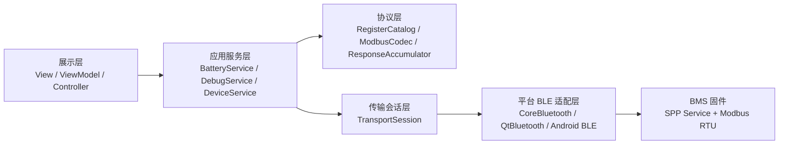
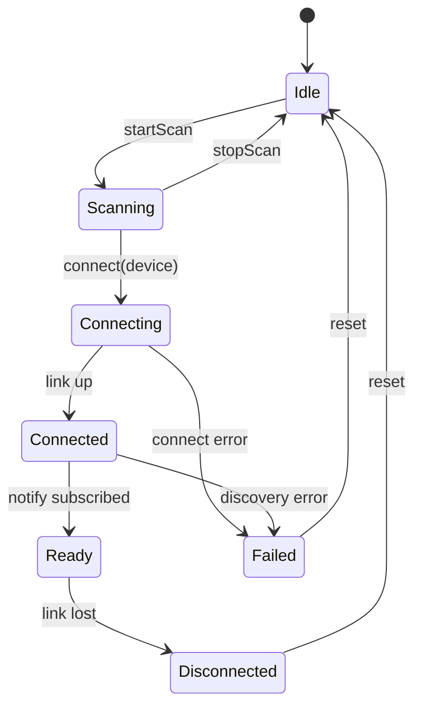

# BMS 客户端跨平台统一架构与开发规范

## 1. 文档目的

本文不是针对某一个具体平台，而是基于当前已经落地的两套客户端：

- mac 原生版 `BMSAssistant`
- Qt 桌面版 `BMSAssistantQt`

提炼出一套后续可以继续复用的统一开发规范，用于指导：

- Windows 上位机
- mac 上位机
- iPhone App
- iPad App
- Android App
- 未来新的调试工具或客户版工具

目标是把“平台相关实现”和“业务共性逻辑”拆开，避免后续每做一个新客户端都从头再想一遍 BLE 和协议链路。

---

## 2. 统一设计结论

后续所有客户端都建议采用同一条核心原则：

> BLE 只是传输层，`SPP Service` 只是字节通道，真正需要长期复用的是 `Modbus RTU over BLE` 协议层、命令调度层和 BMS 领域模型。

因此，未来所有客户端都建议分成 5 层：

1. `Platform BLE Adapter`
2. `Transport Session`
3. `Protocol Codec`
4. `Application Service`
5. `Presentation / ViewModel / UI`

其中：

- 第 1 层平台相关最强
- 第 2、3、4 层应该尽量平台无关
- 第 5 层可以完全因平台而异

---

## 3. 推荐的统一五层架构



### 3.1 Platform BLE Adapter

职责：

- 蓝牙权限初始化
- 扫描设备
- 建立连接
- 发现 Service / Characteristic
- 订阅 notify
- 按平台 API 发送原始字节
- 把原始 fragment 回调给上层

平台映射建议：

- macOS / iOS / iPadOS：`CoreBluetooth`
- Windows / macOS / Linux 桌面：`QtBluetooth`
- Android：`BluetoothLeScanner + BluetoothGatt`

这一层不要放业务寄存器逻辑。

### 3.2 Transport Session

职责：

- 维护当前设备会话
- 暴露统一状态：`idle / scanning / connecting / connected / ready / disconnected / failed`
- 屏蔽“ready 前不能发命令”的细节
- 统一发包入口
- 统一收包入口

这一层是“平台 BLE API”和“业务层”之间的隔离层。

建议暴露的统一接口如下：

```text
startScan(mode)
stopScan()
connect(deviceId)
disconnect()
send(bytes)
onBluetoothStateChanged
onDiscovery
onConnectionChanged
onReady
onDataFragment
onError
```

### 3.3 Protocol Codec

职责：

- 定义固定 UUID
- 定义寄存器地址和数量
- 生成 Modbus 请求帧
- CRC 校验
- 响应解析
- 根据功能码推断期望长度
- 多个 notify fragment 的重组

这一层建议成为未来所有客户端共享的“协议真源”。

建议固定包含以下对象：

- `BMSUUIDs`
- `RegisterCatalog`
- `ModbusCodec`
- `ResponseAccumulator`
- `ParsedResponse`
- `ModbusError`

### 3.4 Application Service

职责：

- 组织高层业务动作
- 做串行命令调度
- 管理超时
- 管理 pending request
- 组织多步命令序列
- 将低层寄存器块转换成高层业务快照

典型服务建议拆成：

- `DeviceService`
- `BatteryService`
- `DebugService`
- `LogService`

### 3.5 Presentation / ViewModel / UI

职责：

- 页面布局
- 用户交互
- 列表展示
- 指标卡片展示
- 输入框与按钮
- 导出入口

这一层只读状态和触发动作，不直接拼 Modbus 帧。

---

## 4. 哪些东西应该跨平台统一

以下内容应该尽可能保持平台一致。

### 4.1 UUID 定义

固定内容：

- `SPP Service UUID`
- `requestCharacteristic UUID`
- `responseCharacteristic UUID`

### 4.2 寄存器目录

固定内容：

- `0x0000` MAC 地址区
- `0x0100` 蓝牙名区
- `0xC002 / 0xC012 / 0xC022` 产品信息区
- `0xC008` 事件日志入口
- `0xD000~0xD03E` 旧状态兼容区
- `0xD115~0xD116` 系统状态区
- `0xD120~0xD12A` 实时窗口
- `0x1005` SOC 写入寄存器
- `0x1103` 调试写寄存器
- `0x2100` 保护参数区

### 4.3 统一数据模型

建议所有客户端内部都保留同名或等价对象。

推荐统一对象如下：

```text
DiscoverySnapshot
DiscoveredDevice
DeviceIdentitySnapshot
BatteryStatusSnapshot
RegisterBlock
ExchangeLogEntry
ConnectionStatus
ScanMode
```

### 4.4 统一高层动作

建议所有客户端都保留这些稳定动作名：

- `refreshIdentity`
- `refreshBatteryStatus`
- `readProtectPreview`
- `readSystemStatus`
- `readEventLogPreview`
- `readManualBlock`
- `writeManualRegisters`
- `writeSOC`
- `writeRegister1103`
- `sendRawFrame`
- `writeBluetoothNameSuffix`
- `sendEchoTest`

这样做的好处是：

- UI 命名一致
- 测试用例一致
- 日志语义一致
- 未来做自动化测试更容易

---

## 5. 哪些东西不应该强行共享

以下内容可以因平台不同而不同，不需要刻意统一实现形式。

### 5.1 扫描 API 和回调形式

- `CoreBluetooth` 用 delegate
- `QtBluetooth` 用 signal / slot
- Android 用 callback / coroutine / Flow

这些是平台壳差异，没必要追求代码形态一致。

### 5.2 UI 组织

- mac / iPhone / iPad 更适合 `SwiftUI`
- Qt 桌面更适合 `QtWidgets` 或未来 `QML`
- Android 更适合 `Jetpack Compose`

UI 技术不必统一，但展示的数据模型应统一。

### 5.3 本地持久化

- Apple 端可以用 `UserDefaults`
- Qt 版可以用 `QSettings`
- Android 可以用 `DataStore`

只要保存的字段语义一致即可。

---

## 6. 统一 BLE 概念模型

为了后续开发时不混乱，建议所有平台都用同一套概念命名。

### 6.1 角色定义

- `Central`：客户端
- `Peripheral`：BMS 板

### 6.2 广播定义

- `ADV`：主广播
- `Scan Response`：扫描响应

当前项目里：

- `ADV` 里主要带 `1812`、`180F`
- 蓝牙名在 `Scan Response`

### 6.3 链路定义

- `Connected`：链路建立，但未必可收发业务
- `Ready`：服务发现、特征发现、notify 订阅完成，可以收发 Modbus

以后任何平台都不要把“connected”和“ready”混成一回事。

### 6.4 通讯定义

- `TX`：上位机写请求特征
- `RX`：上位机收到响应 notify
- `Fragment`：一次 notify 到来的一小段数据
- `Frame`：一条完整 Modbus RTU 响应

---

## 7. 统一状态机设计

### 7.1 扫描状态机



### 7.2 命令状态机

建议所有平台都维护如下状态机：

- `Idle`
- `PendingExchange`
- `PendingSequence`
- `Timeout`
- `Failed`

设计原则：

- 同一时间只允许一条在途 request
- 多步业务动作由 sequence 串行执行
- 任何一步失败，整条 sequence 终止
- ready 之前禁止业务发包

### 7.3 为什么要严格串行

当前协议链路是：

- 单个请求
- 单个响应
- 响应可能分片

如果多个请求并发交织，会导致：

- 无法判断响应属于哪条请求
- 分片重组混乱
- 超时与日志无法对应

所以目前这套 BMS BLE 客户端应坚持“单通道串行命令模型”。

---

## 8. 统一收发流程规范

### 8.1 扫描流程规范

建议所有客户端都采用下面的扫描策略：

1. 优先支持“全部设备”扫描模式
2. 可叠加“当前固件过滤模式”
3. 设备名优先使用 `Local Name`
4. 若 `Local Name` 不存在，则退回 `Peripheral Name`
5. 若都没有，则显示匿名设备 ID
6. 过滤判断优先依据：
   - 名字前缀 `BT`
   - 广播 UUID 含 `180F`
   - 广播 UUID 含 `1812`

这样可以最大程度兼容不同平台的广播字段差异。

### 8.2 连接流程规范

建议统一流程如下：

1. `connect(deviceId)`
2. 发现 `SPP Service`
3. 发现 `requestCharacteristic`
4. 发现 `responseCharacteristic`
5. 写 `CCCD = 0x0100`
6. 收到订阅成功回调
7. 状态切换为 `Ready`
8. 自动触发一次 `refreshBatteryStatus`

### 8.3 发包流程规范

统一要求：

1. 发包前必须检查 `connectionStatus == Ready`
2. 发包前必须检查当前没有 `pendingExchange`
3. 发包时记录 `TX` 日志
4. 发包后启动超时计时器
5. 清空 `ResponseAccumulator`
6. 按 `expectedLengthHint` 或功能码推断帧长度

### 8.4 收包流程规范

统一要求：

1. 每个 notify 都视为 `fragment`
2. fragment 必须先进入 `ResponseAccumulator`
3. 未达到完整帧长度时，不得直接解析
4. 达到完整帧后做 CRC 校验
5. CRC 通过后再做功能码解析
6. 解析成功后回填 `pendingExchange`
7. 停止超时计时器

---

## 9. 统一 Battery 领域模型

未来所有客户端都建议统一输出一个高层 `BatteryStatusSnapshot`，而不是在 UI 层直接处理寄存器数组。

建议快照至少包含以下字段：

- `source`
- `supportsRealtimeWindow`
- `protocolVersion`
- `packVoltage`
- `signedCurrent`
- `soc`
- `maxTemp`
- `minTemp`
- `mosTemp`
- `maxCellVoltage`
- `minCellVoltage`
- `cellDelta`
- `maxCellPosition`
- `minCellPosition`
- `soh`
- `capacityNow`
- `capacityFull`
- `capacityFactory`
- `cycleCount`
- `cellVoltages[]`
- `statusFlags[]`
- `systemStatusRaw`
- `updatedAt`

### 9.1 推荐统一转换路径

建议所有平台都采用相同的解码优先级：

1. 先读 `0xD000~0xD03E`
2. 再读 `0xD115~0xD116`
3. 再读 `0xD120~0xD12A`
4. 如果实时窗口 magic 正确，则优先用实时窗口
5. 如果实时窗口不存在，则回退旧寄存器兼容模式

这样所有平台输出的电池状态语义才一致。

### 9.2 推荐页面模型

以后做任何客户端，至少建议分成两类页面：

- `电池状态页`
- `调试工作台`

原因很简单：

- 用户看状态需要稳定、干净、可读
- 工程调试需要寄存器、原始帧、日志、写操作

这两种诉求不要混成同一页。

---

## 10. 统一错误模型

建议把错误分成 5 类。

### 10.1 平台错误

例如：

- 蓝牙权限缺失
- 蓝牙未开启
- 平台 BLE 栈异常

### 10.2 连接错误

例如：

- 找不到目标 Service
- 找不到请求特征
- 找不到响应特征
- notify 订阅失败

### 10.3 协议错误

例如：

- CRC 错误
- 功能码不支持
- 异常响应
- 帧长度错误

### 10.4 业务错误

例如：

- 设备不支持当前寄存器布局
- 当前命令长度超出 BLE 单包安全范围
- 当前存在未完成请求

### 10.5 用户输入错误

例如：

- 地址格式错误
- 原始 hex 输入错误
- 写寄存器数量不匹配

建议后续所有平台都按这五类归档日志和错误提示。

---

## 11. 统一日志规范

推荐所有客户端都统一日志结构。

建议日志项包含：

- `timestamp`
- `direction`
- `title`
- `payloadHex`
- `note`

其中 `direction` 固定为：

- `TX`
- `RX`
- `INFO`
- `ERR`

这样未来：

- CSV 导出
- 回归测试对比
- 客诉定位
- 现场调试

都会方便很多。

---

## 12. 未来最值得沉淀成共享资产的内容

如果你希望以后开发其他上位机和 App 更轻松，最值得优先沉淀的不是 UI，而是下面这些“平台无关资产”。

### 12.1 协议真源文档

建议保留一份统一文档，明确：

- UUID
- GATT 收发方向
- Modbus 功能码支持范围
- 单包长度约束
- 分片规则
- 超时规则

### 12.2 寄存器目录真源

建议后续把 `RegisterCatalog` 再抽成统一数据文件，例如：

- `docs/register_catalog.json`
- 或后续再演进成 `register_catalog.yaml`

这样多平台可以直接共享一份寄存器目录定义。

### 12.3 测试向量

建议维护一套固定测试向量：

- 典型读寄存器请求帧
- 典型写寄存器请求帧
- 典型响应帧
- CRC 错误帧
- 分片响应样例
- 电池状态快照解码样例

这样以后无论是 Swift、Python、C++、Kotlin，都能跑同一套协议测试。

当前仓库已经新增：

- `docs/register_catalog.json`
- `docs/protocol_test_vectors.json`
- `script/bms_client_asset_tool.py`
- `docs/BMS客户端资产工具使用说明.md`

### 12.4 领域模型定义

建议固定一套 `BatteryStatusSnapshot` 和 `DeviceIdentitySnapshot` 字段语义。

这样不同平台即使实现语言不同，最终对外展示和导出格式都一致。

---

## 13. 为什么当前先用 Python 版 Qt 作为跨平台桌面主线

这个结论对后续规划也有指导意义。

### 13.1 当前阶段目标是快速稳定业务模型

当前最重要的是先把这些问题跑稳：

- 扫描行为
- 连接流程
- notify 链路
- Modbus 编解码
- 电池状态页
- 写寄存器流程
- Windows 交付能力

这些问题的瓶颈主要不在执行性能，而在：

- 协议一致性
- 平台兼容性
- 调试效率
- 工程收敛速度

### 13.2 Python 不会阻碍后续迁移

因为当前真正值得长期复用的是：

- 协议定义
- 寄存器目录
- 状态机
- 高层业务动作
- 日志和测试向量

这些都不是 Python 专属资产。

换句话说，现在先用 Python 把桌面端做通，本质上是在验证架构；以后如果需要切到 `C++ + Qt`，迁移的是稳定的模型，而不是从零摸索。

### 13.3 什么时候值得切 C++

后续如果出现这些条件，可以考虑再做 `C++ + Qt` 版：

- 桌面产品进入长期商业维护阶段
- 团队规模变大，需要更严格的静态类型约束
- 安装包、依赖、部署、二进制交付要求更严格
- 需要更深入接入系统能力

但在当前阶段，Python 作为桌面工程工具主线是合理的。

---

## 14. 新平台开发建议

### 14.1 iPhone / iPad

建议路线：

- 继续使用 `SwiftUI + CoreBluetooth`
- 复用当前 mac 版的协议层和业务层设计
- UI 重点保留：
  - 电池状态页
  - 设备列表页
  - 简化调试页

不建议一开始把桌面全部调试控件都搬上去。

### 14.2 Windows 客户版

建议路线：

- 继续基于 Qt 版
- 先保证：
  - 扫描稳定
  - 连接稳定
  - 自动刷新稳定
  - 写寄存器稳定
  - 日志导出稳定

客户版界面可以比工程版更简化，但底层协议层和调度层尽量不改。

### 14.3 Android

建议路线：

- 单独做原生 Android BLE 客户端
- 复用统一协议规范与测试向量
- 不建议直接把当前 QtWidgets 桌面 UI 生硬迁过去

---

## 15. 推荐的跨平台目录与资产组织方式

后续如果你准备把这套体系长期维护，建议在仓库里逐步形成下面这类结构。

```text
docs/
  BLE链路与协议总规范.md
  BMS客户端跨平台统一架构与开发规范.md
  register_catalog.json
  protocol_test_vectors.json

clients/
  mac-native/
  qt-desktop/
  ios-app/
  android-app/

shared/
  protocol-spec/
  test-vectors/
  sample-frames/
```

如果当前还不准备大改仓库结构，至少建议先做到：

1. 文档统一
2. 寄存器目录统一
3. 测试向量统一
4. 高层动作命名统一

---

## 16. 新客户端最小验收清单

以后你新做一个客户端，不管是什么平台，建议都用同一套最小验收标准。

### 16.1 BLE 基础链路

- 能扫描到目标设备
- 能正确显示 `BT*` 名称或匿名设备 ID
- 能连接成功
- 能发现目标 Service 和 Characteristic
- 能进入 `Ready`

### 16.2 协议链路

- `Echo test` 成功
- `readHolding` 成功
- `writeSingle` 成功
- `writeMultiple` 成功
- 分片响应可正确重组
- CRC 异常能正确报错

### 16.3 业务链路

- 能刷新电池状态
- 能显示单串电压
- 能显示总压、电流、SOC、温度
- 能读取系统状态和保护参数
- 能写 `SOC`
- 能写 `0x1103`

### 16.4 工具能力

- 能导出日志
- 能看到原始帧
- 能看到寄存器块快照
- 能区分用户页和调试页

---

## 17. 最终建议

从长期工程资产角度看，未来最应该持续强化的不是某一套 UI，而是下面三件事：

1. `BLE + Modbus RTU` 的统一协议规范
2. `BatteryStatusSnapshot` 这样的统一领域模型
3. 统一的测试向量和验收基线

只要这三件事稳定下来，未来做任何新的上位机或 App，本质上都只是“换平台壳”和“换界面壳”，而不是重新设计整套系统。

这才是当前两套上位机最值得沉淀出来的长期价值。
