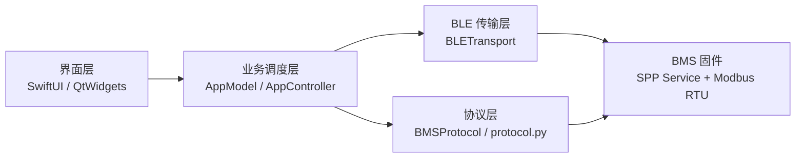
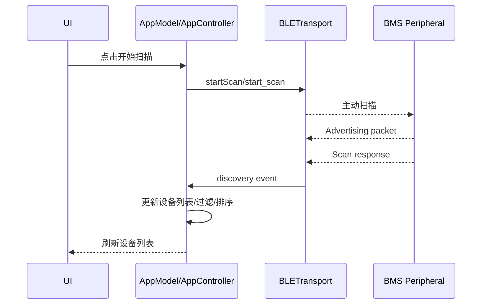
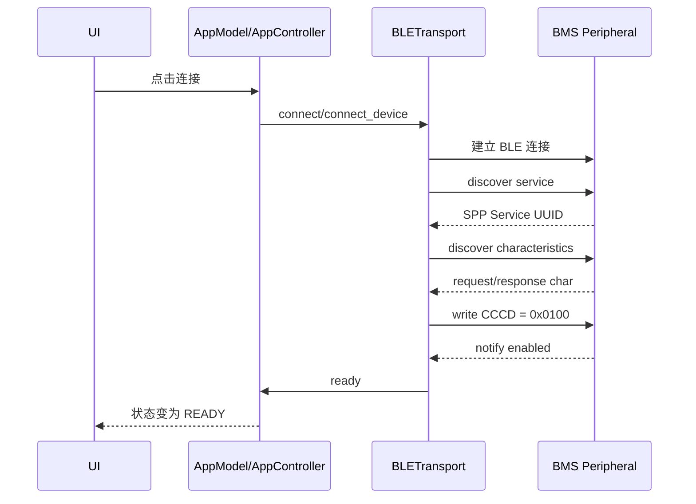
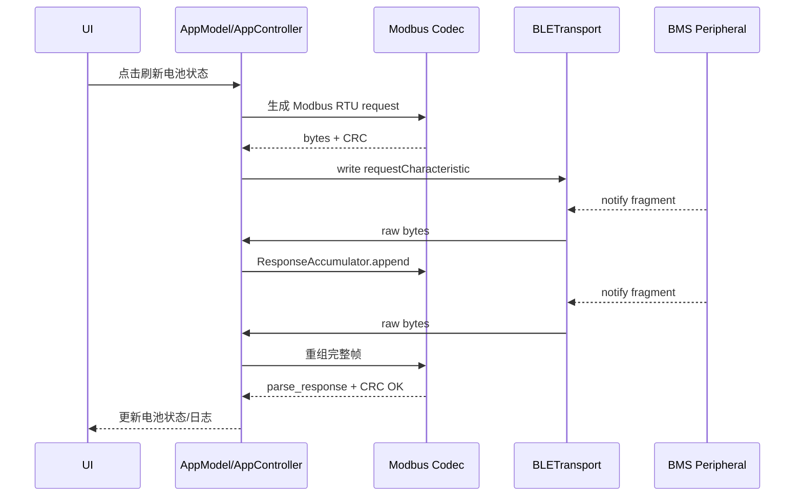

# mac 上位机与 Qt 上位机 BLE 共性架构梳理

## 1. 文档目的

本文面向当前 `vendor/ble_sample` 项目，对两套上位机进行统一梳理：

- mac 原生上位机：`BMSAssistant`
- Qt 跨平台上位机：`BMSAssistantQt`

重点不是 UI，而是把 BLE 相关的概念、逻辑、架构和流程讲清楚。  
目标是让你即使不熟悉 `macOS`、`Qt`、`CoreBluetooth`、`QtBluetooth`，也能建立一套稳定的理解框架。

本文还会回答一个关键问题：

- 为什么当前 Qt 版选择 `Python + PySide6`
- 而不是一开始就写成 `C++ + Qt`

---

## 2. 先给结论

虽然 mac 上位机和 Qt 上位机使用了不同平台和不同语言，但它们的核心 BLE 业务架构本质上是同一套。

两者都可以拆成 4 层：

1. `BLE 传输层`
2. `协议编解码层`
3. `业务调度层`
4. `界面展示层`

其中最关键的共性是：

- BLE 在这里不是“业务协议本身”，而只是传输通道
- 真正的业务协议是 `Modbus RTU`
- 当前项目并不是直接把“电压/SOC/温度”做成 GATT 特征
- 而是通过一个 `SPP 风格服务`，把 `Modbus RTU` 帧塞进 BLE 链路中传输

所以更准确的理解方式是：

- `BLE` = 无线链路
- `SPP service` = BLE 上的串口通道
- `Modbus RTU` = 上位机和 BMS 真正交流的命令语言
- `AppModel / AppController` = 负责调度命令、等待响应、解析结果的核心控制器
- `SwiftUI / QtWidgets` = 只负责显示和操作入口

---

## 3. 当前项目 BLE 实际形态

### 3.1 固件广播层

当前固件的广播有几个实际特点：

- 主广播 `ADV` 里带的是 `16-bit Service UUID: 1812、180F`
- 蓝牙名字放在 `scan response`，不在主广播里
- 广播间隔配置为 `800ms`

这几点直接影响上位机扫描行为。

因此你会遇到这类现象：

- 手机上能看到 `BT_DEFAULT`
- 某些桌面 BLE 栈先收到主广播但还没拿到 `scan response`
- 于是设备可能暂时显示成无名设备
- 或者显示成系统缓存名，而不是你预期的 `BT_DEFAULT`

这不是协议错，而是 BLE 广播模型本身决定的。

### 3.2 实际连接后的 GATT 结构

连接后真正用于收发数据的不是 `180F` 或 `1812`，而是一个 `Telink / Nordic SPP 风格` 的自定义服务：

- Service UUID: `6E400001-B5A3-F393-E0A9-E50E24DCCA9E`
- Request Characteristic: `6E400002-B5A3-F393-E0A9-E50E24DCCA9E`
- Response Characteristic: `6E400003-B5A3-F393-E0A9-E50E24DCCA9E`

实际收发方向可以理解为：

- 上位机写 `requestCharacteristic`
- 设备通过 `responseCharacteristic` 的 `notify` 回数据

所以这里的 GATT 不是“字段模型”，而是“半双工命令通道”。

### 3.3 真正业务协议

上位机发送的并不是“Qt 或 mac 特有格式”，而是统一的：

- `Modbus RTU read`
- `Modbus RTU write single`
- `Modbus RTU write multiple`
- `Echo test`

也就是说，mac 版和 Qt 版虽然 API 不同，但它们最终发到设备上的 payload 是一致的。

---

## 4. 先建立 BLE 基础概念

如果把当前系统抽象成最小认知模型，可以这样理解。

### 4.1 Central 与 Peripheral

- `Central`：主动扫描、主动连接的一方。这里是上位机。
- `Peripheral`：对外广播、等待连接的一方。这里是 BMS 板。

所以你的 mac App、Qt App 都是 `Central`，BMS 板是 `Peripheral`。

### 4.2 Advertising 与 Scan Response

设备在没连接前，会周期性发广播。

这里有两个包：

- `Advertising packet`
- `Scan response packet`

当前项目里：

- `UUID 1812/180F` 在 `Advertising packet`
- `BT_DEFAULT` 这类设备名在 `Scan response`

所以只收到主广播时，未必能立刻看到名字。

### 4.3 Service 与 Characteristic

BLE 连接成功后，Central 会去发现：

- 有哪些 `Service`
- 每个 `Service` 下面有哪些 `Characteristic`

当前项目实际使用的是一个自定义 `SPP Service`，里面最重要的两个特征是：

- 写请求特征
- 通知响应特征

### 4.4 Write 与 Notify

在当前项目中：

- 上位机发命令：`write`
- 设备回结果：`notify`

这和传统串口很像，只是物理层从 UART 变成了 BLE。

### 4.5 Descriptor

上位机想收到 `notify`，不是连接上就自动有，必须先订阅。

实际动作是：

- 找到响应特征
- 写它的 `CCCD` 描述符
- 写入 `0x0100`

只有这一步成功后，链路才算真正 ready。

### 4.6 MTU 与分片

当前工程里，上位机按 `20 byte` 单包安全上限处理请求。根本原因是：

- 默认 ATT MTU 常见为 `23`
- 扣掉 ATT 开销后，单次安全 payload 一般按 `20 byte` 处理

因此：

- 请求过长不能直接发
- 响应也可能被拆成多个 notify 分片返回

这就是为什么两套上位机里都存在 `ResponseAccumulator`。

---

## 5. 两套上位机的共性架构

### 5.1 架构总览

### 5.2 对应关系

| 架构层 | mac 原生版 | Qt 版 | 作用 |
| --- | --- | --- | --- |
| BLE 传输层 | `BLETransport.swift` | `ble_transport.py` | 扫描、连接、服务发现、特征发现、订阅 notify、原始数据收发 |
| 协议编解码层 | `BMSProtocol.swift` | `protocol.py` | UUID、寄存器表、Modbus RTU 编码、CRC、响应解析、分片重组 |
| 业务调度层 | `AppModel.swift` | `app_controller.py` | 管理状态、串行执行命令、处理超时、更新电池数据 |
| 界面层 | `ContentView.swift` | `main_window.py` | 展示设备列表、电池页、调试页，转发用户操作 |

### 5.3 为什么说两者“逻辑相同”

因为这两套程序虽然 API 不同，但都做了同一件事：

1. 扫描 BLE 设备
2. 选择目标设备
3. 建立连接
4. 发现目标 SPP Service
5. 发现请求/响应特征
6. 订阅响应特征 notify
7. 链路 ready 后发送 Modbus RTU 请求
8. 接收一个或多个 notify 分片
9. 重组完整响应帧
10. CRC 校验
11. 按功能码解析寄存器数据
12. 更新电池状态和调试信息

所以从工程认知上，你完全可以先把两者看成“同一个系统的两个平台实现”。

---

## 6. 四层架构分别在做什么

### 6.1 BLE 传输层

这一层只负责“把字节送过去，再把字节收回来”，不负责理解业务含义。

它的职责包括：

- 初始化蓝牙栈
- 扫描周围设备
- 连接目标 Peripheral
- 发现 Service / Characteristic
- 订阅 notify
- 选择 `write with response` 或 `write without response`
- 把收到的 notify fragment 往上抛

它不关心这些字节到底是：

- 读寄存器
- 写寄存器
- Echo
- 还是别的功能码

### mac 版特点

- 使用 `CoreBluetooth`
- 核心对象是 `CBCentralManager`、`CBPeripheral`
- 事件入口是 delegate 回调

### Qt 版特点

- 使用 `QtBluetooth`
- 核心对象是 `QBluetoothDeviceDiscoveryAgent`、`QLowEnergyController`、`QLowEnergyService`
- 事件入口是 signal / slot

### 共性结论

两边都是异步事件驱动，只是事件机制不同：

- mac：delegate callback
- Qt：signal / slot

---

### 6.2 协议编解码层

这一层负责“理解字节的业务意义”。

在当前项目里，这一层做的事包括：

- 定义固定 UUID
- 定义寄存器地址常量
- 生成 `0x03 / 0x06 / 0x10 / 0x7F` 请求
- 计算 `CRC16`
- 解析响应帧
- 判断异常响应
- 对收到的分片做长度推断和重组

这一层与 UI 和平台 API 的关系最弱，是最接近“可共享逻辑”的部分。

换句话说，如果以后要做：

- Windows 版
- Linux 版
- iPhone 版
- iPad 版
- Android 版

最应该保持一致的，就是这一层的协议定义。

---

### 6.3 业务调度层

这一层是两套上位机最容易被忽视、但实际上最核心的部分。

它的作用不是“画页面”，而是把一次业务动作拆成稳定、可控的通讯流程。

例如“刷新电池状态”，本质上不是一个读操作，而是一串顺序动作。

当前两套上位机都会按顺序读取：

1. `0xD000 ~ 0xD03E` 对应的兼容区和单串信息
2. `0xD115 ~ 0xD116` 系统状态
3. `0xD120 ~ 0xD12A` 实时状态窗口

然后再把这几段数据合成一个 `BatteryStatusSnapshot`。

这一层负责的问题包括：

- 当前是否已有请求在途
- 是否允许并发发第二条命令
- 本次命令的超时怎么处理
- notify 收齐后交给哪个 handler
- 失败后如何取消整条动作链
- 完成后如何刷新页面状态

如果没有这一层，上位机虽然也能发命令，但会很快变得不可维护。

---

### 6.4 界面层

这一层负责：

- 设备列表展示
- 电池状态展示
- 调试页展示
- 按钮事件入口
- 用户输入
- 日志导出

它不应该直接决定底层通讯协议。

正确关系应该是：

- UI 触发动作
- 业务调度层执行动作
- 调度层更新状态
- UI 只绑定状态并刷新

这也是为什么两套上位机虽然 UI 技术完全不同，但业务上还能保持一致。

---

## 7. 两套上位机的 BLE 典型流程

### 7.1 扫描流程

这里要特别注意一个现实问题：

- 如果只收到 `Advertising packet`，可能只能拿到 UUID
- 如果拿到 `Scan response`，才能更稳定拿到 `BT_DEFAULT`

所以“扫不到名字”和“扫不到设备”不是一回事。

### 7.2 连接到 ready 流程

这里的关键分界点是：

- 连接成功 != 可收发业务数据
- 只有 `notify` 订阅成功后，才能认为通道 ready

这也是为什么两套程序里都存在 `ready` 事件。

### 7.3 发送命令与接收响应流程

---

## 8. 为什么需要 ResponseAccumulator

这是理解当前 BLE 链路最重要的点之一。

### 8.1 问题本质

notify 到上位机时，不保证“一条 Modbus RTU 响应 == 一次回调”。

真实情况可能是：

- 一条响应一次就到齐
- 或者被拆成 2 次、3 次 notify 才到齐

如果应用层直接把“收到一次 notify”当成“一帧完整响应”，就会出现：

- 长度不对
- CRC 错
- 解析失败

### 8.2 两套上位机的共同做法

两者都实现了同一类缓冲器：

- 累积接收 buffer
- 根据功能码和长度字段推断完整帧长度
- 长度够了再取出完整 frame
- 校验 CRC
- 成功则继续解析
- 失败则报错

所以 `ResponseAccumulator` 不是“可有可无的辅助类”，而是 BLE 上跑 Modbus RTU 的关键稳定器。

---

## 9. 为什么电池状态刷新不是一次读完

原因有两个。

### 9.1 协议本身是寄存器式访问

设备不是一次性返回一个 JSON，也不是一次性返回完整结构体对象。  
它提供的是多个寄存器窗口。

所以客户端必须分别读取几个地址区间，再在本地拼成状态快照。

### 9.2 单包长度受 BLE 限制

如果试图一次读得太多，虽然 Modbus 协议层面可能合法，但 BLE 单包安全长度会成为约束。

因此当前实现采用了更稳妥的策略：

- 拆成多次读
- 每次读一个可控区间
- 收齐后再整合为高层对象

这种方式虽然多发了几条命令，但可维护性和兼容性更好。

---

## 10. mac 版与 Qt 版的主要差异

### 10.1 BLE API 差异

mac 版使用 `CoreBluetooth`：

- 平台原生
- 与 macOS 权限体系天然一致
- 接口更贴近 Apple 生态

Qt 版使用 `QtBluetooth`：

- 通过 Qt 对不同平台 BLE API 做统一封装
- 更适合桌面跨平台
- 但不同平台下仍可能有行为差异

也就是说，Qt 的“跨平台”不是“所有平台行为完全一样”，而是“代码入口尽量统一”。

### 10.2 状态管理方式差异

mac 版业务调度更偏 Swift 异步风格：

- `runTask`
- `async/await`
- continuation 等待响应

Qt 版业务调度更偏 Qt 事件风格：

- signal / slot
- `QTimer`
- `PendingSequence`
- `PendingExchange`

但它们本质都在做一件事：把异步链路串成可控的业务事务。

### 10.3 UI 技术差异

mac 版：

- `SwiftUI`
- `Observation`
- 更适合 Apple 平台原生体验

Qt 版：

- `QtWidgets`
- 适合桌面工具型软件快速交付
- 更利于 `Windows / macOS / Linux` 共用一套桌面逻辑

---

## 11. 为什么当前 Qt 版是 Python，而不是 C++

这个问题要分成“当前阶段为什么这么选”和“长期是否可能切到 C++”两部分看。

### 11.1 当前阶段选择 Python 的核心原因

### 原因 1：当前目标首先是把桌面调试工具快速做出来

你当前最迫切的需求不是做一个重型商业桌面产品，而是先做一个：

- 能扫描
- 能连接
- 能读写寄存器
- 能看电池状态
- 能做日常调试
- 能跨平台迁移到 Windows

这类工具的第一优先级是“交付速度”和“迭代效率”，不是极限性能。

### 原因 2：上位机主要是 I/O 型，不是 CPU 型

当前上位机的工作负载主要是：

- BLE 通讯
- UI 刷新
- 少量协议解析
- 少量日志导出

这些都不是高算力场景。  
这里真正的瓶颈通常是：

- BLE 时序
- 平台权限
- 协议兼容
- 状态管理

而不是 Python 执行速度。

### 原因 3：Python 对单人或小团队迭代更快

当前项目变化还比较频繁，例如：

- 扫描逻辑要调
- 过滤规则要改
- 电池页字段要补
- 写寄存器入口要加
- Windows 打包要补

这种阶段用 `Python + PySide6` 的收益很明显：

- 开发速度快
- 代码改动反馈快
- 打包成本低
- 调试成本低
- 更适合快速验证交互和协议链路

### 原因 4：Python 版更适合先把“业务模型”定型

真正难的不是“C++ 语法”，而是把这些东西想清楚：

- 哪些寄存器需要读
- 一次业务动作拆成几个步骤
- 响应超时怎么处理
- 分片怎么拼
- 页面和调试台怎么分离

先用 Python 把这套模型跑稳，后续即使重写成 C++，迁移的是“成熟架构”，而不是一边试错一边写底层。

### 11.2 这不代表 C++ 不合适

`C++ + Qt` 当然也是合理方案，尤其在以下情况下会更有吸引力：

- 团队以后长期维护桌面产品
- 需要更严格的二进制交付和依赖控制
- 需要更强的静态类型约束
- 需要更复杂的本地资源管理
- 需要更长期的商业产品化

所以不是“Python 比 C++ 更高级”，而是：

- 当前阶段，Python 更适合快速把桌面链路做通
- 长期产品化阶段，C++ 可能更合适

### 11.3 当前选择 Python 的工程判断

对于你当前这个项目，我认为这个选择是合理的，原因是：

1. 协议还在持续补齐和验证阶段
2. 你当前更缺的是跨平台可用工具，而不是高性能桌面核心
3. Windows 客户场景需要尽快验证
4. 桌面上位机主要是工程工具属性

所以现在先用 Python 收敛业务模型，是更务实的路线。

---

## 12. 用一句话理解两套程序

如果你以后再看这两套代码，建议始终用下面这句话做总认知：

> 两套上位机只是平台壳不同，但都在做同一件事：  
> 通过 BLE 的 SPP 通道发送 Modbus RTU 命令，再把响应解析成 BMS 状态。

这句话一旦立住，很多细节都会自然顺下来。

---

## 13. 推荐的阅读顺序

如果你要真正读懂这两套上位机，建议按下面顺序看代码，而不是先看 UI。

### 第一步：先看协议层

先看：

- `BMSAssistant/Sources/BMSAssistant/Protocol/BMSProtocol.swift`
- `BMSAssistantQt/bmsassistantqt/protocol.py`

先搞清楚：

- UUID 是什么
- 寄存器表是什么
- Modbus 帧怎么生成
- 响应怎么解析
- CRC 怎么校验

### 第二步：再看 BLE 传输层

再看：

- `BMSAssistant/Sources/BMSAssistant/Bluetooth/BLETransport.swift`
- `BMSAssistantQt/bmsassistantqt/ble_transport.py`

重点看：

- 扫描
- 连接
- 发现服务
- 发现特征
- 订阅 notify
- send
- ready

### 第三步：再看业务调度层

然后看：

- `BMSAssistant/Sources/BMSAssistant/App/AppModel.swift`
- `BMSAssistantQt/bmsassistantqt/app_controller.py`

重点看：

- `refreshBatteryStatus`
- `_start_sequence / runTask`
- `transact / _send_request`
- pending request / timeout
- 接收响应后如何更新状态

### 第四步：最后看 UI 层

最后再看：

- `BMSAssistant/Sources/BMSAssistant/Views/ContentView.swift`
- `BMSAssistantQt/bmsassistantqt/ui/main_window.py`

这时你会发现 UI 只是最外层皮肤，理解难度反而最低。

---

## 14. 面向后续扩展的建议

基于当前结构，后续最合理的演进方式是：

### 桌面端

- Windows 主线继续走 Qt 版
- mac 保留原生版用于 Apple 平台验证，也可以保留 Qt 版用于跨平台统一交付

### 移动端

- iPhone / iPad 建议继续走原生 `SwiftUI + CoreBluetooth`
- 不建议直接把当前 `QtWidgets` 桌面 UI 当移动端方案

### 协议层

后续最值得沉淀成长期资产的不是某个平台 UI，而是：

- 寄存器定义
- Modbus RTU over BLE 规范
- 响应解析规则
- 电池状态快照模型
- 调试动作清单

这部分才是真正的平台无关资产。

---

## 15. 最后的工程判断

从系统工程角度看，当前两套上位机最有价值的地方，不是“一个是 mac，一个是 Qt”，而是你已经形成了一套比较清晰的可迁移模型：

- BLE 只是传输
- Modbus 是协议
- 协议层独立
- 调度层独立
- UI 可替换

这意味着后续无论你做：

- Windows 客户版
- iPhone / iPad App
- Android App
- 新的调试工具

都不需要重想整套通讯逻辑，只需要替换“平台壳”和“界面壳”。

这就是当前架构最大的价值。
