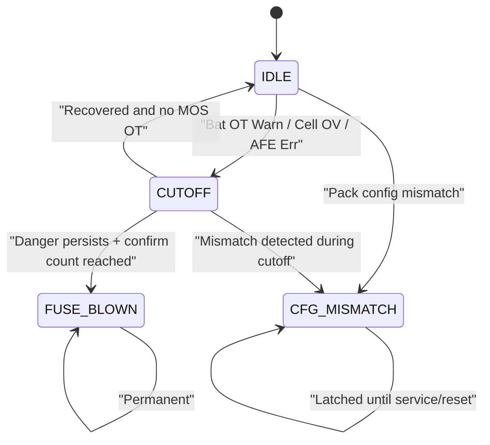

# 双重保护状态机设计

## 1. 设计目的

本文档基于当前项目现状，给出一版可直接映射到代码的双重保护状态机设计。  
目标不是一步做到完整认证级实现，而是先把当前工程中最关键的二级保护与熔断逻辑收敛成统一状态机。

## 2. 设计范围

本状态机覆盖以下对象：

- AFE 正常时的一级保护后备确认
- AFE 异常时的 MCU 冗余保护
- MOS 过温导致的执行链保护
- 配置失配/串数失配保护
- 最终熔断控制

不覆盖以下对象：

- 详细 SOC/SOH 算法
- BLE/Modbus 业务协议细节
- 完整事件日志存储格式

## 3. 输入信号

状态机依赖的输入如下：

- `System_ErrFlag.u8ErrFlag_Com_AFE1`
- `g_stCellInfoReport.u16VCellMax`
- `g_stCellInfoReport.u16VCellMin`
- `g_stCellInfoReport.u16Ichg`
- `g_stCellInfoReport.u16Temperature[8]`
- `g_stCellInfoReport.u16Temperature[9]`
- `ADC_VBUS_PIN` 换算后的 `Vbat_mv`
- `SeriesNum`

## 4. 输出动作

状态机允许的动作如下：

- `open_ctlc()`
- `close_ctlc()`
- `gpio_write(RF_EN_PIN, 1)`
- `FaultWarnRecord2(...)`

## 5. 状态定义

### 5.1 `SECONDARY_PROTECT_IDLE`

含义：

- 二级保护未接管
- 系统允许一级链正常工作
- 若没有 MOS 过温等附加条件，允许 `CTL` 打开

### 5.2 `SECONDARY_PROTECT_CUTOFF`

含义：

- 二级保护已接管
- 系统已执行 `close_ctlc()`
- 当前先做切断，不立即熔断
- 等待危险持续确认或恢复确认

### 5.3 `SECONDARY_PROTECT_CFG_MISMATCH`

含义：

- 系统检测到配置与实际 pack 状态严重不匹配
- 此时禁止恢复导通
- 此状态的目标是“锁住风险”，不是立刻熔断

### 5.4 `SECONDARY_PROTECT_FUSE_BLOWN`

含义：

- 熔断命令已输出
- 系统进入永久不可恢复保护态

## 6. 触发条件

### 6.1 MOS 过温

进入条件：

- `TempMos >= MCU_MOS_OT_DECIDE`

动作：

- `close_ctlc()`
- 记录 `MosOTp_Third`
- 设置 `mos_ot_latched = 1`

退出条件：

- `TempMos <= MCU_MOS_OT_RELEASE`
- 且当前状态回到 `SECONDARY_PROTECT_IDLE`

### 6.2 配置失配

进入条件：

- `Vbat_mv > SeriesNum * MCU_PACK_CFG_MAX_PER_CELL_MV + MCU_PACK_CFG_MARGIN_MV`
- 且 `VCellMin >= MCU_CELL_VALID_MIN_MV`

动作：

- 进入 `SECONDARY_PROTECT_CFG_MISMATCH`
- `close_ctlc()`
- 清空普通熔断计数

退出条件：

- 不自动退出
- 需要服务模式或重新刷对程序后复位处理

### 6.3 AFE 通讯异常

进入条件：

- `System_ErrFlag.u8ErrFlag_Com_AFE1 != 0`

动作：

- 强制进入 `SECONDARY_PROTECT_CUTOFF`
- `close_ctlc()`
- 使用 ADC 包压与温度继续确认危险是否持续

熔断升级条件：

- `Vbat_mv >= MCU_CELL_OV_FUSE_MV * SeriesNum`
  或
- `TempBat >= MCU_BAT_OT_FUSE_DECIDE`
- 连续 `MCU_FUSE_CONFIRM_COUNT` 次成立

### 6.4 电池高温/单体严重过压

进入条件：

- `TempBat >= MCU_BAT_OT_WARN_DECIDE`
  或
- `VCellMax >= MCU_CELL_OV_FUSE_MV` 且 `VCellMin >= MCU_CELL_VALID_MIN_MV`

动作：

- 从 `IDLE` 进入 `CUTOFF`
- `close_ctlc()`
- 记录对应 fault

恢复条件：

- `TempBat < MCU_BAT_OT_RELEASE_DECIDE`
- `VCellMax <= MCU_CELL_OV_RELEASE_MV`
- `AFE` 通讯正常
- 非配置失配

熔断升级条件：

- 已经在 `CUTOFF`
- 连续达到 `MCU_CUTOFF_CONFIRM_COUNT`
- 并且仍检测到充电电流存在
- 并且满足以下任一严重条件：
  - `Vbat_mv` 仍高
  - `VCellMax` 仍高
  - `TempBat` 达到熔断高温阈值
- 连续 `MCU_FUSE_CONFIRM_COUNT` 次成立

## 7. 状态转移图

## 8. 当前代码实现映射

当前工程中，这套状态机已经开始映射到 [`app.c`](/Users/cs/Downloads/work/todo/tc_ble_single_sdk-V3.4.2.8_Patch_0001%20(1)/tc_ble_single_sdk-V3.4.2.8_Patch_0001/tc_ble_single_sdk/vendor/ble_sample/app.c)：

- 增加了 `secondary_protect_state_t`
- 增加了 `secondary_protect_ctx_t`
- 增加了：
  - `pack_cfg_mismatch_detected()`
  - `secondary_force_cutoff()`
  - `secondary_try_release_cutoff()`
  - `secondary_trigger_fuse()`
- 将原先零散的：
  - `AFE 异常`
  - `单体过压`
  - `电池过温`
  - `MOS 过温`
  - `RF_EN_PIN` 熔断输出
  收敛到了一个统一状态机里

## 9. 当前版本解决了什么

当前版本主要解决了以下问题：

### 9.1 熔断顺序更合理

旧逻辑问题：

- 条件散落
- 切断和熔断交织
- 缺少正式状态定义

当前改进：

- 先 `cutoff`
- 再确认危险持续
- 最后 `fuse`

### 9.2 避免因串数失配直接误熔断

旧逻辑问题：

- 总压过高可能直接落入熔断条件
- 但这有可能是配置错、程序错，而不是单纯危险持续

当前改进：

- 优先进入 `CFG_MISMATCH`
- 先锁死，不直接熔断

### 9.3 MOS 过温与熔断逻辑解耦

旧逻辑问题：

- MOS 过温与普通熔断逻辑互相覆盖
- 恢复时可能误打开控制链

当前改进：

- `mos_ot_latched` 独立存在
- 只有状态机回到 `IDLE` 时才允许恢复导通

## 10. 当前版本仍然存在的限制

这版设计仍然是“当前工程可落地版本”，不是最终认证版本。

主要限制如下：

### 10.1 事件记录还不完整

目前主要还是通过 `FaultWarnRecord2()` 和状态变量体现，尚未形成统一事件日志。

### 10.2 熔断后状态持久化不足

当前未把熔断原因、最后采样值、熔断时间持久化保存。

### 10.3 `runtime.c` 仍需后续重构

当前工厂模式计时模块还没有升级成真正的低磨损日志化方案。

### 10.4 故障等级尚未对外统一暴露

目前状态机内部有等级概念，但未正式映射到 Modbus/BLE 的统一故障寄存器。

## 11. 下一步建议

建议后续按以下顺序继续实现：

1. 增加 `bms_soft_protect_status` 调试寄存器
- 可读当前二级保护状态
- 可读是否配置失配
- 可读是否已熔断

2. 增加事件日志
- 至少记录最近一次进入 `CUTOFF` 和 `FUSE_BLOWN` 的原因

3. 重构 `runtime.c`
- 改为低磨损持久化
- 避免每分钟擦写扇区

4. 将状态机从 `app.c` 抽成独立模块
- `bms_soft_protect.c`
- `bms_soft_protect.h`

## 12. 结论

这版状态机设计的重点不是让逻辑更复杂，而是让项目的保护链条变得更可解释、可验证、可扩展。

当前工程已经具备：

- 一级保护基础
- 二级保护采样基础
- 熔断输出链路

后续只要继续把“状态机、事件记录、对外可观测性”补齐，这个项目就会比现在稳很多。
